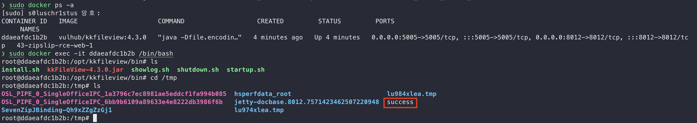

# kkFileView ZipSlip Remote Code Execution

> [이민준 (@s0luschr1stus)](https://github.com/s0luschr1stus)

 

### 요약

-   kkFileView는 오픈소스 온라인 문서 미리보기 솔루션
-   4.3 버전부터 4.4.0-beta 버전에 ZipSlip 취약점 존재
    -   임의의 파일을 서버에 올릴 수 있음
-   문서의 미리보기는 LibreOffice에서 제공하는 UNO API 사용
    -   /opt/libreoffice7.5/program/uno.py 활용
-   ZipSlip 취약점을 이용해 uno.py에 공격자가 임의의 파이썬 스크립트를 쓸 수 있음
    -   웹페이지에서 문서 미리보기를 시도하면 변조된 uno.py 스크립트 실행

 

### 환경 구성 및 실행

-   `docker compose up -d`를 실행하여 테스트 환경을 실행
-   `http://your-ip:8012`에 접속하여 테스트 페이지를 확인
-   `python poc.py`를 실행하여 `test.zip` 생성
-   테스트 페이지에서 `test.zip`와 `sample.odt` 파일 업로드
-   `test.zip` 预览(미리보기) 버튼 클릭 후, `sample.odt` 预览(미리보기) 클릭

 

### 결과

 

### 정리

  이 취약점은 공격자가 ZipSlip 취약점을 이용하여 임의의 스크립트를 업로드 하고 실행시킬 수 있으므로 압축을 풀 때 경로를 검증하거나 프로세스가 파일을 쓸 수 있는 범위를 제한할 수 있도록 권한의 조정함으로 대응할 수 있다.