# Nginx UI Unauthenticated Backup Download with Encryption Key Disclosure (CVE-2026-27944)

**Contributors**

-  [안가영(@ankayeong)](https://github.com/ankayeong)

## 취약점 요약 
CVE-2026-27944는 Nginx UI 2.3.3 이전 버전에 존재하는 인증 우회 취약점이다.

Nginx UI는 Nginx 서버를 관리하기 위한 웹 기반 관리 도구이며, 서버 설정 관리, SSL 인증서 관리 등의 기능을 제공한다.

해당 취약점은 `/api/backup` API를 통해 관리자 인증 없이 접근 가능하게 되어 발생한다. 인증되지 않은 공격자가 시스템 백업 파일을 생성하고 다운로드할 수 있다.

또한 백업 응답 헤더에 포함된 `X-Backup-Security` 값에 AES-256 암호화에 필요한 Key와 IV 정보가 포함되어 있어 공격자는 백업 파일을 복호화할 수 있다.

복호화된 백업 파일에는 Nginx UI 설정 파일(`app.ini`), 데이터베이스 파일(`database.db`) 등이 포함되어 있으며, 이를 통해 JWT Secret 및 Node Secret과 같은 인증 관련 정보를 획득할 수 있다.

공격자는 획득한 **Node Secret**을 이용하여 관리자 API에 접근하고, 관리자 계정을 생성하여 Nginx UI 환경을 완전히 제어할 수 있다.

<br/>

## 환경 구성

### 실행 환경
- OS: Ubuntu (WSL2)
- Docker
- Docker Compose
- Nginx UI 2.3.2

### 실행 방법
명령어
```bash
 docker compose up -d
 ```
입력
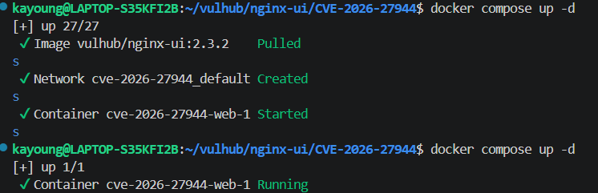

Docker 컨테이너가 정상적으로 실행되었는지 확인한다.

`docker ps` 실행 후 웹 브라우저에서 `http://localhost:9000`로 접속한다.
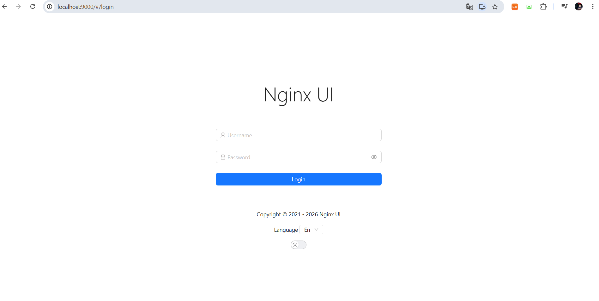

<br/>

## 취약 조건
- Nginx UI 2.3.2 ver 사용
- `/api/backup` API에 인증 없이 접근 가능
- 백업 응답 헤더에 암호화 키 정보 노출

<br/>

## 재현 절차
1) Poc 실행에 필요한 Python 라이브러리를 설치한다. 
```bash
sudo apt install python3-pip
```

2) 아래 명령어를 입력하여 PoC를 실행한다.
```bash
python3 poc.py -u http://localhost:9000 --create-user hacker
```
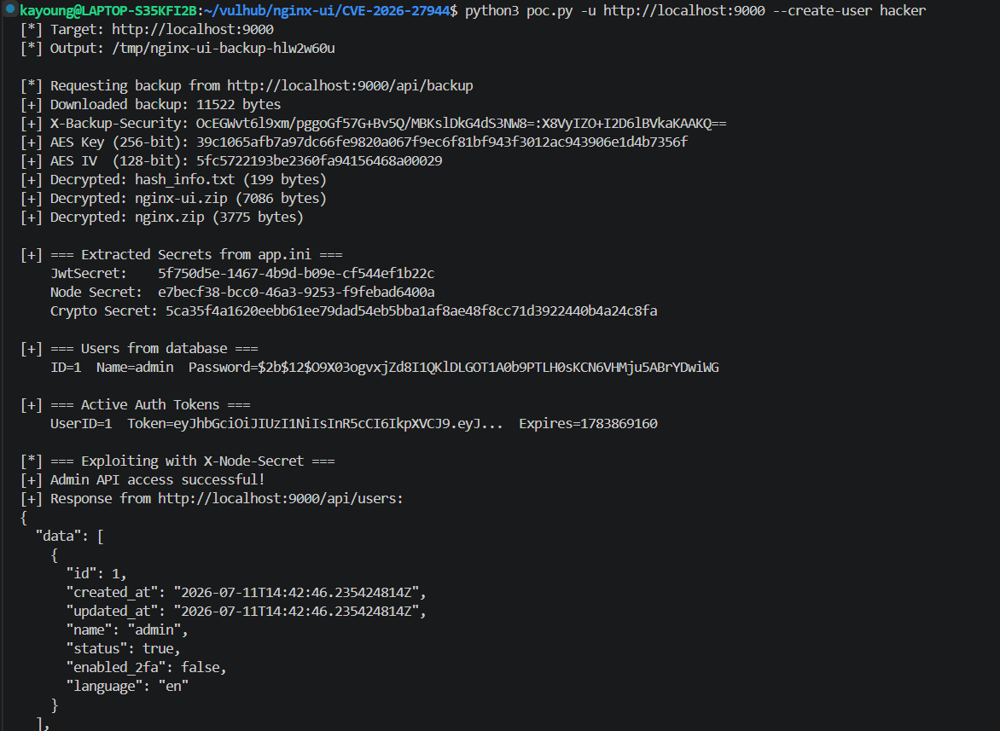
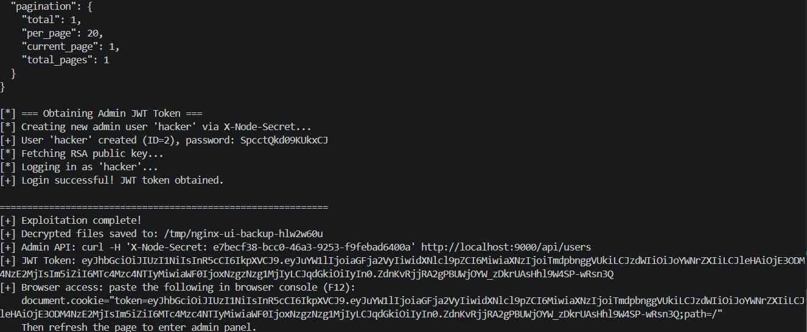

3) 위의 스크립트 실행이 완료되면 출력된 document.cookie 값을 Nginx UI 로그인 화면의 브라우저 개발자 콘솔(F12)에 붙여넣는다. 그다음 새로고침

<br/>

## PoC 코드
1) 인증 없이 백업 다운로드 
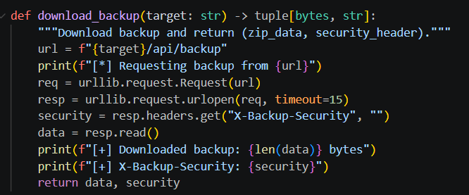
- `/api/backup`에 인증 없이 요청
- backup.zip 다운로드
- 응답 헤더에서 X-Backup-Security 획득

2) AES Key와 IV 추출
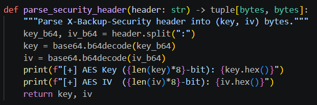
응답 헤더에 포함된 Key:IV를 분리한 후 Base64를 디코딩하여 실제 AES Key와 IV를 얻는다.

3) 백업 복호화
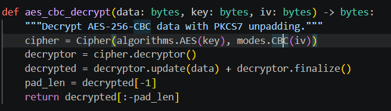
- 앞에서 얻은 AES Key와 IV를 이용하여 backup.zip 내부의 모든 파일을 복호화한다. 복호화 후 app.ini, database.db 등을 확인할 수 있다.

4) Node Secret 추출 

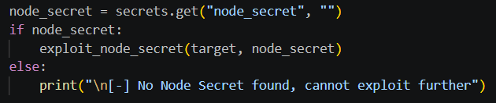 
복호화된 app.ini에서 Node Secret값을 읽는다. 이 값은 이후 관리자 API 인증에 사용된다.

5) 관리자 API 접근
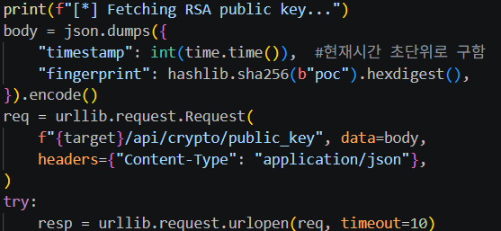
Node Secret을 HTTP 헤더에 넣어 관리자 API에 접근한다. 그럼 정상적인 인증 과정 없이 관리자 권한을 획득할 수 있다.

6) JWT 토큰 획득
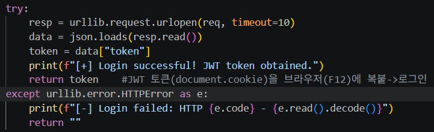
생성한 관리자 계정으로 로그인한 뒤 서버가 발급한 JWT Token을 받아온다. JWT를 브라우저 Cookie에 저장하면 관리자 페이지에 로그인된다.

<br/>

## 실행 결과
1) 응답 헤더에서 AES Key와 IV 값 확인 가능
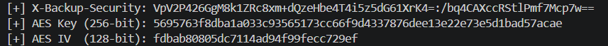

2) 1번 값 이용하여 백업 파일 복호화
JWT Secret / Node Secret / Crypto Secret 값
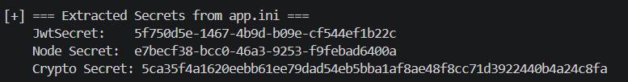

관리자 계정 정보
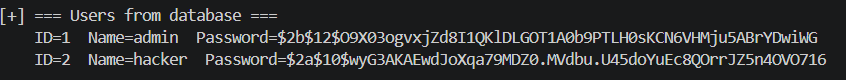

3) Node Secret 이용하여 관리자 API 접근 시도

4) PoC 실행 옵션으로 지정한 `hacker` 계정 생성됨. 해당 계정으로 관리자 페이지 접근 가능
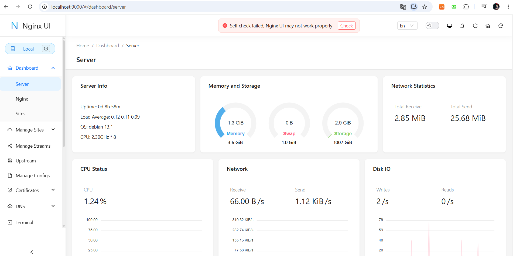
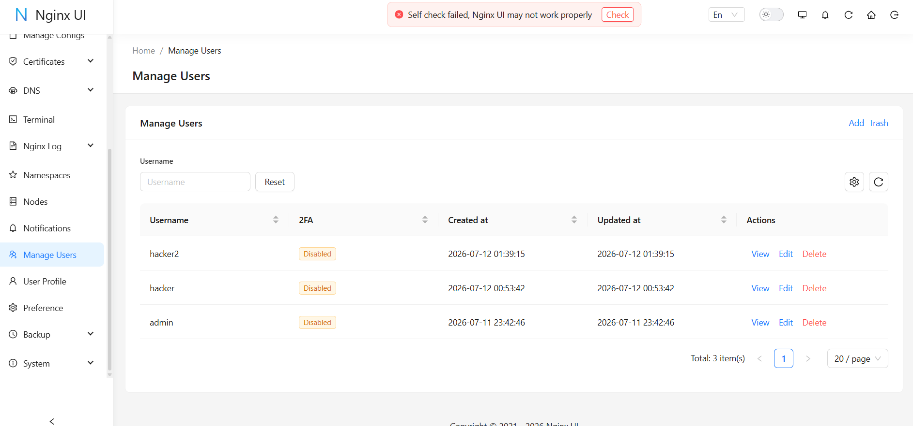

<br/>

## 대응 방안
- Nginx UI 최신 버전을 사용한다.
- 백업 관련 API에 인증 검증을 적용한다.
- 응답 헤더에 암호화 키와 같은 민감 정보를 포함하지 않도록 수정한다.