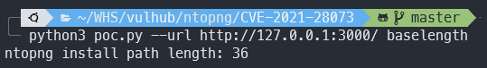
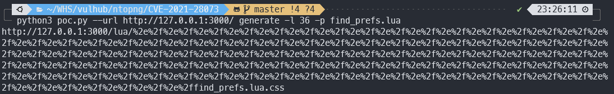
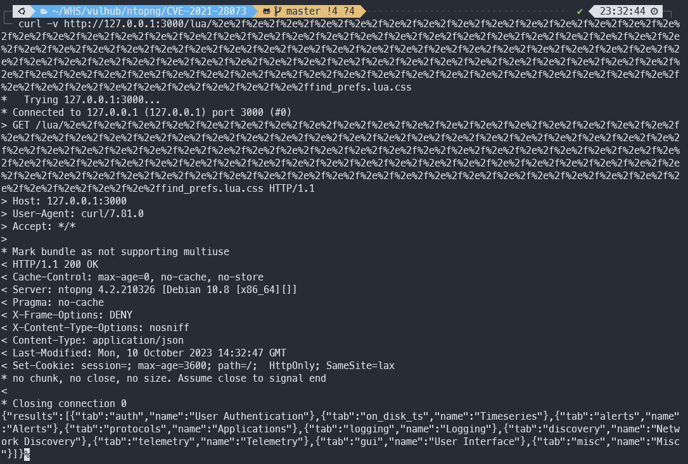

# ntopng Authentication Bypass(CVE-2021-28073)

- ntopng는 서버에서 캡처한 트래픽으로부터 얻은 플로우와 통계에 초점을 둔 수동적인 네트워크 모니터링 도구입니다.

- ntopng 4.2 또는 그 이하의 버전에서 인증을 우회할 수 있는 취약점이 존재합니다.

- Reference Link
    - http://noahblog.360.cn/ntopng-multiple-vulnerabilities/

## 취약 환경 구성
- 다음 명령어를 입력하여 ntopng를 시작합니다.
```sh
docker compose up -d
```
- 서버가 시작되고 나서, `http://your-ip:3000`으로 접속하면 로그인 화면을 볼 수 있습니다. 기본 ID/PW는 admin/admin이며, 처음 로그인하면 비밀번호를 변경해야 합니다.

## 취약점 재현
- 간단한 파이썬 코드 poc.py를 이용하면, ntopng lua 디렉토리의 경로 길이를 확인할 수 있습니다.
```sh
python3 poc.py --url http://your-ip:3000/ baselength
```

- Vulhub 컨테이너에서의 경로 길이는 36인 것을 확인할 수 있습니다.
- 그러고 나서, /lua/find_prefs.lua와 같은 권한 없이 액세스하려는 페이지나 인터페이스를 브라우징하면 로그인 페이지로 리디렉션됩니다.
- 인증하지 않고 접속할 수 있는 URL을 생성하기 위해 poc.py를 이용합니다.
```sh
python3 poc.py --url http://your-ip:3000/ generate -l 36 -p find_prefs.lua
```


- 해당 명령어로 얻은 URL을 통해, 인증하지 않고 인터페이스에 접근할 수 있습니다.



*by kwakmu18 http://github.com/kwakmu18*