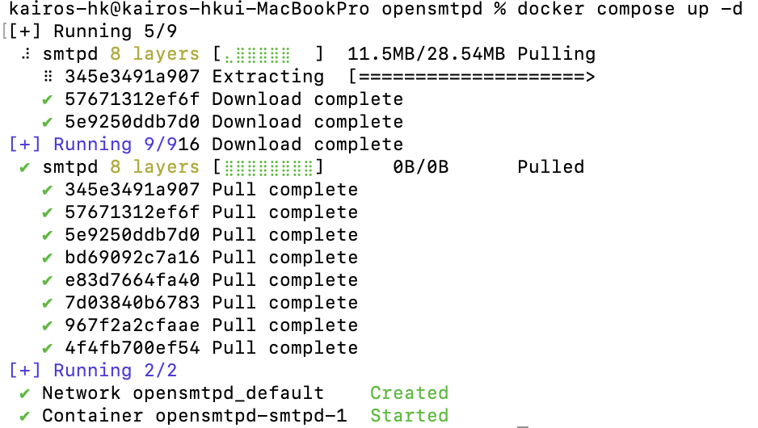
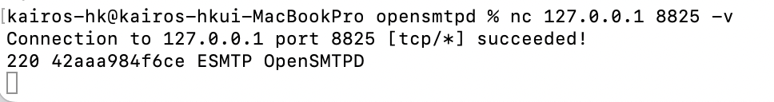
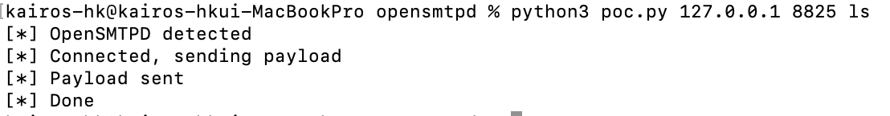
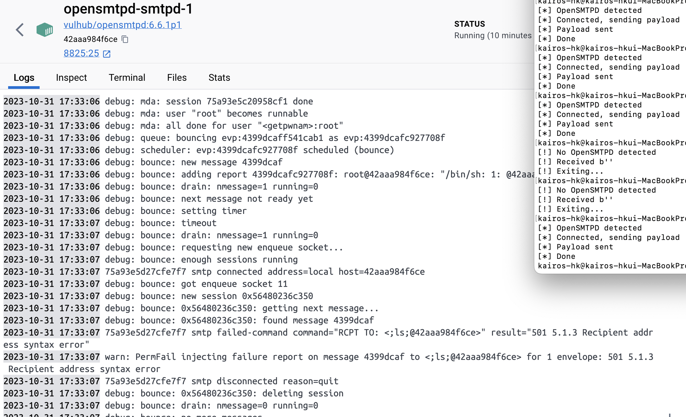

# OpenSMTPD 원격 코드 실행 취약점 (CVE-2020-7247)

**Contributors**

-   [김동영_3768(@kairos-hk)](https://github.com/kairos-hk) 

<br/>

OpenSMTPD는 RFC 5321 SMTP 프로토콜의 유닉스 운영 체제(BSD, MacOS, GNU/Linux)용 smtp 서비스 프로그램입니다. 
'CVE-2020-7247'은 RFC 5321을 구현하는 과정에서 OpenSMTPD의 발신자/수신자 확인이 느슨하여 발생합니다.


## 취약점 재현
### 환경 구성 및 실행

아래의 커맨드를 통해 테스트 환경을 실행함:
```
docker compose up -d
```


SMTPD 서버가 시작된 후 8825 포트에 연결함. (`44dadcc5a6eb`는 컨테이너 ID):
```
$ nc <your-ip> 8825 -v
```


익스플로잇 코드를 통해 실행시킨 opensmtps 서버에 exploit를 실행하였음.
```
python3 poc.py your-ip 8825 <command> 
```


### 결과

-   Docker Log 확인결과, Exploit 코드가 실행되어 공격한 명령어가 전송됨.
