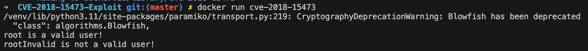

# OpenSSH 사용자 이름 열거 취약점（CVE-2018-15473）

OpenSSH 7.7 이전 버전에는 사용자 이름 열거 취약점이 있습니다.
이를 통해 공격자는 특정 사용자 이름이 대상 호스트에 있는지 여부를 판단할 수 있습니다.

참고 링크：

- http://openwall.com/lists/oss-security/2018/08/15/5
- https://github.com/Rhynorater/CVE-2018-15473-Exploit
- https://www.anquanke.com/post/id/157607

## 취약 환경

OpenSSH 7.7p1을 실행하는 컨테이너를 컴파일하고 실행시킵니다.：

```
docker compose build
docker compose up -d
```

클라이언트에서 `ssh -o StrictHostKeyChecking=no -o UserKnownHostsFile=/dev/null root@your-ip -p20022`를 실행하고 비밀번호 `vulhub`를 입력하면 컨테이너에 로그인할 수 있습니다.

## 취약점 공격

[CVE-2018-15473-Exploit](https://github.com/Rhynorater/CVE-2018-15473-Exploit)을 사용합니다.
userList 중 존재하는 사용자 이름을 열거합니다.：

```
cd CVE-2018-15473-Exploit
vi Dockerfile
# {your ip}를 수정합니다.

docker build -t cve-2018-15473 .
docker run cve-2018-15473
```


## 실행 결과


root는 존재하는 사용자이고, rootInvalid는 존재하지 않는 사용자입니다.