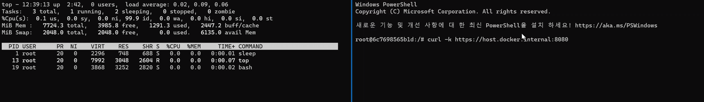

# CVE-2022-0778

**Contributors**

-   [오원영(@RoughBoy0723)](https://github.com/RoughBoy0723)

 

### 요약

-   OpenSSL은 외부로의 위협으로부터 컴퓨터네트워크를 통한 통신을 보호하거나 상대방을 식별해야하는 응용 소프트웨어 라이브러리입니다.

-   OpenSSL에서 공격자가 조작된 인증서를 통해 무한 루프를 발생시켜 서비스 거부를 유도할 수 있는 취약점이 발견되었습니다.

-   이 취약점은 인증서 파싱시 사용되는 BN_mod_sqrt 함수로 인해 발생하였습니다.

-   // crypto/bn/bn_sqrt.c L310-L318
    while (!BN_is_one(t)) {
        i++;
        if (i == e) {
            ERR_raise(ERR_LIB_BN, BN_R_NOT_A_SQUARE);
            goto end;
        }
    if (!BN_mod_mul(t, t, t, p, ctx))
        goto end;
    }`

-   알고리즘에 따르면 고정된 e와 증가하는 i에 대해 해당 loop는 `i == e`인 시점에 끝나야 합니다.

-   하지만 특수한 입력값을 주어 `i=1, e=1` 인 상태로 해당 loop에 진입하도록 유도한다면 무한 loop가 발생하여 서비스 거부가 발생하게 됩니다.

 

### Reference links:

-   <https://github.com/drago-96/CVE-2022-0778>

-   <https://www.cnblogs.com/logchen/p/16030515.html>

-   <https://catbro666.github.io/posts/83951100/>

-   <https://github.com/yywing/cve-2022-0778>

 

### 환경 구성 및 실행

-   `docker compose up -d`를 실행하여 테스트 환경을 실행함.

-   `docker run -it --rm -p 12345:12345 yywing/cve-2022-0778 --addr 0.0.0.0:12345`

-   `docker compose exec curl top`

-   `docker compose exec curl bash`

-   `curl -k https://host.docker.internal:12345`

 

### 결과

 

### 정리

-   해당 취약점은 `i == e` 를 종료 조건으로 가지는 for문으로 바꾸는 방법으로 패치되었습니다.
