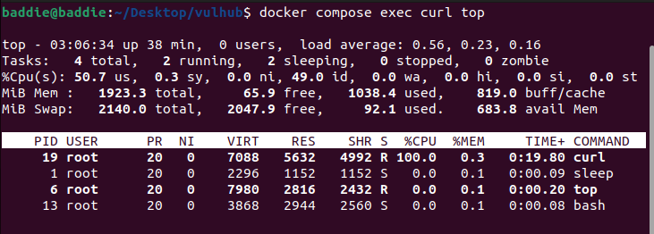

# openssl 무한 루프로 인한 서비스 거부 취약점(CVE-2022-0778)

**Contributors**

-   [김수빈(@rainbow-sherbet)](https://github.com/rainbow-sherbet) 

<br/>

## 요약

-   이 취약점은 인증서를 구문 분석하는 BN_mod_sqrt() 함수의 검증 부족으로 인해 발생한다.
-   공격자로 하여금 유효하지 않은 명시 곡선 파라미터(explicit curve parameters)를 사용하여 잘못된 형식의 인증서를 만들어 무한 루프를 유발하도록 허용한다.
-   공격자는 OpenSSL 라이브러리를 사용하여 OpenSSL 서버 또는 응용프로그램에 조작된 패킷을 전송하여 이 취약점을 이용할 수 있다.
-   공격에 성공하면 영향을 받는 서비스에서 서비스 거부 상태가 발생할 수 있다.

<br/>

## 취약점 재현
### 환경 구성 및 실행

-   `docker compose up -d` 커맨드를 입력해 테스트 환경을 실행
     -   permission deniend 발생 시 `sudo chmod 666 /var/run/docker.sock` 커맨드로 권한 부여
-   `docker run -it --rm -p 12345:12345 yywing/cve-2022-0778 --addr 0.0.0.0:12345` 커맨드로 해당 취약점이 존재하는 서버 생성 및 실행

-   `docker compose exec curl top` 서버의 CPU 사용량을 모니터링하기 위해 top 커맨드 실행
-   `docker compose exec curl bash` 커맨드로 실행 중인 컨테이너 접속
-   `curl -k https://host.docker.internal:12345` 커맨드로 12345 포트로 접속

<br/>


### 결과


-   서버의 CPU 사용량이 100%로 늘어난 것을 확인할 수 있다.

<br/>

## 패치

-   OpenSSL에서 다음과 같이 패치하여 해결했다. 
```
--- a/crypto/bn/bn_sqrt.c
+++ b/crypto/bn/bn_sqrt.c
@@ -14,7 +14,8 @@ BIGNUM *BN_mod_sqrt(BIGNUM *in, const BIGNUM *a, const BIGNUM *p, BN_CTX *ctx)
 /*
  * Returns 'ret' such that ret^2 == a (mod p), using the Tonelli/Shanks
  * algorithm (cf. Henri Cohen, "A Course in Algebraic Computational Number
- * Theory", algorithm 1.5.1). 'p' must be prime!
+ * Theory", algorithm 1.5.1). 'p' must be prime, otherwise an error or
+ * an incorrect "result" will be returned.
  */
 {
     BIGNUM *ret = in;
@@ -301,18 +302,23 @@ BIGNUM *BN_mod_sqrt(BIGNUM *in, const BIGNUM *a, const BIGNUM *p, BN_CTX *ctx)
             goto vrfy;
         }
 
-        /* find smallest  i  such that  b^(2^i) = 1 */
-        i = 1;
-        if (!BN_mod_sqr(t, b, p, ctx))
-            goto end;
-        while (!BN_is_one(t)) {
-            i++;
-            if (i == e) {
-                BNerr(BN_F_BN_MOD_SQRT, BN_R_NOT_A_SQUARE);
-                goto end;
+        /* Find the smallest i, 0 < i < e, such that b^(2^i) = 1. */
+        for (i = 1; i < e; i++) {
+            if (i == 1) {
+                if (!BN_mod_sqr(t, b, p, ctx))
+                    goto end;
+
+            } else {
+                if (!BN_mod_mul(t, t, t, p, ctx))
+                    goto end;
             }
-            if (!BN_mod_mul(t, t, t, p, ctx))
-                goto end;
+            if (BN_is_one(t))
+                break;
+        }
+        /* If not found, a is not a square or p is not prime. */
+        if (i >= e) {
+            BNerr(BN_F_BN_MOD_SQRT, BN_R_NOT_A_SQUARE);
+            goto end;
         }
 
         /* t := y^2^(e - i - 1) */

```
-   i와 e가 모두 1인 경우 무한 루프가 발생할 가능성이 있는 while문을 i < e 조건을 검증하는 for문으로 바꾸었다.

<br/>

### 참고 자료
-   https://blog.alyac.co.kr/4563
-   https://hackyboiz.github.io/2022/03/19/syru/cve-2022-0778/
-   https://blog.rovermoot.co.kr/237
