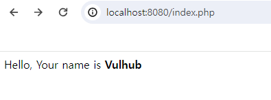
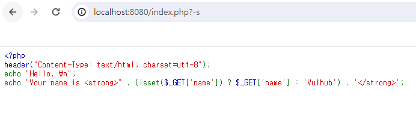
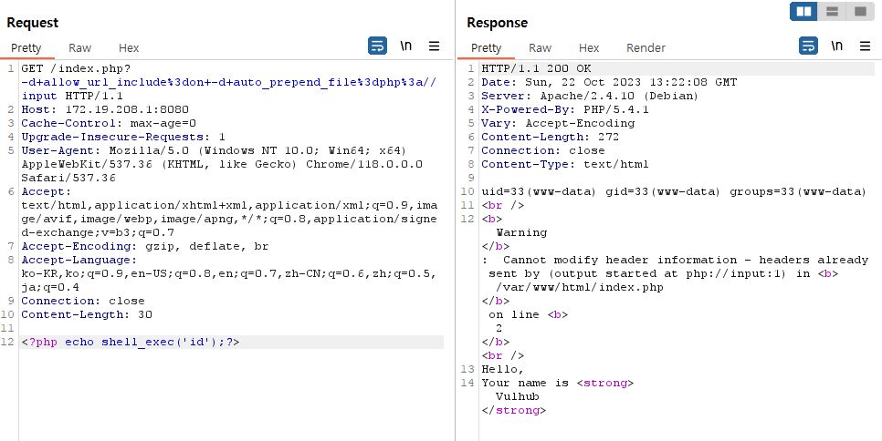

# CVE-2012-1823

**Contributors**

-   [WHS 1기 5반 김태영](https://studykty.tistory.com/)

 

### 요약

-   PHP 5.4.2 이전 버전 또는 5.3.12 버전에서 원격 코드 실행(RCE, Remote Code Execution)이 가능한 취약점 발생했습니다.
-   php에는 웹 서버와 외부 프로그램 간의 상호 작용을 가능하게 하는 표준 프로토콜인 CGI가 존재합니다.
-   sapi/cgi/cgi_main.c 파일 내에 존재하는 php-cgi가 -s, -d와 같은 매개 변수를 검증하지 않아 취약점이 발생했습니다.

 

### 환경 구성

-   `docker compose up -d`를 실행하여 테스트 환경을 실행함.
-   `http://your-ip:8080/`에 접속하여 기본 페이지를 확인합니다.
-   정상적으로 테스트 환경이 구축됐다면, 아래 사진과 같이 페이지에 `Hello, Your name is Vulhub`라는 문장이 출력되어야 합니다.

 

### 취약점 소개 및 구현 증명

CVE-2012-1823은 php-cgi에서 등호 문자가 없는 쿼리 문자열을 제대로 판별하지 못해 발생한 취약점입니다. 사용할 수 있는 매개변수 중 대표적인 것은 아래와 같습니다.
-   `-c` : 현재 디렉토리에서 php.ini 파일의 위치를 찾음.
-   `-n` : php.ini 파일을 사용하지 않음.
-   `-d` : php.ini 파일에 정의된 설정 내용을 임의로 설정함
-   `-b` : fastcgi 프로세스를 시작

`http://your-ip:8080/index.php?-s`에 엑세스 하면 웹페이지의 소스코드가 노출됩니다.

`-d+allow_url_include%3don+-d+auto_prepend_file%3dphp%3a//input`를 데이터 패킷의 헤더 부분에 삽입하고 `<?php echo shell_exec("id"); ?>`를 데이터 패킷의 바디 부분에 추가하여 요청을 보내면 php.ini 파일에 있는 `allow_url_include`와 `auto_prepend_file`가 실행되어 shell_exec() 함수가 실행됩니다. 그 결과 현재 접속된 사용자의 정보가 출력됩니다.

 

### 정리

-   본 취약점은 공격자가 RCE를 발생시켜 php-cgi에 존재하는 명령어를 실행할 수 있습니다.
-   이를 악용하여 웹쉘 등의 추가적인 공격도 진행할 수 있습니다.
-   본 취약점을 방지하기 위해서는 PHP의 버전을 항상 최신으로 유지하는 것이 중요합니다.
