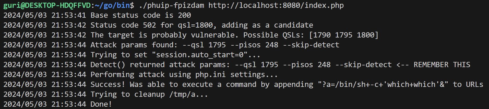
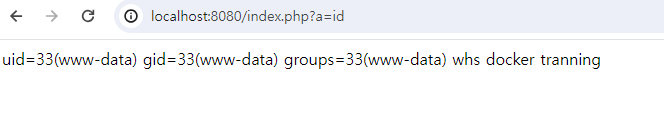

# PHP-FPM Remote Command Execution (CVE-2019-11043)

> [임형천 (@Limguri)](https://github.com/Limguri)

 

### 요약

-   CVE-2019-11043는 PHP의 취약점으로, 취약점은 PHP-FPM이 활성화된 웹 서버에서 발생하며 특정 조건에서 원격에서 악의적인 코드 실행이 가능
    -   PHP-FPM(PHP FastCGI Process Manager)은 웹 서버와 외부 프로그램인 PHP를 연결하여 PHP를 FastCGI 모드로 실행
-   일반적인 NGINX 환경 구성에서 발생
-   공격자는 URL 쿼리 문자열을 통해 취약점을 악용하여 RCE
-   결과적으로 웹 사용자는 원격으로 코드를 실행

 

### 환경 구성 및 실행

-   `docker compose up -d`를 실행하여 테스트 환경을 실행
-   `http://your-ip:8080/`에 접속하여 Nginx 기본 페이지를 확인

-   해당 도구 이용하여 취약점 재현 <https://github.com/neex/phuip-fpizdam:>
-   `go install github.com/neex/phuip-fpizdam@latest`을 통해 해당 도구 설치
-   `~/go/bin`으로 이동 후 생성된 파일로 공격
    -   공격 대상 정보를 인자 값으로 설정해주는 POC 스크립트

 

### 결과

 

### 정리

CVE-2019-11043는 PHP7의 원격 코드 실행 취약점으로, 이를 악용하는 공격이 발생했다. 웹 서버 관리자는 가능한 빨리 해당 패치된 버전으로 업그레이드하고, 보안 강화를 위해 다양한 방법을 검토하는 것이 중요히다.
