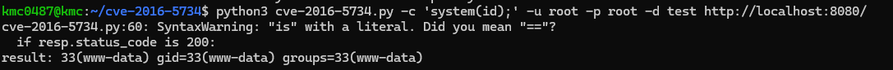

# CVE-2016-5734

> [김민찬 (@minchan02)](https://github.com/minchan02)

 

### 요약
- PhpMyAdmin은 웹을 통한 MySQL관리를 처리하기 위해 php로 작성된 무료 소프트웨어 도구이다.
- 사용자가 제출한 정보가 첫번째 매개변수에 결합될 수 있기 때문에 preg_replace함수에서 취약점이 발생한다.
- PHP 5.4.7버전 이전에는 preg_replace 함수의 첫 번째 매개변수가 \0으로 잘리고 변경 검색 패턴이 \e로 잘릴 수 있었다. 따라서, 원격 코드 실행 취약점이 발생할 수 있다.

- 영향을 받는 버전
  1. 4.0.10.16 이전의 4.0.x 버전
  2. 4.6.3 이전 버전 4.6.x (이 버전을 재현하기 위해선 php5.5+가 필요하기 때문에 실제로 취약점을 재현할 수 없다)

 

### 환경 구성 및 실행
- `docker compose up -d`를 실행하여 테스트 환경을 실행
- `http://your-ip:8080/`에 접속하여 phpmyadmin 기본 페이지를 확인
- `python3 cve-2016-5734.py -c 'system(id);' -u root -p root -d test http://localhost:8080/`를 호출하여 반환 결과를 읽는다.

 

### 결과

 

### 정리
이 취약점은 php 4.3.0 -5.4.6 버전에서 preg_replace함수의 취약한 작동을 이용한 것으로, system의 쉘 코드를 탈취당할 위험이 있다. 안전한 웹 서비스를 위해서 php버전을 최신 버전으로 업데이트 하는것이 중요하다.
