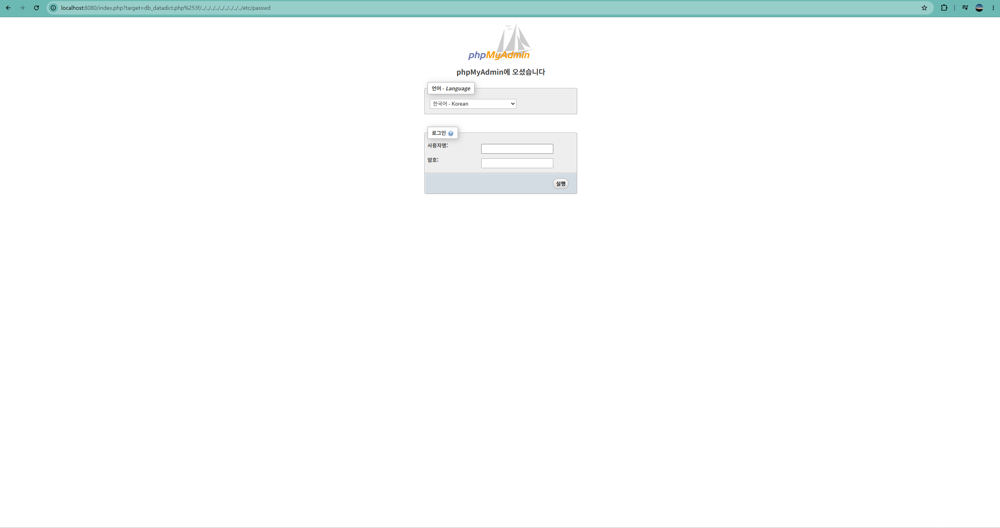

# CVE-2018-12613 phpMyAdmin LFI 실습 보고서

## 1. 취약점 요약
CVE-2018-12613은 phpMyAdmin 4.8.0 및 4.8.1 버전에서 발생하는 LFI 취약점입니다. index.php 파일에서 target 파라미터 값을 제대로 검증하지 않아, 공격자가 서버 내부의 로컬 파일을 마음대로 읽어올 수 있습니다.

## 2. 환경 구성
도커 컴포즈를 사용해 8080 포트에 취약점 테스트 환경을 구축했습니다. 외부 변수를 줄이기 위해 공식 phpmyadmin:4.8.1 이미지를 사용해 컨테이너를 띄웠습니다.

## 3. 취약 조건 및 원인 분석
처음에 도커를 띄우고 바로 공격 코드를 넣었는데 작동하지 않고 계속 로그인 페이지로 튕겨나갔습니다. 취약점 원리를 다시 찾아보니, 이 취약점은 아무나 쓸 수 있는 게 아니라 시스템에 로그인할 수 있는 유효한 DB 계정이 있어야만 동작하는 문제였습니다. index.php 코드가 실행되기 전에 세션 검증을 먼저 거치기 때문입니다.

## 4. 재현 절차
1. docker-compose 명령어로 취약한 서버 실행
2. 브라우저로 localhost:8080 에 접속한 뒤 준비된 계정으로 로그인 시도
3. 주소창 target 파라미터에 LFI 페이로드 입력
4. 필터링을 우회하기 위해 물음표 기호를 %253f로 인코딩해서 삽입
5. 서버의 /etc/passwd 파일 내용이 화면에 출력되는지 확인

## 5. 공격 페이로드
http://localhost:8080/index.php?target=db_datadict.php%253f/../../../../../../../../../etc/passwd

우회 원리: 서버 검사기는 앞부분의 db_datadict.php만 확인하고 안전한 파일로 착각해 무사통과시킵니다. 하지만 실제 내부 로직은 뒤에 붙은 경로 탐색 문자까지 전부 합쳐서 처리하기 때문에 서버 파일이 뚫리게 됩니다.

## 6. 실행 결과

인증 세션 없이 공격을 시도했을 때 방어 로직에 막혀 로그인 화면으로 튕겨져 나온 모습입니다. 이 취약점에 사전 로그인이 꼭 필요하다는 걸 직접 확인했습니다.

## 7. 대응 방안
phpMyAdmin을 취약점이 패치된 버전으로 업데이트해야 합니다. 근본적으로는 서버 개발 시 문자열을 단순히 자르는 방식 대신, 실제 파일 경로를 엄격하게 검증하도록 코드를 고쳐야 합니다.
