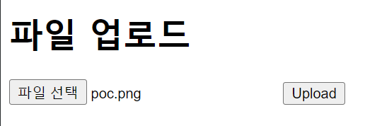
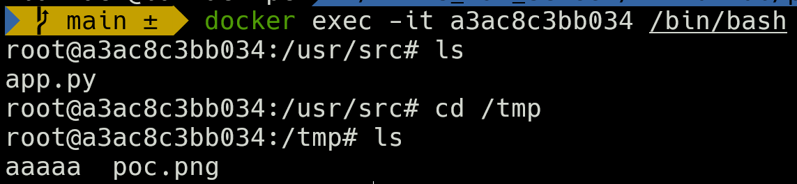

# Python PIL RCE（GhostButt ）

> [이병영 (@yi-barrack)](https://github.com/yi-barrack)


### 요약

Python에서 이미지 처리를 담당하는 모듈 PIL(Pillow)은 내부적으로 GhostScript를 호출하기 때문에 GhostButt 취약점 (CVE-2017-8291)의 영향을 받아 원격 명령 실행 취약점이 발생한다.

GhostButt 취약점(CVE-2017-8291)
- Ghostscript는 -dSAFER 옵션을 통해 안전 모드를 제공하지만, 이 취약점을 통해 안전 모드를 우회함
- 공격자를 특수하게 조작된 .eps 문서를 만들어 Ghostscript 입력으로 제공하게 됨
- Ghostscript가 이 문서를 처리하는 과정에서 유형 혼동이 발생하여, 공격자가 임의의 명령을 실행할 수 있게 됨
<br>


### 환경 구성 및 실행

-   `docker compose up -d` 커맨드를 입력해 테스트 환경을 실행
-   `http://your-ip:8000/` 에 접속하여 파일 업로드 웹 페이지 확인

- 조작된 poc.png 파일 업로드

<br>
<br>

정상적인 기능은 PNG 파일을 업로드하면 백엔드에서 PIL을 호출하여 이미지를 로드하고, 가로 세로 크기를 출력함. 하지만, 백엔드는 파일 헤더를 통해 이미지 유형을 판단하기 때문에 확장자 검사를 무시하고, 실행 가능한 명령이 포함된 EPS 파일을 PNG 확장자로 변경하여 업로드할 수 있음.

예를 들어,[poc.png](poc.png)，파일을 업로드하면 `touch /tmp/aaaaa`명령이 실행됨. POC 파일 내의 명령을 리버스 쉘 명령으로 변경하면 쉘을 획득할 수 있음.
해당 poc.png 파일을 업로드 후 docker에 접속하여 /tmp 에 가보면 touch /tmp/aaaaa명령에 의해 aaaaa 파일이 생성된 것을 확인 가능함


```python
command = ["gs",
            "-q",                         # quiet mode
            "-g%dx%d" % size,             # set output geometry (pixels)
            "-r%fx%f" % res,              # set input DPI (dots per inch)
            "-dBATCH",                    # exit after processing
            "-dNOPAUSE",                  # don't pause between pages,
            "-dSAFER",                    # safe mode
            "-sDEVICE=ppmraw",            # ppm driver
            "-sOutputFile=%s" % outfile,  # output file
            "-c", "%d %d translate" % (-bbox[0], -bbox[1]),
                                            # adjust for image origin
            "-f", infile,                 # input file
            ]

# GhostScript 설치 여부 판단 코드 생략
try:
    with open(os.devnull, 'w+b') as devnull:
        subprocess.check_call(command, stdin=devnull, stdout=devnull)
    im = Image.open(outfile)
```

<br>
<br>

## 결과


<br><br>

## 정리
이 취약점은 -dSAFER 옵션을 통해 안전 모드를 설정했지만, GhostScript의 샌드박스 우회 취약점 (GhostButt CVE-2017-8291)으로 인해 이 안전 모드가 우회되어 임의의 명령을 실행할 수 있다. 또한, 현재까지 GhostScript 공식 최신 버전인 9.21도 이 취약점의 영향을 받기 때문에 운영체제에 GhostScript가 설치되어 있다면 PIL에 명령 실행 취약점이 존재한다고 볼 수 있다.


